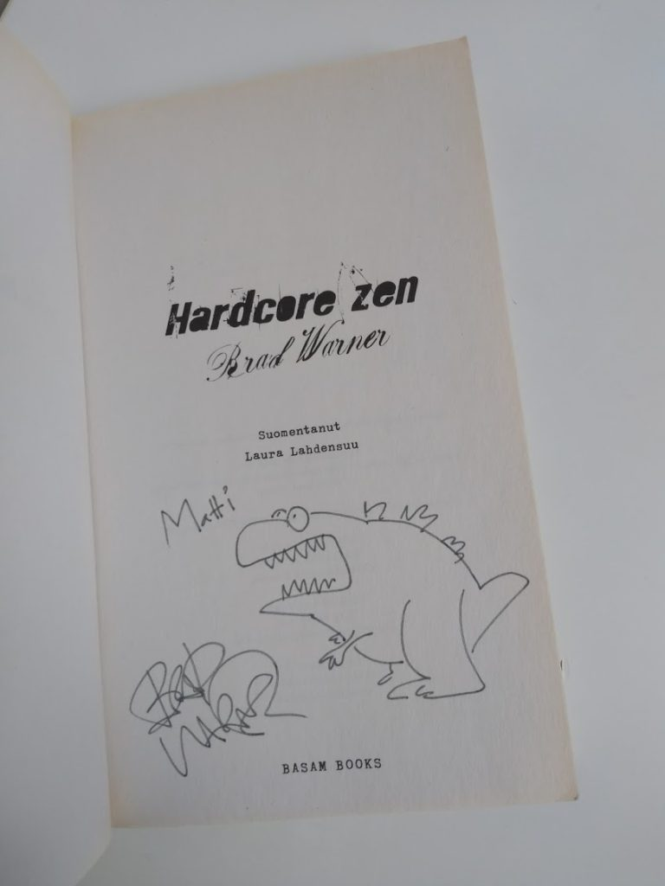

[March 1, 2020March 2, 2020](https://web.archive.org/web/20200302020029/https://www.motivationselfmanagement.com/2020/03/01/mindfulness-face/) [In English](https://web.archive.org/web/20200302020029/https://www.motivationselfmanagement.com/category/in-english/)
[Leave a comment](#respond)
[health behaviours](https://web.archive.org/web/20200302020029/https://www.motivationselfmanagement.com/tag/health-behaviours/)[mindfulness](https://web.archive.org/web/20200302020029/https://www.motivationselfmanagement.com/tag/mindfulness/)[pandemics](https://web.archive.org/web/20200302020029/https://www.motivationselfmanagement.com/tag/pandemics/)

# Mindfulness for burning cities and viral pandemics

*Modern mindfulness practice often gets associated with playing a flute by a waterfall, or giving yourself mental hugs. That may not strike a cord with everyone, including me. Here’s one alternative approach, with an application for contemporary times.* [nb. if you don’t care about the Coronavirus, read [this](https://web.archive.org/web/20200302020029/https://mattiheino.com/2020/03/01/shadow-mean/) first]

As one of my colleagues eloquently put it, “positivity has a negative connotation these days”. I definitely know this, having taken a deep excited dive in positive psychology, and coming out feeling … dirty. But even though the science of that stuff mostly is not, well, scientific, some practices have been known for ages and have stood the test of time. One such practice is that of mindfulness, which is one factor of a larger system also known “the noble eightfold path”. People who originally practiced mindfulness were not ever-smiling fruitarians in the Buddhist equivalent of the Garden of Eden – these people had to deal with burning cities. The original motivation for developing their contemplative practices was to face sickness, old age and death; in a word, suffering.

So, hey, it sounds like it might be a good fit for the modern day, too. I’m definitely not here to preach, just saying that there are flavours for the hippie-averse around, too.

My personal favourite introduction to Buddhist contemplative practices

There are many types of mindfulness, but what they usually come down to is observing closely your breath (e.g. the sensations in the nostrils or abdomen), body (e.g. scanning sensations from top of the head down to the toes), thoughts (paying non-judgemental attention to stuff that goes in your head), etc. In our technique listing, we brushed mindfulness under “dealing with negative emotions”, but there are very practical applications, too. What I’d like to consider here, is a practice of body awareness: mindfulness of your fingers. Why? Because that’s how you get ill from both the normal flu, as well as the Coronavirus.

Here’s a practice:

1. Close your eyes if that feels comfortable. Bring your hand near your face, as if you were going to touch the nose-mouth region, and stop it right before it makes contact. Observe how this feels.
2. Take your hand back to where you started from. Set a timer for two minutes, but don’t look at it.
3. Resolve to perform #1 once, before the timer runs out. But here’s the gist: try to observe very closely, when you get the impulse to perform the movement. You can let the impulse come and pass e.g. three times before doing it “for real”. You can also do this while walking around slowly.
4. In your daily life, when you catch yourself touching your face: stop and repeat the same touching movement three times, but this time halting your hand before it reaches its destination. Aim for continuous awareness of where your body and mind are, with a touch of curiosity – the kind you have when watching an ant carry a needle.

Some additional tips for the contagion season:

- Use a ballpoint pen to draw x-marks on each of your fingertips, as well as your palms. This will facilitate being mindful of where those things are going.
- When moving around, try to mindfully hold your thumb and index finger together. This will make it more salient, when you grab things; also try to be mindful when opening your palm and observe where you put your hands afterwards. Keep a tiny bit of your attention on your thoughts, feelings and intentions at all times.
- Withdraw a bunch of small cash notes, such as five 10€/10$ bills with a friend or colleague. Make a pact, that whenever they catch you touching your face, you have to give them one of those notes, and vice versa.
- When negative emotions such as restlessness arise, use the *labelling technique*. Give a label to what you’re feeling: “this is fear”, “that’s anger”, “there comes anxiety”, etc. There’s some neurophysiological evidence for this practice’s effectiveness on reducing emotional turmoil (the fight-or-flight-response) and increasing clear-headedness; funnily enough, the FBI uses this for interpersonal settings as well. What they do is neutralise the other person’s emotions by labelling them: “It looks like you don’t want to be in this situation”, then shutting up and letting the other person speak. So, maybe it works for friends and family too, but you can start practicing with labeling your own mental states any time.

References and further information

- Properties of the Coronavirus pandemic: [Coronavirus, lifestyle diseases and the Shadow Mean](https://web.archive.org/web/20200302020029/http://www.mattiheino.com/shadow-mean)
- Smile or Die – How Positive Thinking Fooled America and the World by Barbara Ehrenreich: Great book, here’s a [news story about it](https://web.archive.org/web/20200302020029/https://www.theguardian.com/books/2010/jan/10/smile-or-die-barbara-ehrenreich)
- Nonlinear dynamical systems and positive psychology: [Article](https://web.archive.org/web/20200302020029/https://www.researchgate.net/publication/321084093_Nonlinear_Dynamical_Systems_and_Humanistic_Psychology)
- On developing continuous awareness: [Book](https://web.archive.org/web/20200302020029/https://www.amazon.com/When-Awareness-Becomes-Natural-Cultivating/dp/1611803071/ref=sr_1_1?crid=21WM01OCJ7BLJ&keywords=when+awareness+becomes+natural&qid=1583095935&s=books&sprefix=when+awareness%2Cstripbooks-intl-ship%2C239&sr=1-1)
- On the FBI’s use of the labelling technique: [Book](https://web.archive.org/web/20200302020029/https://www.amazon.com/Never-Split-Difference-Negotiating-Depended/dp/0062407805), [cheat sheet](https://web.archive.org/web/20200302020029/https://www.slideshare.net/YanDavidErlich/never-split-the-difference-cheatsheet)
