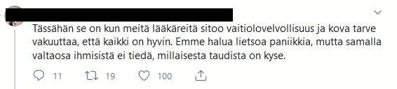
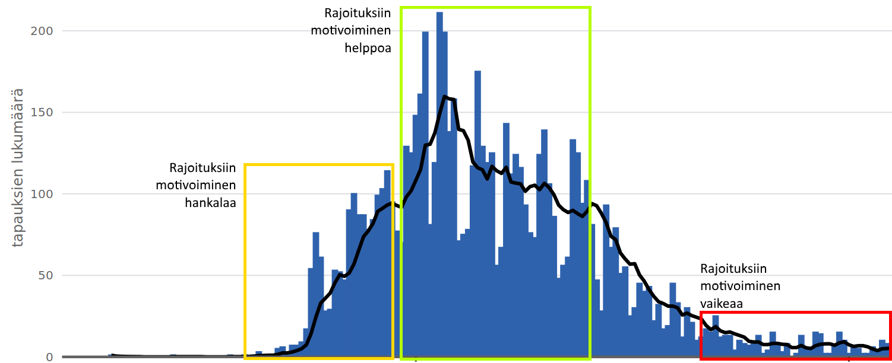

[Suomeksi](https://web.archive.org/web/20200818010544/https://www.motivationselfmanagement.com/category/suomeksi/)
[Leave a comment](#respond)
[henkinen-kriisinkestävyys](https://web.archive.org/web/20200818010544/https://www.motivationselfmanagement.com/tag/henkinen-kriisinkestavyys/)[itsensä-johtaminen](https://web.archive.org/web/20200818010544/https://www.motivationselfmanagement.com/tag/itsensa-johtaminen/)[itseohjautuvuus](https://web.archive.org/web/20200818010544/https://www.motivationselfmanagement.com/tag/itseohjautuvuus/)

*Parin viimeaikaisen lehtihaastattelun ([1](https://web.archive.org/web/20200818010544/https://www.hs.fi/kotimaa/art-2000006602621.html), [2](https://web.archive.org/web/20200818010544/https://www.iltalehti.fi/koronavirus/a/564a0614-8925-4566-9f7f-59c192fa290f)) synnyttämiä ajatuksia tämänvuotisen koronataistelun edistymisestä ja yhteisen uhan nitistämisestä. Julkaistu myös toisessa blogissani [mattiheino.com](https://web.archive.org/web/20200818010544/http://www.mattiheino.com/itseohjautuvuus). Jos on kysyttävää, *[ota yhteyttä](https://web.archive.org/web/20200818010544/mailto:matti.tj.heino@gmail.com)**!

Olen ollut tänä vuonna paljon tekemisissä suomalaisten terveysviranomaisten ja kansainvälisen tiedeyhteisön välisten näkemyserojen kanssa. Yksi huolestuttavimmista piirteistä, joita olen havainnut, on koulutettujen ihmisten (mukaanluettuna lääkärit) piireissä toistellut varoitukset ”veneen keikuttamisesta”. Ajatuskulku menee jotenkin niin, että luottamus viranomaisiin aiheuttaa hyvin toimivan viranomaiskoneiston, jolloin ”luottamuksen nakertaminen” nähdään hyökkäyksenä parhaansa tekeviä yhteiskunnallisia instituutioita vastaan. Syy ja seuraus menevät tietenkin päinvastaiseen suuntaan, eli hyvin ja läpinäkyvästi toimiva viranomaiskoneisto aiheuttaa luottamusta, ja esimerkiksi kevään aikana nähdyt tärkeiden asiakirjojen [salailutapaukset](https://web.archive.org/web/20200818010544/https://www.okf.fi/fi/2020/06/15/thln-paatos-epidemialaskelmien-salaamisesta-vastoin-valtioneuvoston-avoimuuslinjausta/) ruokkivat epäluottamusta.

Luottamuksen ansaitseminen ei ole ihan turha asia ja suljettujen ovien takana toimiminen saattaa johtaa ikäviin seurauksiin. Maailmallahan on käyty paljon keskustelua siitä, riistääkö valtio kansalaistensa vapautta **pakottamalla** heidät käyttämään kasvomaskeja vai onko kyseessä tupakoinnin rajoittamisen kaltainen tapa pyrkiä takaamaan kaikille **oikeus** terveeseen elämään. Suomalaisesta näkökulmasta tämä on tietenkin järjetön keskustelu; pääosin ymmärrämme esim. selvinpäin ajamisen ja vilkun käytön – maskien tavoin – suojelevan muita kuin itseämme, ja olemme muutenkin tottuneet siihen, että meille kerrotaan kuinka terveydestä tulee pitää huolta.

Toki ehkä vähän liikaakin.

Johtavat terveysviranomaiset kevään ja kesän mittaan panostivat erittäin paljon sen viestimiseen, että nyt ei ole kenelläkään täällä mitään hätää (ks. esim. “[Virus jyllää kolmesta kuuteen kuukautta ja sitten se katoaa](https://web.archive.org/web/20200818010544/https://yle.fi/uutiset/3-11246000)“). Ehkä taustalla oli ajattelu, että huoli kiihdyttää ihmiset paniikinomaiseen berserkkitilaan, eikä ihmisille voi siksi antaa vastuuta riskiarvioistaan. (Sivuhuomiona, tutkimusnäyttö viittaa siihen, että Hollywoodin luomasta kuvasta poiketen, kriiseissä toimitaan pääosin altruistisesti ja rationaalisesti.) Mutta on sekä yhteiskunnallisen riskinhallinnan, että yksilön henkisen kriisinkestävyyden kannalta viisaampaa huolestua tietynlaisista uhista ensin paljon ja sitten tiedon karttuessa vähentää huolestuneisuutta[1](https://web.archive.org/web/20200818010544/https://twitter.com/nntaleb/status/1293517795595096069).

Lääkärin realiteetteja kuvastava vastaus kysymykseen “Miten ihmiset voi[si]vat alkaa hahmottamaan tartuttamisen ja sairastumisen riskejä laajasti mutta tasapainoisesti?”

Jos alkujaan suhtautuu potentiaalisesti hyvinkin viheliäiseen patogeeniin positiivisella ajattelulla (kuten esim. silloin, kun vielä viestittiin ilmateitse tarttumisesta [turhana pelotteluna](https://web.archive.org/web/20200818010544/https://www.mtvuutiset.fi/artikkeli/ilmateitse-tarttuva-koronavirus-lahinna-vain-pelottelua-tartuntoja-paaosin-vain-lahipiireissa-infektiotautien-ylilaakari-kertoo-mita-kaikkea-koronaviruksesta-tiedetaan-talla-hetkella/7831714#gs.6wtx8j)), jatkuva huonojen uutisten virta ([ilmateitse tarttuminen](https://web.archive.org/web/20200818010544/https://www.eroonkoronasta.fi/eroon-koronasta-vahentamalla-puheen-muodostamaa-aerosolia/), [pitkäaikaissairauden vakavuus](https://web.archive.org/web/20200818010544/https://yle.fi/uutiset/3-11489088), jne.) voi alkaa jossain vaiheessa kuormittamaan niin, että ihminen lakkaa kiinnittämästä huomiota virusviestintään, jolloin rajoitustoimien jatkamisesta tulee yhä hankalampaa. Tämä ei kuitenkaan ole uutisten, vaan huolettoman lähtökohdan syytä. Vaikka harva silloin ymmärsi viestin, [jo tammikuussa oli selvää](https://web.archive.org/web/20200818010544/https://jwnorman.com/wp-content/uploads/2020/03/Systemic_Risk_of_Pandemic_via_Novel_Path.pdf), miten tulisi kohdella räjähdysaltista uhkaa. Sittemmin tieteellisissä julkaisuissa on osoitettu, että pandemiat ovat itse asiassa vakavimpia globaalia hyvinvointia uhkaava tekijöitä (ks. [1](https://web.archive.org/web/20200818010544/https://www.nature.com/articles/s41567-020-0921-x) ja [2](https://web.archive.org/web/20200818010544/https://arxiv.org/pdf/2007.16096.pdf)).

> **On sekä yhteiskunnallisen riskinhallinnan, että yksilön henkisen kriisinkestävyyden kannalta viisaampaa huolestua tietynlaisista uhista ensin paljon ja sitten tiedon karttuessa vähentää huolestuneisuutta.**

Järjestelmät, joissa valta on keskitetty harvoille kokonaiskuvaa hallitseville tahoille, [ovat hauraita](https://web.archive.org/web/20200818010544/https://link.springer.com/article/10.1007/s10614-020-10021-5). Tämä on opittu yhtä lailla terroristiverkostoissa kuin liike-elämässäkin, jossa on viime aikoina alleviivattu entistä enemmän [itsensä johtamisen tärkeyttä](https://web.archive.org/web/20200818010544/https://yle.fi/uutiset/3-11151550). Aikamme suurin itseorganisoitumishaaste tuleekin tässä: kun rajoitukset alkavat taas purra ja virusta näkyy yhä vähemmän, riskin näkyvyys vähenee ja ihmiset hölläävät käyttäytymistään, vaikkei tulipaloa ole vielä kokonaan sammutettu. Koronavirus ”kytee” vähäoireisilla ja testeihin hakeudutaan vähemmän, kunnes tapaukset taas räjähtävät käsiin.

Uudet tartuntatapaukset Suomessa maaliskuusta heinäkuuhun. Kuvalähde [THL](https://web.archive.org/web/20200818010544/https://thl.fi/fi/web/infektiotaudit-ja-rokotukset/ajankohtaista/ajankohtaista-koronaviruksesta-covid-19/tilannekatsaus-koronaviruksesta?utm_source=Pandemia.fi&utm_campaign=95fb4c9bcc-EMAIL_CAMPAIGN_2020_05_29_11_41_COPY_01&utm_medium=email&utm_term=0_bc8649d035-95fb4c9bcc-365535193), lisätty laatikot ja tekstit. Huomioitavaa: tapaukset lähenevät huippua räjähtävällä tahdilla, mutta vähenevät toimenpiteiden johdosta lähes yhtä nopeasti.

Toinen aalto on jo täällä. Miten vältämme kolmannen?

##### Maskit muistuttajana katukuvassa

Näytti siltä, että maskeista luotiin kevään ja kesän aikana kovalla työllä suurta mörköä. Sen aikana esim. maskit päällä kaupassa Tampereella käyneitä kavereitani yritettiin tulla sylkemään päin – vaimollekin huudeltiin kadulla oluttölkin takaa ”Ei tost oo apua!”. Ja sanon *näytti* siltä, koska Hanlonin partaveitsi velvoittaa pitämään sen mahdollisuuden auki, että kyse oli vain epäpätevyydestä. Mielestäni on kuitenkin päivänselvää, ettei ihmismieli lue suosituksia kirjaimellisesti, jolloin “Emme anna suositusta kasvomaskien käyttöön” tulkitaan helposti “Emme suosittele kasvomaskien käyttöä” tai “Suosittelemme olemaan käyttämättä kasvomaskeja”. Viranomaisten maskidenialismi on ollut tähän asti sanalla sanoen vastuutonta. Toivon, että maskisuosituksen puolivillaisuudesta huolimatta alamme syksyn edetessä nähdä maskeja paljon enemmän katukuvassa, aina siihen saakka kunnes virus on nitistetty.

##### Testaamisen uusia tuulia

Toivon, että näemme pian uusia testiratkaisuja. Mahdollisuuksien piiriin ovat esimerkiksi tulossa syljestä virusta seulovat [pikatestit](https://web.archive.org/web/20200818010544/https://medium.com/@jyri/pikatestit-k%C3%A4ytt%C3%B6%C3%B6n-kouluissa-ja-ty%C3%B6paikoilla-82fd6efe7229), jotka ovat nykyistä nenään työnnettävää puikkoa huomattavasti helppokäyttöisemmät ja miellyttävämmät, vaikkakin vähemmän herkät. Lisäksi oireettomia tartuttajia voidaan seuloa esim. kouluista niin, että kaikki luokan oppilaat sylkevät pussiin, pussin sisältö analysoidaan, ja jos sieltä löytyy virusta, kaikki luokkalaiset eristetään tai laitetaan karanteeniin automaattisesti. Maailmalla erinomaisia tuloksia tuoneesta [tietokonetomografiasta](https://web.archive.org/web/20200818010544/https://www.endcoronavirus.org/ct-scans) ei ole Suomessa toistaiseksi edes voinut keskustella.

##### Yhteishenkeä painottava viestintä

Voisimmeko myös viestiä paremmin? Rajoitustoimia motivoivassa viestinnässä toisten auttamisen tulisi olla asian ytimessä, esim. kansainvälistä [Masks4All](https://web.archive.org/web/20200818010544/https://masks4all.co/)-liikettä mukaileva ”Suojaa minua, suojaan sinua” (tai *Suojaa selustaani, minä suojaan sinun!*). Tässä lisäksi kuusi vinkkiä, erästä [tieteellistä julkaisua](https://web.archive.org/web/20200818010544/https://jech.bmj.com/content/74/8/617.long) Suomen kontekstiin mukaellen:

1. Selkeät ja tarkat ohjeet: Viestiminen riittävän yksinkertaisesti ja ja konkreettisia esimerkkejä antaen – kuitenkin ymmärtäen, että tiedon tarjoaminen on tarpeellista, muttei itsessään riittävää käyttäytymiseen vaikuttamiseksi. Erinomaisen tärkeää on olla selkeä siinä, että A) tauti on äärimmäisen vaarallinen, B) se leviää hengitysilmassa, hämmästyttävän nopeasti ja oireettakin, C) voimme päästä siitä eroon käyttäytymistämme muuttamalla.
2. Suojellaan toisiamme -viestit: Sen painottaminen, että estämällä koronaviruksen leviämistä, suojellaan muita. Viestit, jotka kohdistuvat vain omiin riskeihin, eivät ole tehokkaita mikäli vastaanottaja ei koe itse olevansa altis riskille.
3. Yhtenäisen rintaman viestit: Ryhmäjäsenyyden (esim. omaan perheeseen, kuntaan, kaupunkiin tai suomalaisuuteen kuulumisen) korostaminen, kuitenkin välttäen “me-vastaan-muut”-henkeä.
4. Meikäläiset toimivat näin -viestit: Viruksen leviämistä rajoittavan käyttäytymisen esittäminen sellaisena, joka on osa ryhmään kuulumista, ja johon oman ryhmän jäsenet kannustavat.
5. Suunnittelun ja suunnitelmien säännöllistä arviointia tukevat viestit: Tukimateriaali, joka antaa konkreettisia ohjeita sen suunnitteluun, kuinka esim. perhepiirin kesken voidaan toimia suositusten mukaan hankaloittaen kuitenkin omaa elämää mahdollisimman vähän.
6. Mahdollistamista tukevat viestit: Kerrotaan konkreettisesta tarjolla olevasta avusta, esim. liittyen sosiaalitoimen palveluihin.

#### Itseohjautuvuus ja väärät kartat

Väärän kartan päättelyvirheellä (false map fallacy) tarkoitetaan sitä, että ajatellaan minkä tahansa mallin olevan parempi, kuin ei mallia ollenkaan. Mutta jos olet seikkailemassa Belgradissa, Tukholman kartasta on vain haittaa ja tarvitset ennemminkin havaintokykysi ja avoimen mielen. Monet kevään virustorjunnan ongelmista johtivat siitä, että koronavirusta [yritettiin pakottaa influenssamalliin](https://web.archive.org/web/20200818010544/https://worldaccordingtomatti.blog/2020/08/12/pandemiaa-kiinnostaa-vaesto-yksilo-on-vain-yhdentekeva-solu/), vaikka parempaa tietoa [oli saatavilla](https://web.archive.org/web/20200818010544/https://necsi.edu/corona-virus-pandemic).

> *Kun ainoa työkalusi on influenssamalli, kaikki ongelmat alkavat näyttämään influenssalta.*
>
> *– Henri Lampikoski, lääkäri ja Eroon koronasta -verkoston perustajajäsen*

Kuten [maailmallakin](https://web.archive.org/web/20200818010544/https://papers.ssrn.com/sol3/papers.cfm?abstract_id=3638340), kansalaiskeskustelu oli merkittävä tekijä, joka Suomessa sai [epäröivän hallituksen](https://web.archive.org/web/20200818010544/https://www.iltalehti.fi/koronavirus/a/9932d022-e52f-4984-879b-bb231ad9c24d) muuttamaan politiikkansa laumasuojan tavoittelusta tolkullisiin toimiin. Esimerkiksi [Eroon koronasta](https://web.archive.org/web/20200818010544/http://www.eroonkoronasta.fi/) -verkostossa olemme työskennelleet palkatta päivittäin oman toimemme ohella paremman tiedonkäytön puolesta, mitä ei ole helpottanut se, että tilannekuvatietoa on herunut viranomaisilta varsin vähän. Ehkä tulevaisuudessa käytämmekin suomalaisten kouluttautuneisuuden paremmin hyödyksi päätöksenteossa, emmekä yritä päättää uhkien huolestuttavuudesta keskitetysti kaikkien kansalaisten puolesta. Toivottavasti siis opimme tästä ja alamme johtamaan yhteiskuntaamme yhdessä, [varovaisuusperiaate](https://web.archive.org/web/20200818010544/https://medium.com/brandin-kirjasto/varovaisuusperiaate-p%C3%A4%C3%A4t%C3%B6ksentekoon-nyt-3bb744efd6cf) mielessä pitäen.

> **Yksilöiden ja heidän lähipiirinsä pienet päivittäiset valinnat ovat koronasta eroon pääsemisen avain**

Tästä pääsemme myös takaisin itsensä johtamiseen: *Yksilöiden ja heidän lähipiirinsä pienet päivittäiset valinnat ovat koronasta eroon pääsemisen avain*, byrokratian hitaasti pyörivät rattaat auttavat jos auttavat. Virus voidaan tukahduttaa yhtä eksponentiaalisella nopeudella, kuin millä se on levinnytkin.

ps. Onko sinustakin tuntunut, että ”Korona yllätti viranomaiset” on uudenlainen vakiouutistyyppi? Erinomainen yhteenveto aiheesta löytyy [täältä](https://web.archive.org/web/20200818010544/https://medium.com/brandin-kirjasto/mik%C3%A4%C3%A4n-ei-ole-niin-vaarallista-kuin-toistuvat-yll%C3%A4tykset-e54c3b63fdf9).

pps. löydät kuvitetun oppaan suomalaiselle koronarintamalle [täältä](https://web.archive.org/web/20200818010544/https://www.eroonkoronasta.fi/eroon_koronasta_pandemian_torjunnan_toinen_era.pdf); tärkeimpiä suomennettuja artikkeleita [täältä](https://web.archive.org/web/20200818010544/https://medium.com/@thlbr), ja omat suosikkini [täältä](https://web.archive.org/web/20200818010544/https://mattiheino.com/2020/03/24/koronavirus-suomeksi/). Lue myös tästä blogista [antihauraasta elämästä](https://web.archive.org/web/20200818010544/http://www.motivationselfmanagement.com/antihauras).
