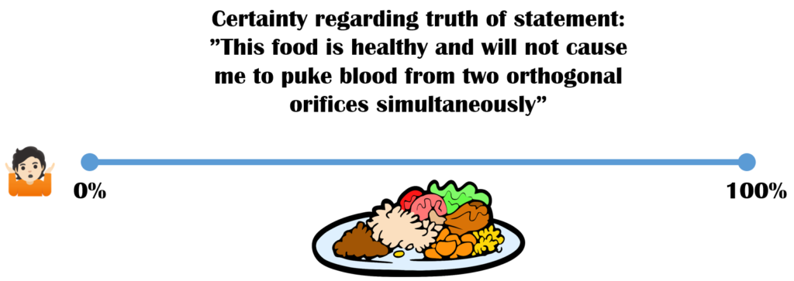
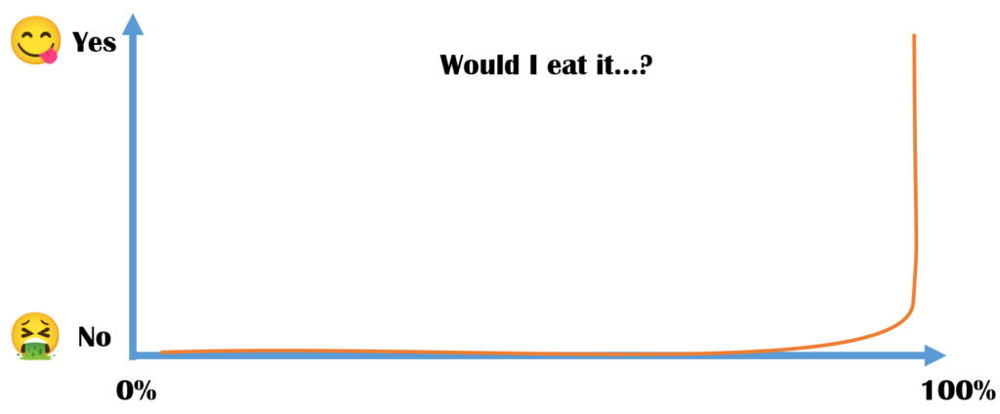

[September 15, 2020September 15, 2020](https://web.archive.org/web/20200915150126/https://www.motivationselfmanagement.com/2020/09/15/uncertainty/) [In English](https://web.archive.org/web/20200915150126/https://www.motivationselfmanagement.com/category/in-english/)
[Leave a comment](#respond)
[culinary fantasies](https://web.archive.org/web/20200915150126/https://www.motivationselfmanagement.com/tag/culinary-fantasies/)[decision making](https://web.archive.org/web/20200915150126/https://www.motivationselfmanagement.com/tag/decision-making/)[russian roulette](https://web.archive.org/web/20200915150126/https://www.motivationselfmanagement.com/tag/russian-roulette/)[uncertainty](https://web.archive.org/web/20200915150126/https://www.motivationselfmanagement.com/tag/uncertainty/)

# How uncertainty makes decisions easier, not harder

*During the COVID-pandemic, a group of complexity scientists has been correct about pretty much everything [since January](https://web.archive.org/web/20200915150126/https://necsi.edu/systemic-risk-of-pandemic-via-novel-pathogens-coronavirus-a-note), with officials from WHO (or the Finnish THL) lagging far behind in their recommendations. Some traditional scientists and epidemiologists have had trouble with the confidence placed in their statements, even [claiming they are spreading misinformation](https://web.archive.org/web/20200915150126/https://twitter.com/Heinonmatti/status/1303783970514051072). The logic seems to be, that there are so many uncertainties at play, that we shouldn’t make hasty decisions. In this post, I show how the opposite can actually be the case.*

So, how does uncertainty about Very Serious Matters influence decision making? Say you’re in some unfamiliar place, like the Venezuelan or Cambodian jungle, and someone you don’t know has cooked you dinner. You face a dilemma. Take a moment to think of different decision scenarios based on where you are on the line below.

Would you eat the food if you were all the way to the left of the line? What about all the way to the right? Or somewhere in between?

I’m guessing most people’s reaction curve is at least as steep as the line below: The less certain you are of the outcome, the more certain you are of what’s the right thing to do.

When the costs of refusing the food – e.g. coming off as rude – are known and bounded, but the costs of eating it are unknown and possibly fatal, the decision is clear. It’s the same reason playing Russian Roulette doesn’t generally make sense.

So, as you can see, in some matters the uncertainty of knowledge leads to certainty of action. In the case of the COVID, we know it could’ve been much, much worse ([see article here](https://web.archive.org/web/20200915150126/https://www.nature.com/articles/s41567-020-0921-x)). Aggressive mitigation bought us time to get more information on the properties of the virus, so that we could move to a better-targeted strategy.\* To survive, it’s better to worry a lot at first, then get progressively less worried with new information, than to do the other way around – as the author of the aforementioned article [has stated](https://web.archive.org/web/20200915150126/https://twitter.com/nntaleb/status/1293517795595096069).

Someone said that a good decision is one, which you don’t regret whatever the outcome. If your friend drinks a bottle of vodka before driving home and nothing bad happens, doesn’t mean it was a good decision. Driving sober is the right decision regardless of outcome.

**Take-home message:** When stakes are high, *make that right decision*. When stakes are low, arrange your position such, that you can repeatedly fail with grace, learning from each try.

\*Well, not “us”, but e.g. the New Zealanders, who actually didn’t want anyone to get infected by some sort of a batshit zombie virus
