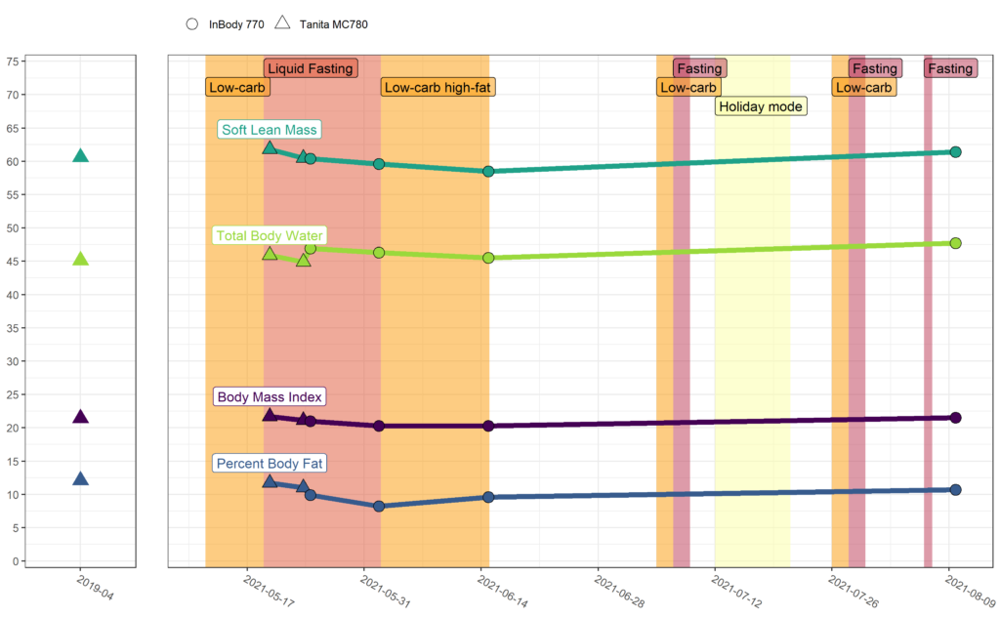
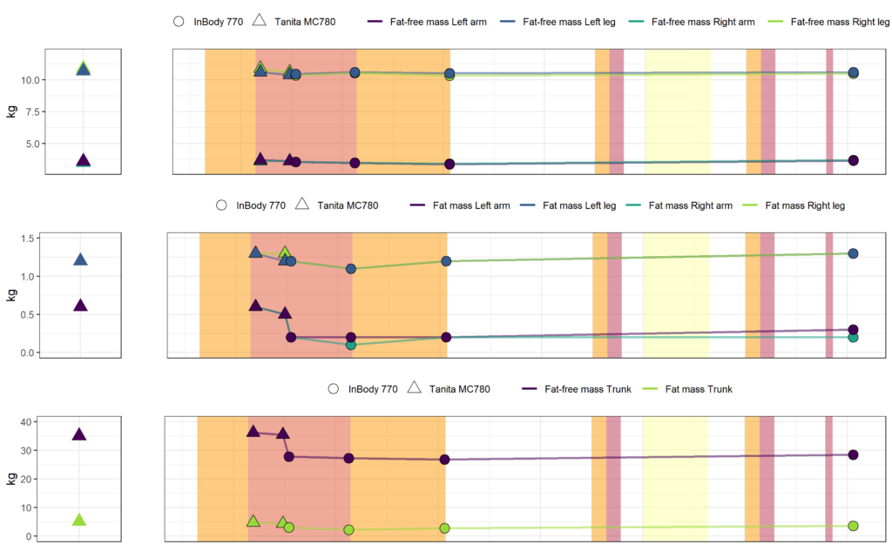

[September 13, 2021September 19, 2021](https://web.archive.org/web/20211031100621/https://www.motivationselfmanagement.com/2021/09/13/fasting-experiment/) [In English](https://web.archive.org/web/20211031100621/https://www.motivationselfmanagement.com/category/in-english/)
[body composition](https://web.archive.org/web/20211031100621/https://www.motivationselfmanagement.com/tag/body-composition/)[fasting](https://web.archive.org/web/20211031100621/https://www.motivationselfmanagement.com/tag/fasting/)[health behaviours](https://web.archive.org/web/20211031100621/https://www.motivationselfmanagement.com/tag/health-behaviours/)[natural movement](https://web.archive.org/web/20211031100621/https://www.motivationselfmanagement.com/tag/natural-movement/)[physical activity](https://web.archive.org/web/20211031100621/https://www.motivationselfmanagement.com/tag/physical-activity/)

# A 14-day Fasting Experiment

**Short version:**

- For its widely touted health benefits, I was curious to do a 14-day fast.
- I was a bit wary of its effects on muscle mass. Surprisingly, a few studies I read indicated a little to no impact on that. But study populations were almost exclusively obese or otherwise not representative of me, necessitating a personal investigation.
- I ate just liquids (amounting to less than 100 calories a day) for 14 days, while keeping physical activity at normal pace. I also did six body composition measurements along the way.
- Results at 2-month follow-up showed negligible impacts on any of the indicators measured (notwithstanding the change in measurement device) – just as I hoped would happen.
- Interestingly, the workout regimen I had been doing due to gym closures (see demo below), produced equivalent or better results compared to intensive gym training I did in 2019. Plus, it cost nothing and is actually fun 😄

[detailed version below]

In the figure above, you can see the measurements done in 2019 (left), as well as those taken during the fasting period. “Low-carb” periods are when I tried to eat less than 20g of carbs daily; “Liquid fasting” is described below, and periods marked “Fasting” involve no food at all. Holiday mode is a week at a family holiday, with unrestricted hedonism involving e.g. ice cream and a couple of beers almost daily. Areas without colour indicate time-restricted eating (having a 12-18h foodless period between the last meal of the day, and the first meal of the next day).

For the curious, this is what the aforementioned training regimen looks like:

[detailed version continues below]

### **Detailed version:**

I have some background in fasting (for health, not for fitness), i.e. refraining from eating for varied durations: 12-18 hours daily, 1-5 days monthly, and 1-2 longer periods annually. Having done an 8-day water/coffee fast the previous year (see thread journaling the process [here](https://web.archive.org/web/20211031100621/https://twitter.com/Heinonmatti/status/1288204137080016896)), I wanted to try out a [protocol](https://web.archive.org/web/20211031100621/https://twitter.com/Heinonmatti/status/1394901413797453824) for 14 days. This meant eating only fasting liquids ([here’s](https://web.archive.org/web/20211031100621/https://twitter.com/Heinonmatti/status/1395098121194119171) what’s meant by “fasting liquids”) during the period. In practice this meant making soups / broth, freezing the chunky parts for later use, and just drinking the fluid. Having entered the previous fast after a huge plate of nachos, this time I entered fasting after a week of low-carb. By subjective experience, it was a great decision.

#### Eating regimen

Note that this wasn’t a water fast, and basically you’re allowed ~500 calories a day. I wanted to keep it a bit stricter, though. So, what I allowed myself to eat at the outset:

- Liquid from soup
- Tea / Black coffee (although I had to halve my consumption to get to 6 cups a day)

What I ended up cheating with:

- Whatever sauce came off my wife’s plate after she was done eating; usually approx a forkful in total.
- An occasional slice of cucumber left over from my son’s plate.
- Circa once daily I put a spoonful of homemade mayo in the liquid-from-soup that was my meal.
- Full-xylitol chewing gum maybe once a day.
- Kids’ salted liquorice flavoured xylitol pastille or two every now and then.
- When my wife finished a box of orange juice, I filled it with water and enjoyed the taste from the leftover juice drops.

As always, hunger came and went in a few waves (treatable with drinking water) after disappearing almost completely after the first couple of days.

#### Body composition measurements

As is recommended during fasting, I kept physical activity as normal as possible. The first body composition measurement looked like this, in comparison to a measurement I had done on the same device in 2019:

 alt="Image">

Column marked 2019 is when I was doing intensive strength training at the gym, interspersed with one to three runs to the office a week (~5 km / 3 miles one way) with a 5-15kg (11-33lbs) backpack. Column marked 2021 is the first day of the fast, during a period when I had been doing exclusively “natural movement” (see [MovNat](https://web.archive.org/web/20211031100621/https://www.movnat.com/); not affiliated) for a year, in playgrounds and forests. Robustness check is repeating the previous measurement immediately after performing it, to get an idea of measurement error.

Unfortunately, during the measurement period I lost access to the Tanita MC780 device we had had at the office for years after a research project we used it for. Hence [Joni Jaakkola](https://web.archive.org/web/20211031100621/http://optimalperformance.fi/joni-jaakkola) from Optimal Performance, with whom I had done a [podcast](https://web.archive.org/web/20211031100621/https://www.motivationselfmanagement.com/2020/02/11/antihauras/) earlier, was kind enough to give me a discount for using the InBody 770 device at their gym.

Here is a detailed graph with development outlined per body part (omitting period and x-axis labels for clarity):

Where triangle shape switches to a point, I changed the measurement device; measures are from subsequent days and should be approximately equal if the devices are fully comparable. Changing the measurement device made a difference in the fat-% of arms (but note the very small absolute numbers in y-axis scale), and fat-free mass of the trunk. But notwithstanding that, everything that changes, returns to baseline by the 2-month follow-up – which was exactly what I hoped for.

#### Training regimen and notes of mental landscape

I ended up not doing as much resistance training as normal, and doing more biking instead (mostly due to having to act as a bus for my son). In general, during fasting my performance lowers a bit, which is in no small part due to wanting to give up more easily. If I recognise this thought/impulse for what it is (i.e. a thought), I can usually perform almost normally.

Some other thought patterns, which are really important for me to notice before they build up:

1. “I wonder what I should eat when I end the fast” – this is **danger zone**, often leading to nonsensical impulse purchases and a fridge full of stuff you don’t really want. The mad plan gets made in a very different state of mind than where I am at end of fast, which is usually a calm state where you’re not even craving stuff. *Antidote:* Pre-make a plan for break-fast, preferably low-carb or just bone broth. High carbs on the first meal make me feel like shit big time.
2. “I wonder what’s going on in my body; what if this isn’t safe; am I going to die?” – letting this thought pattern loose can create anxiety. *Antidote:* Remind yourself that hundreds of thousands of people, many or most in worse condition than you, have done this before.
3. “I don’t want to do physical activity, I want to lay in bed and it’s for the best” – if humans couldn’t be active during a fasted state, our ancestors would’ve starved to death long ago. *Antidote:* Remind yourself that some studies have indicated muscle tissue loss and even something called refeeding syndrome, as a result from too much inactivity during fasting.

Motivation-wise, the most pleasant training regimen for me is “allowing oneself to get invited” by some form of physical activity. Might post about that some other day.

All in all, this was an interesting thing to try out, and not nearly as difficult as I expected; will do something similiar again next year the latest.

To conclude, this is from day 6 of the fast:

> Welcome to a new non-reductionist complexity gym! Found this one today; they keep popping these up via a mechanism called affordances.  
>   
> Here: lap carry –> [lowering & positioning] –> power clean –> jerk (w/ bad techique) –> inverse slow press –> throw[https://t.co/Mdw43E4CLD](https://web.archive.org/web/20211031100621/https://t.co/Mdw43E4CLD) [pic.twitter.com/gmhlj6W1WH](https://web.archive.org/web/20211031100621/https://t.co/gmhlj6W1WH)
>
> — matti heino (@Heinonmatti) [May 24, 2021](https://web.archive.org/web/20211031100621/https://twitter.com/Heinonmatti/status/1396866061857927171?ref_src=twsrc%5Etfw)
