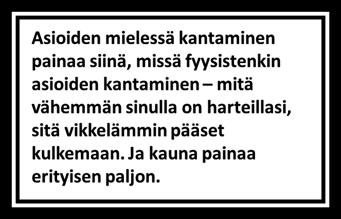

*English summary: People often condition their actions on the actions of others. This may be helpful at times ("let it be known that those who betray me shall face a painful death"), but often in ordinary life, it's beneficial to adopt a simple strategy, which you know is in accordance with what you want. So, it might we worthwhile not to let asshats define your mood and level of generosity. Instead, maybe train yourself to not expect anything in return for acting decently. Maybe not spend energy to figure out, if each person "deserves" your kindness. Maybe remember what you value, and not become what you don't.*

Usein ihmiset ajattelevat, että he kyllä kohtelisivat toisia hyvin, jos vain toiset ensin kohtelisivat heitä hyvin. Että on vain kohtuullista olla antamatta toisille, ennen kuin toiset antavat itselle. Odottaa ensin toiselta anteeksipyyntöä, pyytää sitten itse anteeksi.

Mutta mitä vapautta tämä on? Jos vain reagoi muiden tekemisiin, antaa toisille vallan vaikuttaa omaan tahtoonsa. Oma käytös ulkoistetaan muille, valinnanvapaus annetaan pois ja antaudutaan muiden vietäväksi.

Jos haluaa olla itsenäinen ja aidosti vapaa, on fiksumpaa toimia omien arvojensa mukaisesti, riippumatta muiden tekemisistä. Kuinkakohan usein ylipäätään kukaan on mykkäkoululla ”antanut toiselle opetuksen”, josta on ollut pitkän tähtäimen hyötyä?

Jos et ole vielä miettinyt strategiaasi tälle vuodelle, kokeile halutessasi anteliaisuutta ja ole mukava kaikille, *odottamatta mitään* heidän käytökseltään sinua kohtaan. Silloin kun joku tekee jotakin mielestäsi ärsyttävää, voit myös yrittää löytää hänen tekojensa taustat. Sanoiko hän pahasti, koska on ilkeä, vai oliko hänellä huono päivä? Voiko olla, että hän oli vain peloissaan? Entä pitäisikö sinun samalla olla vihainen hänen sanoilleen, hänen persoonalleen tai tyylilleen, hänet kasvattaneille vanhemmille, hänen vanhempiensa vanhemmille vai alkuräjähdykselle, jonka tuloksena loppujen lopuksi itsekin olet parhaillaan tätä lukemassa?

Esimerkiksi jouluna on helppo harjoitella hyväntahtoisuutta. Mutta miksi tehdä mitään vain kerran vuodessa? Kiitollisuuskin lisää henkilökohtaista hyvinvointia, mutta siitä ei ole iloa, jos sitä harjoittaa vain kiitospäivänä. Kun uskoo siihen, että hyväntahtoisuuden lisääminen lisää maailman hyvinvointia, voi sen ottaa ohjenuorakseen ja jakaa ennakoivia iskuja päivittäin.

On myös poikkeuksellisen vapauttavaa määritellä itse itsensä ja toimia sen mukaan, mitä pitää oikeana. Toimintatapamme muuttuvat helpommiksi (ja täten yleistyvät) käytön myötä – halusimme tai emme. Jokainen päivä siis olkoon sen harjoittelua, kuinka haluamme kohdella muita loppuelämämme jokaisena päivänä.

Mukavaa vuotta juuri sinulle!
