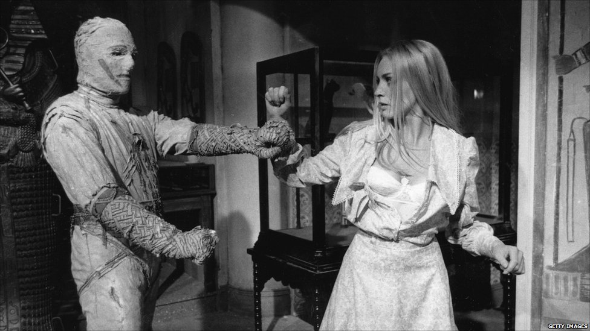

*English summary: To avoid getting stuck in one's worldview, I propose four heuristics. They consist of not identifying with one's thoughts, trying to prove oneself wrong, paying attention to surprises and inspecting events that "push one's buttons".*

Max Planckin kerrotaan sanoneen, ettei uusi tieteellinen totuus syrjäytä edeltäjäänsä saamalla vanhan käsityksen kannattajat siirtymään puolelleen, vaan siten, että sen vastustajat ennemmin tai myöhemmin kuolevat. Erityisesti fiksut ihmiset pystyvät järkeilemään ennakkokäsityksiään uhanneen tiedon joko hömpäksi tai omaa alkuperäistä käsitystään vahvistavaksi, mutta säilyttävät silti kuolevaisuutensa. Ja näin tiede etenee – yhdet hautajaiset kerrallaan.

On helppo kuvitella, kuinka ihmiset vanhetessaan kasvavat vastustuskykyisemmiksi uusille ajatuksille. Mitä pidemmälle erikoistuu, sen vahvemmaksi varmasti muodostuu epämukavuus omaa käsitystä tukemattoman todistusaineiston edessä. Tuntuu pahalta ottaa askelia taaksepäin, kun on juuri ollut pääsemässä johonkin – meissä kaikissa asuu pieni muumio, jonka tehtävänä on suojella nykyistä maailmankuvaamme ympäröivää aarrekammiota.

 Älä anna muumioiden määrätä elämästäsi! [kuvalähde: LEE VING 1977 image gallery]Rakkaista, mutta toimimattomista ajatuksista täytyy kuitenkin voida päästää irti. On muistettava, että suurin osa uutisista on täysin merkitystä vailla vuoden päästä (poislukien Matti Nykänen). Suurin osa yritysten ja valtioiden pitkän tähtäimen strategioista näyttää harhaisilta viiden vuoden päästä (Neuvostoliitto yritti 13 kertaa). Ja suurin osa mullistaviksi uumoilluista keksinnöistä on unohdettu kymmenen vuoden kuluttua (kysy mistä tahansa patenttitoimistosta). Tänään tehdyt ennustukset ovat harvinaisen usein jo huomenna homeessa.

Toimintaympäristömme ja sen vaatimukset muuttuvat jatkuvasti. Ajattelu onkin pidettävä tuoreena käyttämättä sellaisia säilöntäaineita, jotka jymähdyttävät sen nykytilaansa.

Oma reseptini luovan tietotyön maailmasta, kiteytettynä neljään peukalosääntöön:

**1. Älä samaistu ajatuksiisi.** Pidä ideoita mieluummin noutopöytänä, josta voi mutustella eri makuja, kuin osana minuuttasi.

**2. Yritä todistaa olevasi väärässä ja palkitse itsesi onnistuessasi.** Mikä olisi vaihtoehtoinen selitys? Mikä olisi kaukaa haettua, mutta tärkeää jos totta? Löydätkö sille todistusaineistoa?

**3. Pysähdy hetkeksi, kun huomaat yllättyväsi.** Onko tapahtunut vain sattuman oikku, vai kaipaako maailmankatsomuksesi päivitystä?

**4. Kiinnitä huomiota siihen, kun ärsyynnyt tai vihastut.** Hermostuitko sinä vai sisäinen muumiosi, jonka rauhaa häirittiin?

[alkuperäinen versio artikkelista julkaistu myös Status-lehden numerossa 1/2013]
