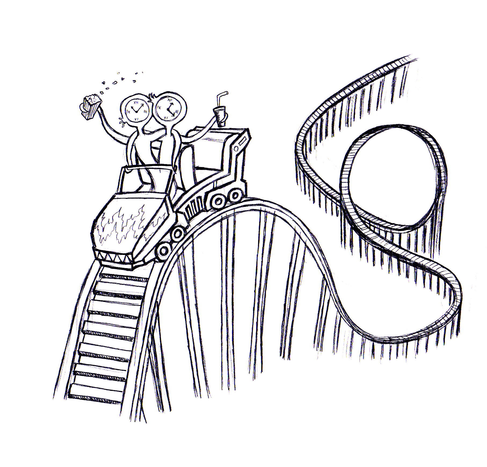

*English summary: I'm often baffled by some implications of [pessimistic (meta-)induction](https://plato.stanford.edu/entries/scientific-realism/#PesInd). There's this eerie feeling that Future Me is looking at Current Me in the same way, as the Current Me rolls his eyes to Past Me. There's a case to be made for compassion towards the past versions of ourselves, as well as past societies that have preceded ours.*
En tiedä teistä, mutta oma menneisyyden minäni on ollut melkoinen hölmöläinen. Naiivi paskiainen, joka on tai ei ole tiennyt, mikä itselleen ja muille on parhaaksi, muttei ainakaan ole osannut toimia sen mukaisesti. Nykyisyyden minäni tietenkin tietää paremmin ja hänellä on tapana katsoa menneisyyden minääni päätään pyöritellen. Olen tietenkin iloinen, että nykyisyyden minä on fiksumpi kaveri kuin menneisyyden minä, mutta herää kysymys: mitä tulevaisuuden minä ajattelee nykyisyyden minästä? Ja entäs sitten, kun katsomme *nykyisyyden yhteiskunnan* silmin *menneisyyden yhteiskuntaa* ja mietimme *tulevaisuuden yhteiskunnan* ajatuksia molemmista?
 Kuva: Ismo Pitkänen
On olemassa filosofinen näkökulma (nk. pessimistinen metainduktio), jonka mukaan hienot teoriat ihmiskunnan historiassa ovat aina jossain vaiheessa osoittautuneet vääriksi – emme enää usko sellaisiin intuitiivisiin itsestäänselvyyksiin, kuten eetteriin avaruuden täyttäjänä tai flogistoniin tulen polttoaineena. Miksi meillä siis olisi syytä uskoa, että yhteiskunnassa tai omassa päässämme tosina pidetyt ajatukset olisivat sen enempää totta, kuin mitä olivat aikaisempien sukupolvienkaan käsitykset?
Oli toiveikkuuteen perusteita tai ei, haluaisin tulevaisuuden minäni ajattelevan, että nykyisyyden minä tekee parhaat päätökset sen tiedon valossa, mitä hänellä on. Samaan tapaan haluaisin oppia katsomaan menneisyyden minääni siltä kantilta, että tällä oli tietty määrä valoa päässään ja tämän valon avulla hän teki parhaat mahdolliset päätökset.
Voisiko samanlaisella lempeydellä katsoa ihmiskuntaa, jolle on kaikissa historian vaiheissa mitä todennäköisimmin menneisyyden yhteiskunta näyttäytynyt hölmöläisten kylänä? Vaikka usein ”leikillään” sanotaankin, että ennen kaikki oli paremmin, kyse on yleensä vain hyvien asioiden muistelusta kun huonot puolet ovat unohtuneet. En usko, että mikään yhteiskunta tarkoituksella tekee asioita huonommin kuin voisi ja suurin osa ihmisistä varmasti mielestään toimii parhaalla mahdollisella tavalla. Ehkä meidän pitäisikin tuntea enemmän empatiaa menneisyyden olioita kohtaan.
 Kuva: Ismo Pitkänen
Mikä tärkeintä, meidän olisi voitava katsoa niin itseämme, kuin nykyistä yhteiskuntaammekin tämän myötätunnon linssin läpi - luultavasti parhaillaan tulevaisuuden minä ja tulevaisuuden yhteiskunta katsovat meitä kulmiaan kohotellen. Siksi olisi syytä suhtautua vähemmän tosissaan siihen, minkä ”tiedämme todeksi” ja suuremmalla armolla niitä kohtaan, joiden väärässä olosta olemme varmoja.
Vai oletko eri mieltä?
*Alkuperäinen juttu julkaistu Status-lehden numerossa 2/13.*
