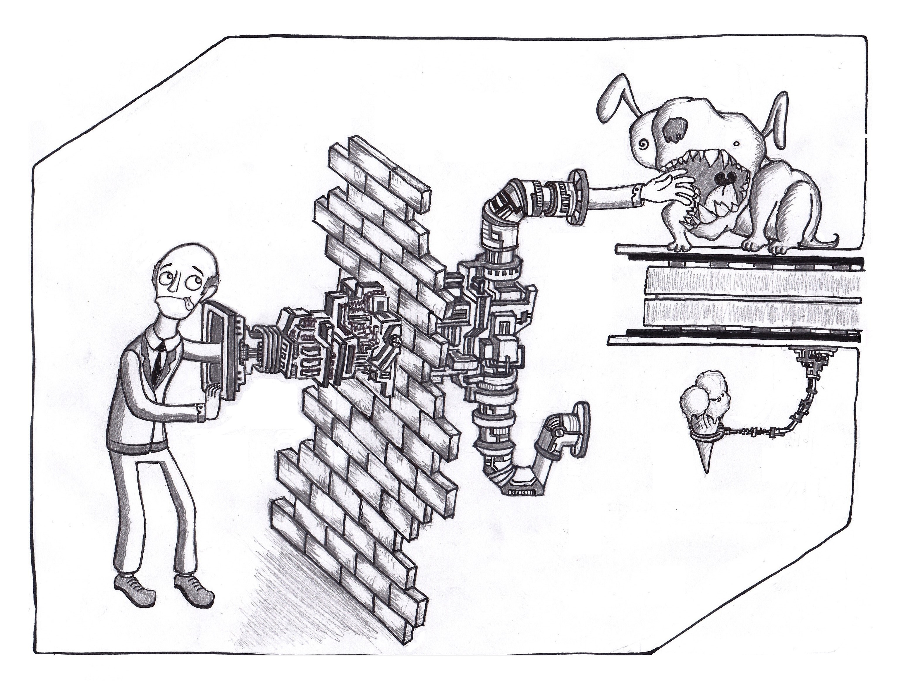

*English summary: To manage living in an uncertain world, there's a threefold technique also summarised [here](http://www.epmchannel.com/wp-content/uploads/2012/05/MIT-Why-Forecasts-Fail-and-What-to-Do-Instead.pdf) (see reading list in the end of this post for more on the subject). A quote to follow: "By all means make forecasts — just don't believe them".*

Vuonna 2011 satuin ostamaan työmatkojen ratoksi audiokirjakauppa Audiblen alennusmyynneistä Leonard Mlodinowin kirjan nimeltä The Drunkard's Walk: How Randomness Rules Our Lives. Kirja ihmetytti, hengästytti sekä aiheutti pitkän ketjun lukuelämyksiä (ml. Nassim Talebin provosoivat [opukset](http://www.penguinrandomhouse.com/series/INO/incerto)) ja muita tapahtumia, jotka lopulta johtivat muun muassa tilastotieteestä innostumiseen (tästä ehkä lisää toiste), tohtoriopintoihin ja myös siihen, että sinä tällä hetkellä luet tätä tekstiä.

Kuten jokainen yrittäjä ja onnettomien romanssien jälkeen upean kumppanin löytänyt henkilö tietää, satunnaistapahtumilla on elämiimme valtava vaikutus. Toisaalta tämä tarkoittaa, ettei ole mahdotonta, että huominen tuo mukanaan kaiken pilaavan katastrofin – toisaalta taas asiat voivat myös muuttua parempaan. Mistä tiedämme, mitä tulee tapahtumaan?

Inhottavaa on, että me emme yksinkertaisesti tiedä. Positiivista on, että meidän ei välttämättä tarvitsekaan tietää.

 Ei se mitään, ensi kerralla suojakäsineen kanssa! Kuva: Ismo Pitkänen

Kirjassaan Dance with Chance ([kirjan idea tiivistettynä](http://www.epmchannel.com/wp-content/uploads/2012/05/MIT-Why-Forecasts-Fail-and-What-to-Do-Instead.pdf "Why Forecasts Fail. What to Do Instead. - MIT Sloan Management Review")) kolme alansa huippua – päätöksenteon tutkija, tilastotieteilijä ja psykologi – pyrkivät vastaamaan kysymykseen "Miksi ennusteet epäonnistuvat, ja mitä tehdä niiden sijasta?". He ehdottavat kolmiosaista taktiikkaa, jonka olen suomentanut vapaalla kädellä Hyväksy–Arvioi–Laajenna (HAL) -taktiikaksi.

## 1. Hyväksy tulevaisuuden epävarmuus

Runoilija John Keatsin lanseeraamalla termillä *[negatiivinen kyvykkyys](http://en.wikipedia.org/wiki/Negative_capability "Negative capability - From Wikipedia, the free encyclopedia")*nimitetään taitoa elää epävarmuuksien keskellä;  hyväksyä epävarmuus ilman jatkuvaa tarvetta kuvitella, että tiedämme tulevaisuudesta enemmän kuin todellisuudessa voimmekaan tietää. Sillä vaikka mitä uskottelemmekaan itsellemme, emme olisi voineet vuosikymmen sitten ennustaa meille myöhemmin tapahtuneita asioita.

Henkilökohtaisesti olen hyötynyt mindfulness-harjoittelusta epävarmuuden hyväksymisen taidon kehittämisessä.

## 2. Arvioi epävarmuuden laajuus

Ilmaise epävarmuus määrällisesti: pohdi mielessäsi mahdollisia tulevaisuuksia ja määritä, mikä on 95%n todennäköisyydellä pahimman ja parhaimman skenaarion välinen ero (toisin sanoen, olisit oikeassa 95 kertaa sadasta, tai 19 kertaa 20:sta). Yritä päästä mahdollisimman lähelle tuota 95%:a, et hyödy mitään arvioimalla yrityksesi saavan ensi vuonna nollasta miljoonaan uutta asiakasta (mikä voisi olla totta esim. 99,9999% todennäköisyydellä).

## 3. Laajenna arviotasi

Päätöksenteon tuloksia tutkittaessa on havaittu, että paras arviomme siitä, mitä 95%:a mahdollisista tapahtumista pitää sisällään, menee yleensä metsään. Siksi kuilu todennäköisen parhaimman ja huonoimman skenaarion välillä pitääkin vielä kertoa kahdella (tai ei ainakaan alle 1,5:llä). Jos olet arvioinut, että 95% todennäköisyydellä tienaat kolmen vuoden päästä vaikka 1500– 2500 euroa kuussa, suunnittele sen varalle, että tienaisit mitä tahansa tuhannen ja kolmen tuhannen euron välillä. Jos olet arvioinut, että talosi (tai säästöjesi) arvo 20 vuoden kuluttua on välillä 300 000 - 325 000 euroa, laajenna arviotasi esim. välille 290 000 – 340 000 ja varaudu siihen.

Tämän lisäksi kannattaa miettiä, voiko jokin äärimmäisen epätodennäköinen tapahtuma totaalisesti tuhota sinut ja voiko (tai kannattaako) siihen varautua. Asuntokuplien puhkeaminen, työttömyys, sota ja pörssiromahdukset tapahtuvat harvoin odotetusti. Haluat ehkä hajauttaa sijoituksiasi ja vakuuttaa itsesi sairauden varalle, mutta meteori-iskuun lienee turha varautua. Huomioi myös, että mitä pidemmälle ajassa yrität katsoa, sitä epävarmemmaksi arvio muuttuu.

## Yhteenveto

Johtopäätöksenä voitaneen sanoa, että elämän ennustaminen ei ole mahdollista, maailma on luonteeltaan epävarma ja *se on pohjimmiltaan hyvä asia*. Epävarmuus tarkoittaa muutoksen pysyvyyttä, mikä taas tarkoittaa, että **a)** hämmästyttävät onnenpotkut ovat mahdollisia ja **b)** on ylipäätään vain neljä mahdollista tilannetta: ***1)*** asiat pysyvät samana, ***2)*** asiat menevät huonompaan, ***3)*** asiat paranevat, ***4)*** joku edellämainittujen yhdistelmä. Kohta *1)* on menneisyyden huomioonottaen äärimmäisen epätodennäköinen, ja muista kohdista ei voi etukäteen tietää. Ainoa, mitä on tehtävissä, on valmistautuminen - tässä tulee apuun HAL-taktiikka.

Lopuksi kannattaa muistaa, että arvelut tulevaisuudesta ovat aina arvauksia ja vaikka ne olisivatkin välttämättömiä, ei pidä unohtaa niihin liittyvää epävarmuutta. Kuten aiemmin mainitsemani tutkijat asian ilmaisevat; "By all means make forecasts — just don't believe them".

### Kirjallisuutta:

- Spyros Makridakis, Robin Hogarth & Anil Gaba – [Dance with Chance](http://knowledge.insead.edu/strategy/the-illusion-of-control-dancing-with-chance-2218 "Tekijöiden tietoa kirjasta"): Making Luck Work For You
- Leonard Mlodinow – [The Drunkard's Walk](http://www.theguardian.com/books/2008/jul/12/saturdayreviewsfeatres.guardianreview4 "Arvio Guardianissa"): How Randomness Rules Our Lives

- Nassim Nicholas Taleb – [Fooled by Randomness](http://en.wikipedia.org/wiki/Fooled_by_Randomness "Wikipedia"): The Hidden Role of Chance in Life and in the Markets (suom. Satunnaisuuden hämäämä: Sattuman salattu vaikutus elämässä ja markkinoilla). [The Black Swan](http://en.wikipedia.org/wiki/The_Black_Swan_%282007_book%29 "Wikipedia"): The Impact of the Highly Improbable (suom. Musta joutsen: Erittäin epätodennäköisen vaikutus). [Antifragile](http://en.wikipedia.org/wiki/Antifragile:_Things_That_Gain_from_Disorder "Wikipedia"): Things That Gain from Disorder (suom. Antihauras: Asioita, jotka hyötyvät epäjärjestyksestä).
