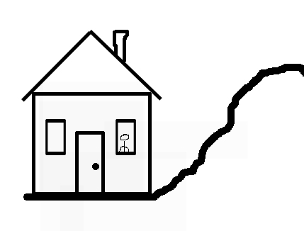
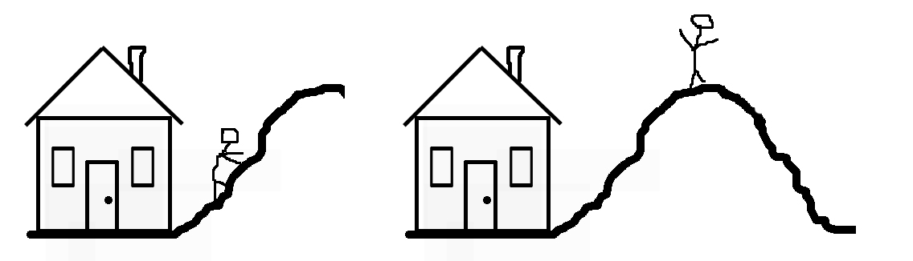
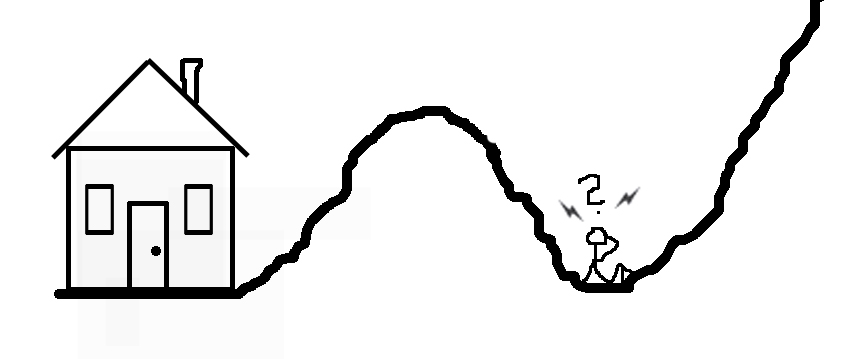

Toisistaan näennäisesti riippumattomien osaamisalueiden yhdistelyn hengessä vietin toissaviikonlopun biologien kestitsemänä Lammilla. Aika biologisella asemalla vinksautti ajatusmaailmaani mukavasti, ja haluaisinkin kirjoittaa hieman henkilökohtaisesta kasvusta [adaptiivisen maiseman](http://fi.wikipedia.org/wiki/Adaptiivinen_maisema "Wikipedia: Adaptiivinen maisema") (fitness landscape) käsite löyhästi lähtökohtanani.

Kuvitellaan aluksi, että asut tyytyväisenä vinopiippuisessa mökissäsi. Tähän tapaan:

Ajatellaan seuraavaksi, että haluat (esimerkiksi nälän, kyllästymisen tai uteliaisuuden ajamana) kiivetä läheiselle huipulle. Oletetaan lisäksi, että mitä korkeammalle maastossa pääset, sitä paremmassa asemassa olet ympäristöön nähden. Toisin sanoen, elämäsi on sitä mukavampaa ja turvallisempaa, mitä korkeammalle pääset. Kiipeät siis kukkulalle:

Tavoitteesi on täyttynyt ja olet parantanut olosuhteitasi roimasti. Olet saavuttanut niin sanotun *paikallisen maksimin*; mikä tahansa muutos (ainakin lyhyellä tähtäimellä) heikentää asemiasi, ja vaikuttaa siten hölmöltä liikkeeltä. Oletetaan kuitenkin seuraavaksi, että jokin sattumasta aiheutuva vastoinkäyminen, kuten Adam Smithin [näkymättömän käden](http://dictionary.reference.com/browse/invisible+hand) rystysten isku paukauttaa sinut mukavuusalueeltasi.

Olet jälleen lähtötasollasi, mutta nyt huomaat edessäsi olevan entistä korkeamman huipun. Sinulla on nyt kolme vaihtoehtoa: jää makaamaan kuoppaan, palaa aiemmalle huipulle (jonka maksimikorkeuden jo kokemuksesta tiedät) tai lähde kiipeämään uudelle huipulle. Mikäli sinulla on kanttia ja resursseja, selkeä valinta on tuntematon huippu, jonka oletat olevan vähintään yhtä korkea kuin entinen.

Ajatellaan, että pääset seuraavalle huipulle ja prosessi toistuu; joskus saatat vastoinkäymisen sijaan omasta uteliaisuudestasi johtuen vieriä tarkoituksella alas huipulta, mutta koskaan et etukäteen tiedä varmuudella, onko seuraava huippu yhtä korkea kuin edellinen, tai jaksatko edes kavuta sille. Oletetaan nyt koko paikallinen maisema tällaiseksi (kokonaiskuva on luonnollisesti itsellesi tuntematon missä tahansa yksittäisessä maaston kohdassa):

Ajatus selviytymismaastosta yhdistettynä tosimaailmaan sallii meidän tekevän muutaman käyttäytymisarkkitehtonisen johtopäätöksen:

## 1. Ei kannata pysyä paikallaan.

Tosimaailman maastolla on sellainen raivostuttava ominaisuus, että se muuttuu jatkuvasti: on äärimmäisen hankalaa löytää jotain tiettyä huippua, joka vuodesta toiseen pysyisi samanlaisena. Muutos on pysyvää.

## 2. Ainoa tapa vastata itse liikkeistään on monipuolistuminen.

Mitä enemmän sinulla (tai vaikka organisaatiollasi) on erilaisia tapoja vastata ympäristön haasteisiin, sitä vähemmän olet altis toimintaympäristön oikuille. Kyseessä on tavallaan Ashbyn "[tarpeellisen vaihtelun laki](http://rossdawsonblog.com/weblog/archives/2012/08/the-law-of-requisite-variety-why-flexibility-and-adaptability-are-essential-for-success.html "The law of requisite variety: Why flexibility and adaptability are essential for success")". Esimerkiksi katutappelussa on hyvä olla vähintään yhtä monta keinoa puolustautua kuin hyökkääjällä on keinoja hyökätä. Tai jos oman alan töitä ei enää ole (olemassa), on hyvä osata jotain muutakin ja niin edespäin. Yleisesti: mitä vähemmän olet joustava, sitä enemmän olet ympäristön oikkujen armoilla — ja olet sitä joustavampi, mitä useampia tapoja sinulla on vastata ko. oikkuihin.

## 3. Jos sinun on mahdollista varautua, varaudu.

Aavikkoa ei voi ylittää, ellei joko ole todella taitava löytämään vettä tai kanna mukanaan ylimääräisiä vesileilejä. Ja aavikon ylittäminen tulee harvemmin ajankohtaiseksi ennalta tiedossa olevan aikataulun mukaisesti.

Lopuksi vielä hyvä kysymys säännöllisesti itseltä kysyttäväksi: *olenko jumiutunut paikalliseen maksimiin*?
