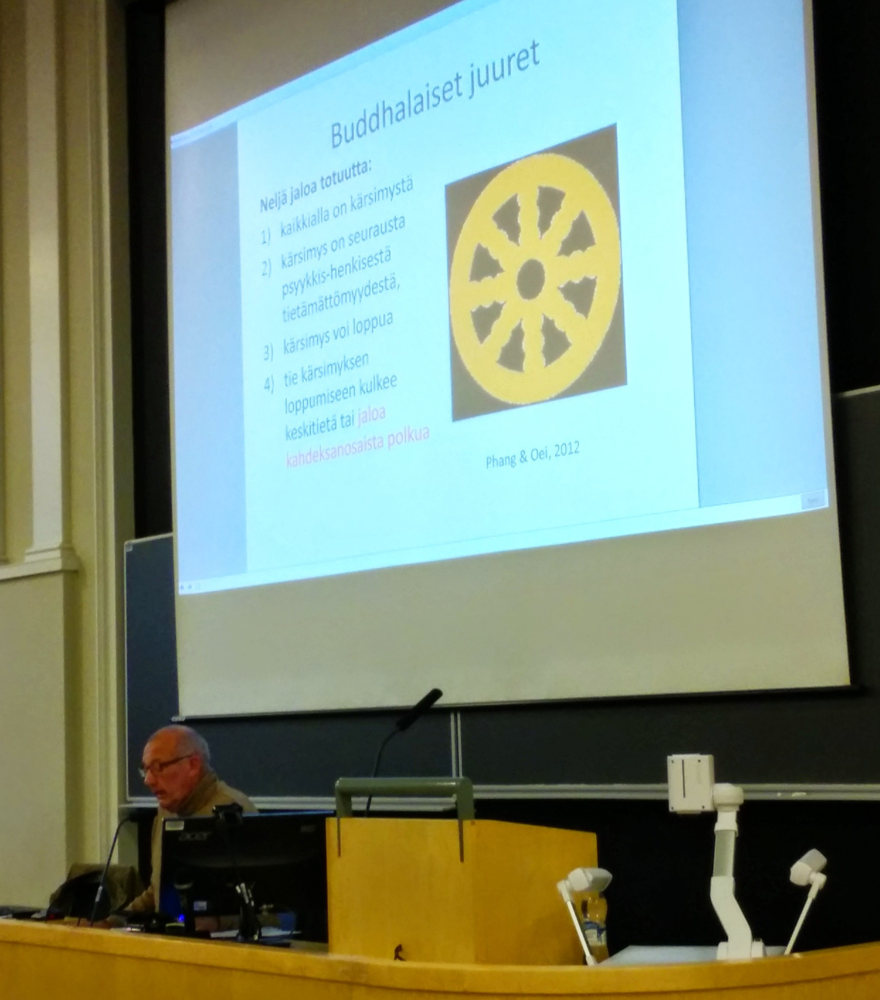

[*huomio työpaikoilla blogia lukeville: teksti ei vaadi videoiden katsomista]*

Osallistuin tänään Helsingin Avoimen yliopiston positiivisen psykologian kurssin [mindfulnessia](http://fi.wikipedia.org/wiki/Tietoisuustaito "http://fi.wikipedia.org/wiki/Tietoisuustaito") käsittelevälle luennolle. Luento itsessään oli poikkeuksellisen monipuolinen, ja sen herättämä keskustelu vahvisti ajatustani tämän kirjoituksen tarpeellisuudesta.

Sanottakoon aivan ensiksi, että olen harrastanut meditaatiota/mindfulnessia viimeiset 15 vuotta muodossa tai toisessa ja viimeiset viitisen vuotta päivittäin; en siis pidä sitä millään muotoa puhtaana roskana tai ajanhukkana. Kuitenkin tapa, jolla aiheesta mediassa puhutaan, on suosion kasvun myötä sukeltanut sameisiin (ja pahanhajuisiin) syvyyksiin. Nostan havainnollistavaksi esimerkiksi tämän videopätkän, joka kiteyttää monta ongelmaa:

<iframe src="https://www.youtube-nocookie.com/embed/FAcTIrA2Qhk" title="YouTube video" loading="lazy" allow="accelerometer; autoplay; clipboard-write; encrypted-media; gyroscope; picture-in-picture; web-share" allowfullscreen></iframe>

## 1. "Tiede käskee meditoimaan"

Väitteiden näennäisestä varmuudesta huolimatta tutkimusperinne on varsin nuorta, mistä johtuen ovat tutkimuksetkin pääosin niin pieniä, ettei niiden luotettavuudesta todellisuudessa voi sanoa juuta tai jaata. Yksi tärkeä ongelma on julkaisuharha: tilastollisesti merkitsevät tulokset päätyvät julkaistuksi ja ne tutkimukset, joissa vaikutusta ei löytynyt, vaipuvat unholaan. Toki vaikutuksista on paljon näyttöä, mutta vasta aika paljastaa todellisuuden ja uusilla väitteillä on tieteessäkin tapana olla [yliampuvia](http://dcscience.net/ioannidis-associations-2008.pdf "Why Most Discovered True Associations Are Inflated"). Eräässä uudehkossa [meta-analyysissa](http://www.thementalelf.net/mental-health-conditions/anxiety-disorders/new-meta-analysis-supports-the-use-of-mindfulness-for-depression-but-not-anxiety/ "New meta-analysis supports the use of mindfulness for depression, but not anxiety") todettiin, ettei harjoittelulla ollut vaikutusta verrattuna aktiiviseen kontrolliryhmään ([mikä se on ja miksi se on tärkeää huomioida](https://www.facebook.com/sp.uutisryhma/photos/pb.198021276902148.-2207520000.1406697485./565072106863728/?type=1 "Sosiaalipsykologinen uutisryhmä: Paremman Tieteen Perävalot 15.9.2013")), vaikka hyötyjen puolesta voidaankin varmasti argumentoida verratessa mindfulnessin ja terapian kustannusvaikuttavuutta.

Myöskään yhteys neuropsykologisen tutkimuksen löydöksistä käytännön vaikuttavuuteen ei ilmaannu väläyttelemällä hienojen yliopistojen nimiä (tilastollinen merkitsevyys [ei ole yhtä](http://www.med.uottawa.ca/sim/data/Statistical_significance_importance_e.htm "http://www.med.uottawa.ca/sim/data/Statistical_significance_importance_e.htm") kuin käytännön merkittävyys). Tämä on [tunnettu](http://www.deirdremccloskey.com/docs/jsm.pdf "The Cult of Statistical Significance") ongelma, eikä mitään "x oli suurempi/parempi meditoijilla kuin kontrolliryhmällä" -mallista väitettä voi arvioida kysymättä *kuinka paljon suurempi tai parempi,* sillä ero voi olla varsin mitätön.

## 2. "Meditaatiolla ei ole haittavaikutuksia"

Kun mindfulness ja meditaatio revitään irti siitä filosofisesta kontekstista, jossa ne ovat syntyneet, saattaa syntyä [vakavia seurauksia](http://www.theatlantic.com/health/archive/2014/06/the-dark-knight-of-the-souls/372766/ "For some, meditation has become more curse than cure. Willoughby Britton wants to know why. ").

<iframe src="https://player.vimeo.com/video/70483499" title="Vimeo video" loading="lazy" allow="autoplay; fullscreen; picture-in-picture" allowfullscreen></iframe>

Aihepiiriin on paneutunut Willoughby Brittonin tutkimusryhmä projektissa nimeltä "Varieties of Contemplative Experience" (ent. Dark Night Project), jonka [löydökset](http://vimeo.com/18819660 "http://vimeo.com/18819660") pitävät sisällään ajatteluun (minuuden rakenteen hajoaminen, epämiellyttävät hallusinaatiot, vaikeudet keskittyä tai orientoitua ympäristöön, muistiongelmat), tuntemiseen (paniikki, pelkotilat, mania, mielialan heilahtelut) ja kehoon (kiputilat, ei-tahdonalaiset liikkeet) liittyviä ongelmia.

Tutkimusryhmän kartoittamat vastoinkäymiset esiintyivät pääasiassa pitkään ja/tai hyvin intensiivisesti meditoineilla, oireiden keston vaihdellessa noin kuudesta kuukaudesta kahteentoista vuoteen. Tärkeänä huomiona oireet vaikuttivat olevan sitä lyhytaikaisempia, mitä enemmän kontaktimahdollisuuksia niistä kärsivällä oli ilmiöitä tunteviin ohjaajiin. Niin sanottuun mietiskelyn polkuun liittyviä vaikeuksia pidetään asiaankuuluvina buddhalaisessa kirjallisuudessa, mutta niistä puhuminen on tabu länsimaisessa taikapillerikulttuurissa.

Mm. meditaation haittavaikutuksiin perehtynyt tutkija Willoughby Britton. Lähde: Learnboard.

## 3. "Meditaatio on helppo polku menestykseen, onnellisuuteen ja terveeseen elämään"

Olet kenties kuullut väitettävän, kuinka "kaikki nämä huipputason ihmiset meditoivat, koska tietävät sen olevan tehokasta". Kyseessä on ns. ad populum -harha, jonka kohdatessaan kannattaa muistaa, ettei siitä niin pitkään ole, kun huippu-urheilijat Tour de Francessa [vetivät pikaiset sauhut](https://mattiheino.com/wp-content/uploads/2014/10/a8326-smokerstdf.jpg "Bicyclists smoking before Tour de France hills (to \"prepare\" their lungs).") ennen ylämäkeä valmistaakseen keuhkonsa koitokseen. Ihmiset tekevät paljon tyhmiä juttuja ja meditaatio nyt siinä mielessä lienee fiksuimmasta päästä, mutta kuten [täällä](http://blogs.helsinki.fi/hema/plasebojoiku/ "Käyttäytymisarkkitehtuuri: Suunnistusta lumeen ja riskien näreikössä") väitin, mikään ei ole ilmaista (ja "kattotarkastelun" tuloksia oman elämän asiayhteydessä kannattaa kuunnella).

Alun videossa povataan meditaatiosta seuraavaa terveysvallankumousta ja ennustetaan sen liittyvän mm. liikunnan ja lääkkeiden syömisen joukkoon asioina, joiden tekemättä jättäminen tulee *saamaan olon tuntumaan syylliseltä*. Minulla ei ole mitään terveyskäyttäytymisen muuttamista vastaan – päin vastoin, työskentelen tälläkin hetkellä parempien tapojen luomiseen pyrkivässä sosiaalipsykologisessa interventioprojektissa – mutta minua kylmää tällainen massavelvollistuttaminen. Jos liikut tasaisesti hereilläoloaikana (mm. keskeyttäen [istumisen](http://apps.washingtonpost.com/g/page/national/the-health-hazards-of-sitting/750/ "The Washington Post: The health hazards of sitting") vähintään puolen tunnin välein), et välttämättä tarvitse lenkkeilyä. Lääkkeiden syöminenkin monesti liittyy itse luomiimme elämäntapasairauksiin. Minua huolettaa se, miten voi hyvinkin olla, että ihmiset suorittavat itsensä piippuun ja sitten pyrkivät "fiksaamaan" tai "hackaamaan" kurjuuttaan meditaatiolla, säilyttäen muun elämänsä ennallaan. Samaan tapaan kuin kuntosaliohjelmien kanssa; ensin luodaan ongelma ja sitten kaupallistetaan siihen laastari (ns. [McMindfulness](http://www.huffingtonpost.com/ron-purser/beyond-mcmindfulness_b_3519289.html "http://www.huffingtonpost.com/ron-purser/beyond-mcmindfulness_b_3519289.html")-ilmiö).

 Dosentti Juhani E. Lehto kertomassa mindfulness-tutkimuksesta Helsingin Avoimen yliopiston positiivisen psykologian luennolla. Huomaa, kuinka kontekstia ei ole unohdettu.

Kuten alussa mainitsin, en väitä että meditaatio olisi ajanhukkaa; suosittelen sitä ystävilleni, harjoitan sitä päivittäin ja kerään myös tietoa sen vaikutuksista itseeni. Muistutan kuitenkin, että vaikka olen mindfulness-"liikkeen" kannalla (ainakin kunnes todistusaineisto vaatii minua muuttamaan mielipiteeni), kaikilla asioilla on myös toinen puoli. Meditoi siis, jos voit ja koet sen toimivaksi, mutta älä tunne tuskaa jos se ei ole oma juttusi. On hyödyllisempää suhtautua siihen elämää tasapainottavana taukona kuin kaiken mullistavana ihmeenä. Joka tapauksessa mindfulness on muutakin kuin vaalea nainen risti-istunnassa rantaresortilla.
