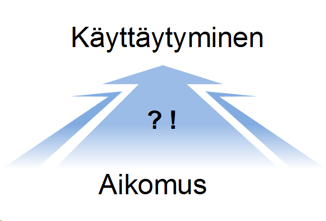
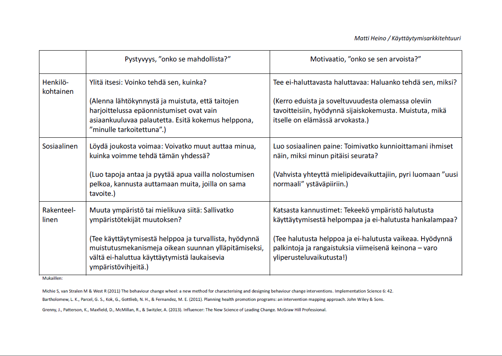

*Kirjoitus pohjautuu sosiaalipsykologian päivillä 2014 terveyden ja hyvinvoinnin työryhmässä pidettyyn esitelmään.*
Tuhansien self help -opusten väitteistä huolimatta, käyttäytymisen muuttaminen on usein pirullisen hankalaa. Sitä ei tee helpommaksi se, että pelkästään tutkijat ovat luoneet ainakin [83 erilaista muutosteoriaa](http://www.behaviourchangetheories.com/ "http://www.behaviourchangetheories.com/")  ja jokainen kirjan kirjoittanut ei-tutkija on enemmän tai vähemmän onnistunut luomaan omansa. Alla kuvailen Muutoskartaksi kutsumaani prosessia, jota olen soveltamisen helpottamiseksi pyrkinyt yksinkertaistamaan niin paljon, kuin toimivuuden säilyttäminen on sallinnut.

## Taustaa

Muutosteoriat pääosin jakavat käyttäytymisen muutoksen kahteen vaiheeseen: ennen aikomusta muuttaa käyttäytymistä ja muutosaikeen jälkeen. Esittelemäni prosessi keskittyy jälkimmäiseen, pyrkien jossain määrin myös vaikuttamaan siihen kuiluun, joka niin usein estää hyvien aikeiden toteutumisen.
Mitä aikeiden toteutuminen sitten vaatii? Niin kutsutun COM-B -mallin mukaan käyttäytymisellä on kolme edellytystä: fyysinen ja henkinen kyky (Capability), tilaisuus (Opportunity) ja halu sen toteuttamiseen (Motivation). Jos jokin näistä puuttuu, hankaloituu käyttäytyminen huomattavasti.
Lisäksi konstruaalitasoteorian mukaan, mitä lähempänä jokin asia on, sitä käytännöllisemmin siihen suhtaudutaan – vastaavasti kaukaisempia asioita ajatellaan abstraktimmin. Tätä hahmottaa jaottelu kysymysten "miten teen jotain" (suuri konkretia, läheiset asiat) ja "miksi teen jotain" (pieni konkretia, kaukaiset asiat) välillä. Yksi etäisyyden mitta on aika: on yleensä vähemmän stressaavaa ajatella tekevänsä jotain ensi viikolla kuin heti seuraavana aamuna. Ilmiöllä on hyvät ja huonot puolensa: toisaalta voimme päätyä kuvittelemaan ratkaisevamme ongelmamme "sitten joskus" ja näin varmistaa niiden pysyvyyden kuten Homer alla. Toisaalta voimme myös huijata laiskaa nykyisyyden mieltämme tekemään muutossuunnitelman Tulevaisuuden Minän toteutettavaksi.
[embed]https://www.youtube.com/watch?v=jQvvmT3ab80[/embed]
Juoni on kolmivaiheinen.

## 1. Menneisyyden Minän kohtaamat esteet

Ensimmäisessä vaiheessa pohditaan, mitkä asiat ovat estäneet Menneisyyden Minää toteuttamasta aietta (jos kyseessä on jotain, mitä ei ole koskaan yrittänyt, tämä vaihe on tarpeeton tai sen voi korvata arvauksilla tulevasta). Alla oleva kartta havainnollistaa, miten COM-B -mallin elementtien voi ajatella asettuvan elinympäristöömme. Sosiaalisella tarkoitetaan kaikkea muihin ihmisiin liittyvää ja rakenteellisella kaikkea passiivista, automatisoitua, ympäristön rakenteisiin liittyvää.

Jos otamme esimerkiksi viikottaisen kuntosalikäyntikertojen lisäämisen, saattaisimme ajatella näin:

1. Henkilökohtainen kyvykkyys: väsymys on saanut tuntumaan siltä, ettei vain kykene lähtemään salille.
2. Henkilökohtainen motivaatio: muut asiat ovat olleet tärkeämpiä ja ei ole jäänyt aikaa salilla käymiseen.
3. Sosiaalinen kyvykkyys: pomo on halunnut, että jään myöhään töihin ja näin kuntoilulle varaamani aika on mennyt ohi.
4. Sosiaalinen motivaatio: mieluummin olen istunut kaverien kanssa ravintolassa.
5. Rakenteellinen kyvykkyys: sali on kaukana kotoa, laajentaen treenin vaatimaa aikaikkunaa ja täten vähentäen treenimahdollisuuksia.
6. Rakenteellinen motivaatio: lähteminen vaatii niin paljon sumplimista, että se tuntuu erityisen hankalalta.

## 2. Tulevaisuuden Minän strategiat

Toisessa vaiheessa ideoimme muutokset, joilla Tulevaisuuden Minä nujertaa ensimmäisessä vaiheessa tunnistamamme esteet. Vaihe asettuu kartalle samoin kuin edellinen, vain kysymysten vaihtuessa:

Voisimme ohjeistaa Tulevaisuuden Minäämme toimimaan esimerkiksi näin:

1. Henkilökohtainen kyvykkyys: laita puhelimeen hälytys iltakymmeneltä muistuttamaan, että olisi aika aloittaa nukkumaanmenovalmistelut. Unen määrä lisääntyy ja virkeämpänä on helpompi ajatella treeniä.
2. Henkilökohtainen motivaatio: listaa hyötyjä, joita saat liikunnasta (esim. energisyys, hyvä olo, parantunut aivoverenkierto). Kirjoita nämä ylös ja laita lappu johonkin treenivaatteiden läheisyyteen – kun on aika valita salille lähtemisen ja jonkin muun aktiviteetin välillä, sitoudu katsomaan lappua ennen kuin teet päätöksen.
3. Sosiaalinen kyvykkyys: harjoittele tapoja kieltäytyä ylitöistä, tai mieti vaihtoehtoisia liikuntamuotoja (esim. lenkkeily), joita voit tehdä mikäli alkuperäinen suunnitelma kariutuu.
4. Sosiaalinen motivaatio: pyydä ystävää treenikaveriksi ja sovi ajat etukäteen. Näin kynnys jättää harjoittelu väliin nousee.
5. Rakenteellinen kyvykkyys: hanki kotiin liikuntavälineitä (esim. kahvakuulat) ja kerro itsellesi, että voit lopettaa vartin jälkeen jos fiilis ei ole kohdallaan.
6. Rakenteellinen motivaatio: pakkaa treenivaatteesi valmiiksi edellisenä iltana näkyvälle paikalle, josta voit ottaa ne mukaan ulos lähtiessäsi. Näin kynnys lähtemiseen alenee.

 Vinkkiliuska osa-alueiden läpikäyntiin (klikkaa suuremmaksi).
Oheisessa vinkkiliuskassa on yleislaatuisia ohjeita eri osa-alueiden läpikäyntiin. Kun tämä vaihe on käyty läpi, meillä on ainakin yksi strategia (käyttäytyminen) jokaisessa kuudesta lokerosta ja voimme siirtyä seuraavaan kohtaan.

## 3. Suunnitelma: mitä, missä, milloin?

Viimeisessä vaiheessa on aika luoda edelliseen vaiheeseen pohjaava konkreettinen suunnitelma. Tässä kohtaa on fiksua noudattaa klassista SMART-periaatetta, jonka mukaan hyvät tavoitteet ovat 1) **S**elkeästi määriteltyjä (mitä-missä-milloin), 2) **M**itattavissa (tiedät jostain saavuttaneesi tavoitteen), 3) **A**ikaan sidottuja (tiedät, mihin mennessä tavoite saavutetaan), 4) **R**elevantteja itselle (tiedät, miksi tavoite on tärkeä) ja 5) **T**oteutettavissa.
 Odysseus valjastamassa rakenteita tahdonvoiman sijaan (Wikimedia Commons).
On syytä varmistaa että ainakin yksi 2. vaiheen käyttäytymisistä tulee toteutumaan SMART-suunnitelman avulla – kaikkea ei yleensä voi tehdä. Pyri siis muuttamaan yksi lokero kerrallaan. Yleisenä peukalosääntönä käyttäytymistä muuttaessa kannattaa pyrkiä ennemmin muuttamaan rakenteita kuin luottamaan tahdonvoimaan.

## Lopuksi

Käytännössä rakenteisiin luottaminen tahdonvoiman sijaan tarkoittaa sitä, että sitoudumme tulevaisuudessa tapahtuviin muutoksiin tässä ja nyt (lisää esim. [Zen Habits -blogissa](http://zenhabits.net/impossible/ "http://zenhabits.net/impossible/")). Varoituksen sanana muistettakoon [*suunnitteluharhana*](http://en.wikipedia.org/wiki/Planning_fallacy "http://en.wikipedia.org/wiki/Planning_fallacy") tunnettu ilmiö, jossa aliarvioimme asioiden vaatiman panostuksen ja päädymme työllistämään Tulevaisuuden Minämme hermoromahduksen partaalle.
Iloisia suunnitteluhetkiä!
 Suunnitteluharha. Kuva: 2dayblog.com
Lähteitä ja lukemistoa:
Michie S, van Stralen M & West R (2011) The behaviour change wheel: a new method for characterising and designing behaviour change interventions. Implementation Science 6: 42.
Bartholomew, L. K., Parcel, G. S., Kok, G., Gottlieb, N. H., & Fernandez, M. E. (2011). Planning health promotion programs: an intervention mapping approach. John Wiley & Sons.
Trope, Y., & Liberman, N. (2010). Construal-level theory of psychological distance. Psychological review, 117(2), 440.
Grenny, J., Patterson, K., Maxfield, D., McMillan, R., & Switzler, A. (2013). Influencer: The New Science of Leading Change. McGraw Hill Professional.
