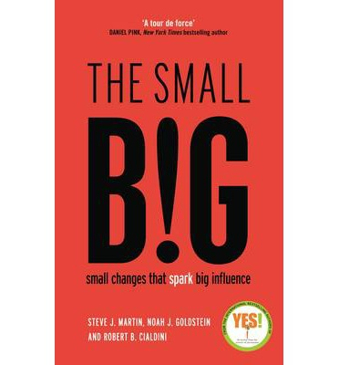

Luin pitkästä aikaa kasan käyttäytymisen muuttamista koskevia populaaripsykologisia opuksia. Näihin kuului tutkijoiden kirjoittama "[The small BIG: small changes that spark big influence](http://www.bookdepository.com/Small-Big-Noah-Goldstein/9781781252741)", turvallisuusasiantuntijan "[Social Engineering: The Art of Human Hacking](http://www.bookdepository.com/Social-Engineering-Christopher-Hadnagy/9780470639535)" ja myynti-/markkinointikonsultin "[Maximum Influence: The 12 Universal Laws of Power Influence](http://www.bookdepository.com/Maximum-Influence-Mortensen/9780814472583)". Kirjoissa pyrittiin mahdollisimman suureen käytännönläheisyyteen ja odotetusti yksinkertaistettiin tutkimustuloksia, tulkittiin luovasti niiden tuloksia ja ylihypetettiin eri tekniikoiden vaikuttavuutta. Kahdessa viimeisessä kuitenkin silmään pisti se, että kirjoittajat kertoivat kirjojen sisällön hyödyntämisen kuuluvan heidän päivittäiseen työhönsä, kasvokkain tapahtuvissa sosiaalisissa kohtaamisissa.

  
Social Engineering- ja Maximum Influence-kirjoissa erityisesti korvaan räsähtivät NLP-piireistä tutut vaikuttamistekniikat, jotka tutkimuksissa noudattavat pitkälti perinteistä hälytyskelloja soittavaa kaavaa: mitä laadukkaampi tutkimus, sitä pienempi vaikutus. Mutta jos tekniikat perustuvat heikkoon päättelyyn ja eivät tosiasiassa toimi, miksi kirjoittajat kokevat niiden toimivan niin hyvin omassa elämässään?
Tähän auttaa ....
Aristoteles päätti noin 350 eaa., että painavammat asiat putoavat kevyempiä nopeammin. Ja yli 1500 vuotta tähän uskottiin, koska se oli järkeenkäypä väittämä (ja, tietenkin, koska Aristoteles).
Kokeilujen haitoista roskatiede-blogissa: http://roskatiede.wordpress.com/2014/12/30/mita-haittaakaan-siita-olisi-jos-kokeilisit/
Maximum influence -kirjassa tutkimuksen tulkintaa: ne, jotka satunnaisesti saivat esseistään hyviä arvosanoja, olivat entistä jyrkempiä esittämissään mielipiteissä. Kun taas saivat satunnaisesti valittuna huonon arvosanan, olivat mielipiteissään epävarmempia. Selitys: kiitollisuus auttaa vahvistamaan käytöstä.
 
Barnum-vaikutus sanoo, että xx. Ihmiset haluavat kuulla, että heidän ajatuksensa vetävät asioita puoleensa (kts. Rhonda Byrne ja mielestäni skientologiaan verrattavissa oleva The Secret-kultti), että yrityksen saa menestymään yksinkertaista reseptiä noudattaen (kts. kaikki, mitä liiketaloudesta on kirjoitettu) – että samankaltaisella reseptillä voi saavuttaa pysyvän onnellisuuden. Erityisesti usein näkee kerrottavan, että sattumoisin myös tiede (kvanttifysiikka XKCD embed) tukee kaikkia näitä asioita.
 
Science of …
touch
empathy
social connections
 
On mielenkiintoista ajatella, kuinka ihmiselle elämän tiettynä hetkenä jonkin kirjan lukeminen voi tuottaa valtavan ahaa-elämyksen, kun taas toisessa tilanteessa tai myöhemmin elämässä sama asia voi tuntua pilaantuneelta, “hitto mitä hömppää”. Itselleni näin on käynyt kaiken paitsi kaikkein vanhimman kirjallisuuden kanssa.
