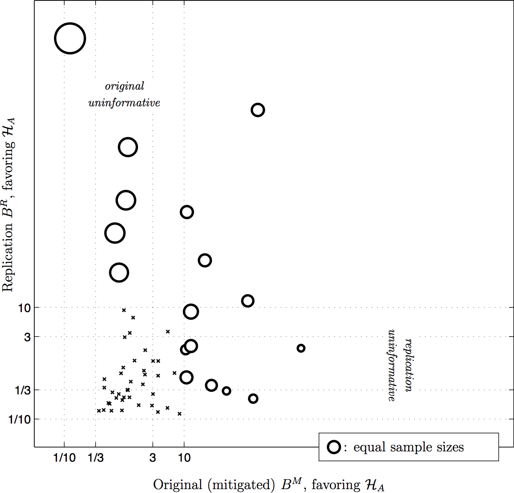
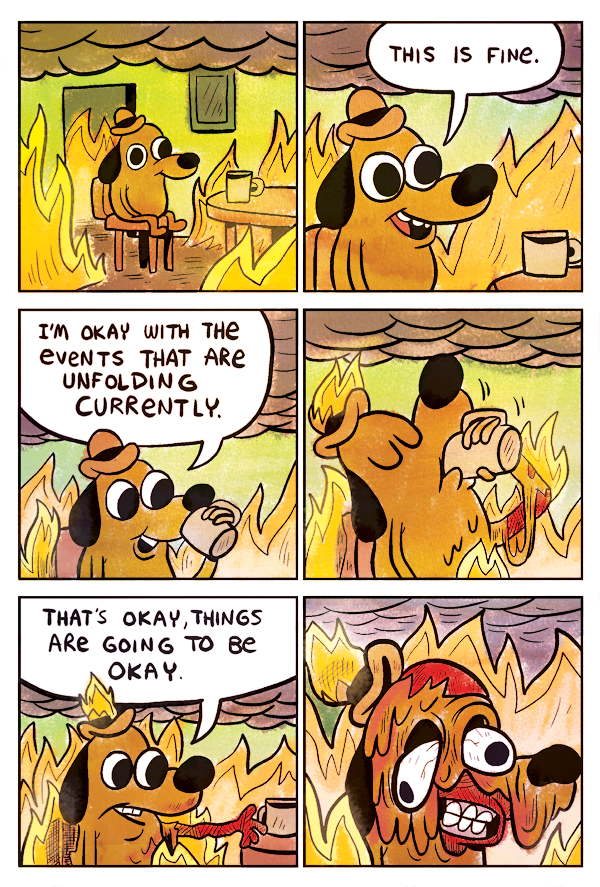
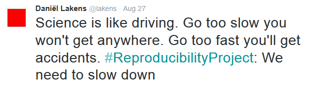
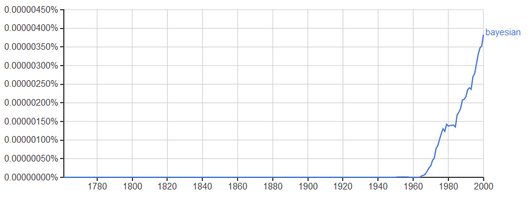
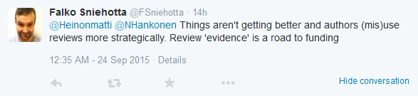
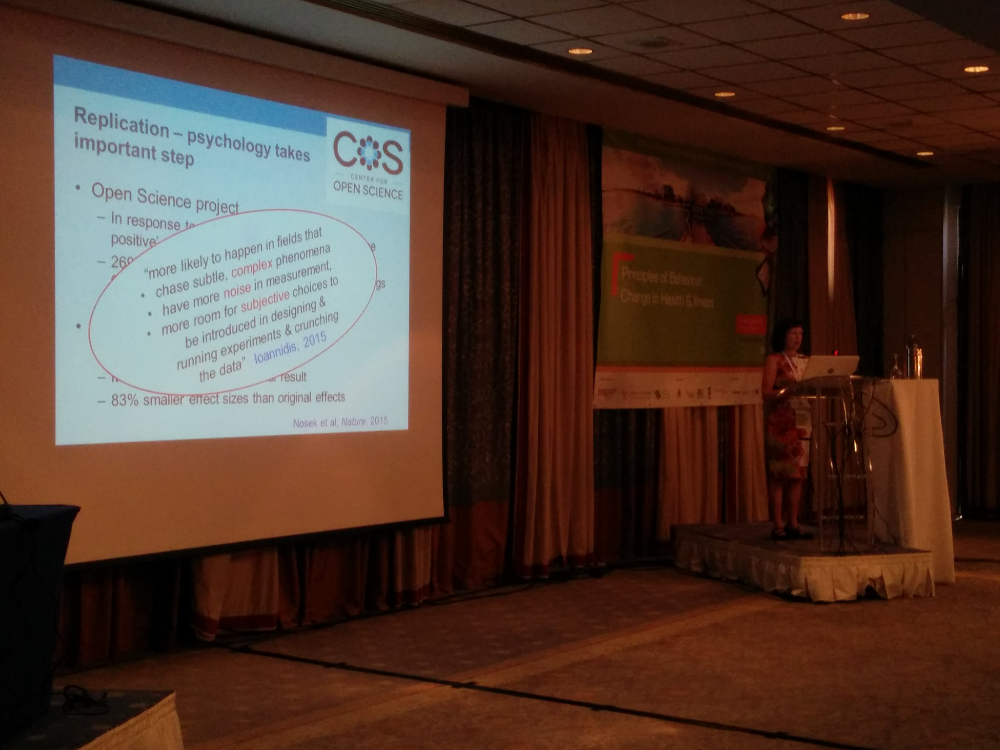

[Update 6. March 2016: new figure for the Bayesian RP:P + some minor changes]
The first thing you need to know about practical science is that it is not a miraculous (or often, even awesome) way to learn about the world. As put in the excellent blog [Less Wrong](http://lesswrong.com/lw/ajj/how_to_fix_science/), it is just *the first set of methods **that isn't totally useless*** when trying to make sense of the modern world. Although [problems](http://www.vox.com/2015/5/13/8591837/how-science-is-broken) are somewhat similar in all sciences, I will focus on psychology here.
One of the most important projects in the history of psychology was published in the journal [Science](http://www.sciencemag.org/content/349/6251/aac4716) in the end of August. In the "Reproducibility Project: Psychology", 356 contributors tried to re-do 100 studies published in high-profile psychology journals (all in 2008). (You can download the open data and see further info [here](https://osf.io/ezcuj/wiki/home/).) Care was taken to mimic the original experiments as closely as possible, just with many more participants for increased reliability.
The results? Not too flattering: the effects in the replications were only about half as big as in the original studies. [Alexander Etz](https://twitter.com/alxetz) provides an informative summary in this figure from this [blog](http://alexanderetz.com/2016/02/26/the-bayesian-rpp-take-2/) about a recent paper:
 If Bayes Factor (B) is somewhere between 1/10 and 10 (or, for example 1/3 and 3, if you have less strict evidence standards), you can't make confident conclusions. Most of the replicated studies (the ones on the lower left corner) never contained much information in the first place!
The number of "successes" in different fields of psychology depends on how you count and what you include (for example, what you think counts as social or cognitive psychology). For social psychology, the success rate of replication was **somewhere between 8%** (3 out of 38; by [Replication Index](https://replicationindex.wordpress.com/2015/09/03/comparison-of-php-curve-predictions-and-outcomes-in-the-osf-reproducibility-project-social-psychology-part-1/)) **and 25%** (14 out of 55; the paper in Science). Even conceding that the scientific method is not perfect, as referred to in the beginning, this was not what I expected to see.
My thoughts and beliefs often torment the hell out of me, so I've learned to celebrate when they turn out to be false. Thus, I ended up informing people at Helsinki University's discipline of social psychology by replicating a "Friday-cake-for-no-reason" from a month earlier by one awesome colleague:
 Behold; the Replicake!
The messenger cake worked well in Helsinki, but unfortunately the news were too bitter a dish to many. The results raised several confused reactions from psychologists who refused to believe the sorry state of status quo. I like the term "hand-wringling" as a description, the loudest arguments being (in no specific order):
 Don't just sit there, go make the world a better place!

1. The replicators didn't know what they were doing.
2. The studies replicated weren't representative of the actual state of art.
3. This is how science is supposed to work, no cause for alarm!
   1. ... because some fields are doing even worse (e.g. replicability of cancer biology may be just [10%-25%](https://osf.io/e81xl/wiki/home/), economics ~[49%](http://www.federalreserve.gov/econresdata/feds/2015/files/2015083pap.pdf), psychiatry less than [40%](http://bjp.rcpsych.org/content/207/4/357) etc.)
   2. ... because non-replications are a part of the self-correcting nature of science.

Andrew Gelman [answers these points](http://andrewgelman.com/2015/09/02/to-understand-the-replication-crisis-imagine-a-world-in-which-everything-was-published/) eloquently, so I won't go much deeper into them. Note also, that Daniel "Stumbling on Happiness" Gilbert & co. used these arguments in their much publicised (but unhappily, [flawed](https://hardsci.wordpress.com/2016/03/03/evaluating-a-new-critique-of-the-reproducibility-project/)) critique of the psychology's replication effort.
Suffice it to say that I value practicality; claiming there is a phenomenon only you can show (ideally, when no-one is looking) doesn't sound too impressive to me. What worries me is this: science is supposed to embrace change and move forward with cumulative knowledge. Instead, researchers often take their favourite findings to a bunker and start shouting profanities to whoever wants to have a second look.
> Researchers take their favourite findings to a bunker and start shouting profanities to whoever wants to have a second look.

I think anyone who's seen the Internet recognises the issue. Personally, I find it hard to believe that arguing can change things, so I'd rather see people exemplify their values by their actions.
Sometimes I find consolation in Buddhist philosophy, so here are some thoughts maybe worth considering when you need to amp up your cognitive flexibility:

## 1. "You" are not being attacked.

Things are non-self. Just as wishing doesn't make winning the lottery more likely, a thought of yours that turns out to be ill-informed doesn't destroy "you". Your beloved ideas, whether they concern the right government policy, the right way to deal with refugees or the right statistical methods in research, may turn out to be wrong. It's okay. You can say you don't know or don't expect your view to be the final solution.
When [Richard Ryan](https://en.wikipedia.org/wiki/Richard_M._Ryan) visited our research group, I asked him when does he expect his [self-determination theory](http://www.selfdeterminationtheory.org/) to die. The answer was fast: "When it gets replaced by a higher-order synthesis". He had thought about it and I respect that.

## 2. The business of living includes stress, but it's worse if you cling to stuff.

Wanting to hold on to things you like and resist things you don't is normal, but takes up a lot of energy. You might want to try not gripping so hard and see if it makes an actual difference in how long the pleasures or displeasure lasts. So; if your ideas are under fire, take a moment to think about what life would be without whatever it is being threatened.
One of the big ideas in science is that we need big ideas. And, of course, big ideas are exciting. The problem is that most ideas – big or small – will turn out to be wrong and if we don't want to be spectacularly wrong, we might want to take small steps at a time. As [Daniel Lakens](https://twitter.com/lakens), one of the authors of the reproducibility project, put it:

## 3. Nothing will last (and this, too, will pass – but the past will never return).

Although calls for change in research practices have been made for at least half a century, this time the status quo is currently going away fast. It might be a product of the accelerating change we see in all human domains. It's impossible to predict how things end up, but change isn't going away. What you can do, is to try create the *kind* of change that reflects what you think is right.
For an example in research, take statistical methods, where the [insanity](http://www.dcscience.net/Colquhoun-2015-chalkdust.pdf) of the whole "p<0.05 -> effect exists" approach has become more and more common knowledge in the recent years. Another change is happening in publishing practices; we are no more bound by the shackles of the printing press, which did serve science well for a long time. This means infinite storage space for supplements and open data for anyone to confirm or elaborate upon another researcher's conclusions. Of course, the traditional publishing industry isn't that happy about seeing their dominance crumble. But in the end, they too must change to avoid the fate of (music industry) dinosaurs in this [NOFX-song](https://www.youtube.com/watch?v=_Ahc-oEFQ7k) from 15 years ago.
 Change in action: Mentions of "Bayesian" in the English literature since the death of rev. Thomas Bayes in 1761. Click for source in Google Ngram. For an intro to Bayesian ideas, check out [this](http://alexanderetz.com/understanding-bayes/) or [this](http://www.lifesci.sussex.ac.uk/home/Zoltan_Dienes/inference/Bayes.htm).

# Good research with real effects does exist!

The reproducibility project described above was actually not the first large-scale replication project in psychology. Projects called "Many Labs", where effects in psychology are tested with different emphases, are just now beginning to bear fruit:

- [Many Labs 1](https://osf.io/ebmf8/) (over 6 000 participants; published fall 2014) picked 13 classic and contemporary effects and managed to replicate 10 consistently. Priming studies were found hard to replicate. Interestingly the fact that most psychology studies are conducted on US citizens didn't have much of an effect.
- [Many Labs 2](https://osf.io/8cd4r/wiki/home/) (ca. 15 000 participants; expected on October 2015) studied how effects vary across persons and situations.
- [Many Labs 3](https://osf.io/csygd/) (around 3 500 participants; currently in press) studied mainly the so-called "semester-effects". As study participants usually are university students, it has been thought they might behave differently in different points of the semester. Apparently they don't, which is good news. The not-so-good news is that only three of the original 10 results was replicated.
- [Many Labs 4](https://osf.io/ph29u/wiki/home/) (in preparation phase) will study how replicator expertise affects replicability, as well as whether involving the original author makes a difference.

These projects definitely will increase our understanding of psychological science, although suffer from some limitations themselves (such as the fact that e.g. really expensive studies get less replication attempts for practical reasons).

# ... It's just really hard to tell what's real and what's not.

In the Cochrane Colloquium 2015, John "God of Meta-analysis" Ioannidis (the guy who published the 3000+ times cited [paper](http://www.ncbi.nlm.nih.gov/pmc/articles/PMC1182327/) *Why Most Published Research Findings Are False*) ended his presentation with a discouraging [slide](https://twitter.com/SarahChapman30/status/650934173759311872). He concluded that systematic reviews in biomedicine have become marketing tools with illusory credibility assigned to them.
The field I'm most interested in is health psychology. So when [one](https://twitter.com/FSniehotta) of the world's top researchers in the field tweeted that poorly performing meta-analyses are increasingly biasing psychological knowledge, I asked him to elaborate. Here's his reply:

[Susan Michie](https://twitter.com/SusanMichie) addressed the reproducibility problem in her talk at the annual conference of the European Health Psychology Society, with an emphasis on behavior change. She mostly addressed reporting, but [questionable research practices](https://www.authorea.com/users/2013/articles/31568/_show_article) are undoubtedly important, too.
 Susan Michie presenting in EHPS 2015. Click to enlarge.
This became clear in the very same conference, when a PHD student told me how a professor reacted to his null results: "Ok, send me your data and you'll have a statistically significant finding in two weeks". I have hope that young researchers are getting more savvy with methods and more confident that the game of publishing can be changed. This opens the door for fraudulent authority figures to exit the researcher pool like [Diederik Stapel](https://en.wikipedia.org/wiki/Diederik_Stapel) – by the hands of their students, instead of a failed peer-review process.
> "Ok, send me your data and you'll have a statistically significant finding in two weeks".
> – a professor's reaction to null results

# Conclusion

Based on all the above, here's what I think makes science worth the taxpayers' money:

1. Sharing and collaborating. Not identifying with one's ideas. Maybe openness to the possibility of being wrong is the first step towards true transparency?
2. Doing good, cumulative research [1], *even if it means doing less of it*. Evaluating eligibility for funding by the number of publications (or related twisted metrics) must stop. [2]
3. Need to study how things can be made better, instead of just describing the problems. **Driving change** instead of clinging to the status quo!

[1] The need for better statistical education has been apparent for [decades](https://www.google.fi/url?sa=t&rct=j&q=&esrc=s&source=web&cd=1&cad=rja&uact=8&ved=0CCMQFjAAahUKEwjo2bi8kLbIAhXnl3IKHbH7A10&url=https%3A%2F%2Fwww.apa.org%2Fpubs%2Fjournals%2Freleases%2Famp-54-8-594.pdf&usg=AFQjCNGOnY4SBuUkfqVA1L0r4JHc0E3mqg&sig2=A2F5605mh8xL9sWTyyagTA) but [not much has changed](https://osf.io/e9qbp/)... Until the 2010s.
[2] See [here](http://www.dcscience.net/2014/01/16/why-you-should-ignore-altmetrics-and-other-bibliometric-nightmares/) for reasoning. (Any thoughts on [this](https://replicationindex.wordpress.com/2014/12/01/quantifying-statistical-research-integrity-r-index/) alternative?)
