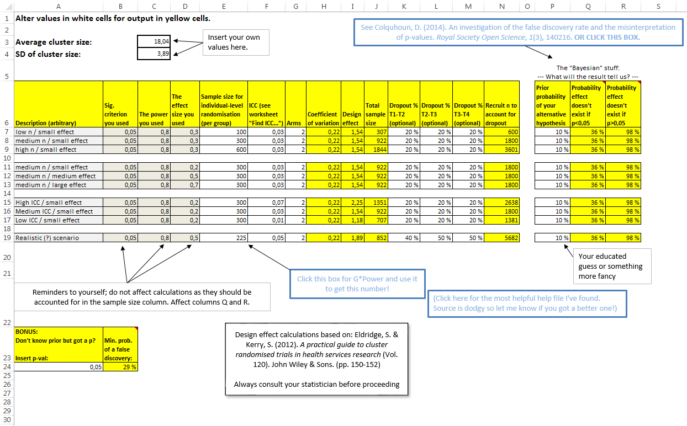
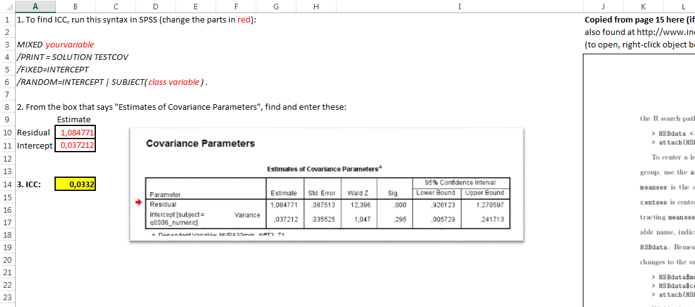
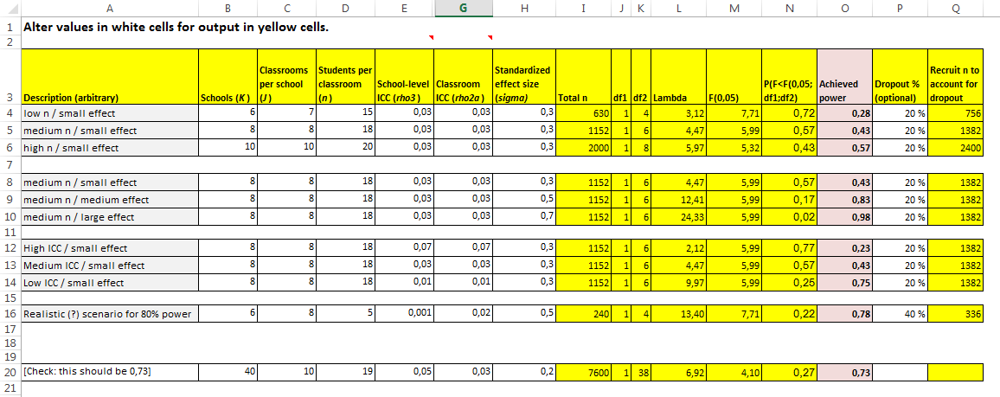

> In the right light, study becomes insight
> But the system that dissed us
> Teaches us to read and write
>
> - Rage Against The Machine, "TAKE THE POWER BACK"

[DISCLAIMER 1: THIS POST MAY CAUSE DEATH BY BOREDOM IF YOU'RE NOT INVOLVED WITH INTERVENTION RESEARCH DESIGN]

Statistical power is the probability of finding an effect of a specified size, *if* it exists. It is of critical importance to interpreting research, but it's amazing how little attention it has got in undergraduate statistics courses. Of course it can be argued, that up until recent years, statistics in psychology was taught by those who were effectively a part of the problem. I can't recommend enough this [wonderful summary](https://replicationindex.wordpress.com/2015/09/22/the-statistical-power-of-abnormal-social-psychological-research-a-revew-by-jacob-cohen/) of Cohen's classic article about how psychology failed to take it seriously in the 20th century.

This doesn't mean the problem is eradicated. In social psychology research, power still seems to be [less than 50%](https://replicationindex.wordpress.com/2015/09/15/replicability-ranking-of-100-social-psychology-departments/). It gets worse in neuroscience: the median power is estimated to be [around 20%](http://www.nature.com/nrn/journal/v14/n5/full/nrn3475.html). So, if an effect is real, you have a 1-in-5 probability of finding it with your test. If you still happen to find the effect, it most probably is grossly overestimated, because when an effect happens to look big just by chance, it crosses the p<0.05 threshold more easily. (See [paper](http://dcscience.net/ioannidis-associations-2008.pdf) by John Ioannidis; "Why Most Discovered True Associations Are Inflated".)

Once more: *if your study is underpowered, you* *not only fail to detect possible effects, but also get unrealistic estimates when you do*.

Recently, I've had the interesting experience of having to figure out how to do sample size calculations in a cluster-randomised setting. This essentially means that you're violating the assumption of independent observations, because your participants come clustered in e.g. classrooms, and people in one classroom tend to be more like each other than people in another classroom.

It also pretty much churns your dreams [of simple sample size specification] to dust.

That's probably the case, [Research Wahlberg](https://www.facebook.com/researchmark). But HOW MUCH more?! This intra-class correlation is killing me!

So, to make my life easier, I built a couple of Excel sheets that can be used by a simpleton like me. You can download the file from the end of this post. (note: the sheets contain "array formulas" that only work in Excel, so sadly no Openoffice version.)

I want to make it perfectly clear that I still know very little about power analysis (or anything else, actually) and made these as tools to help me out because my go-to statistician was too busy to give me the support I needed. Sources and justifications are provided, but it's not impossible these calculations are **totally wrong**.

I'm guessing your friendly neighbourhood statistician, too, would rather help "see if your calculations are correct" instead doing your calculations for you. So I'm hoping you can use this tool to estimate the sample size, then talk to a statistician and let me know if he says you have corrections to make :)

[DISCLAIMER 2: ALWAYS CONSULT A STATISTICIAN BEFORE MOVING FORWARD WITH CALCULATED SAMPLE SIZES]

# What's in the sheets

Here's what's in the file:

## 2-level cluster randomization: sample size aide

Use this sheet to calculate sample size for 2-level cluster randomization when you know power and a bunch of other stuff. Some links and guidance is included. Also includes two toys (the rightmost and the bottom yellow blocks) that give you optimistic estimates of whether your "discovery" is false. These are based on this [paper](http://rsos.royalsocietypublishing.org/content/1/3/140216). I highly recommend it if you want to make sense of p-values.

## Find the ICC (intra-class correlation) in SPSS and R

One of the big boogiemen, to me at least, of the whole enterprise was the intra-class correlation (apparently, often used synonymously with "intra-cluster" correlation). I jotted down instructions that I wish I had when I began meddling with this stuff.

## Power calculator for a 3-level cluster randomized design

Here's the dream crusher. In the "Justifications..."-sheet you'll find mathematical formulas and the logic behind the machine, but it's not super obvious for us mortals. I managed to make it work in Excel by combining pieces of code from all over the internet; I'm hoping you don't need to do the same.

Download the Excel-file **[HERE](https://mattiheino.com/wp-content/uploads/2015/10/power-for-cluster-randomisation_matti-heino_v151009-beta1.xlsx)**.

Have fun and let me know if you find errors! All other comments are of course welcome, too.
