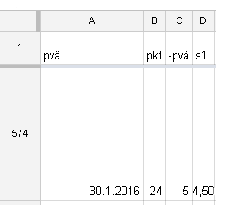
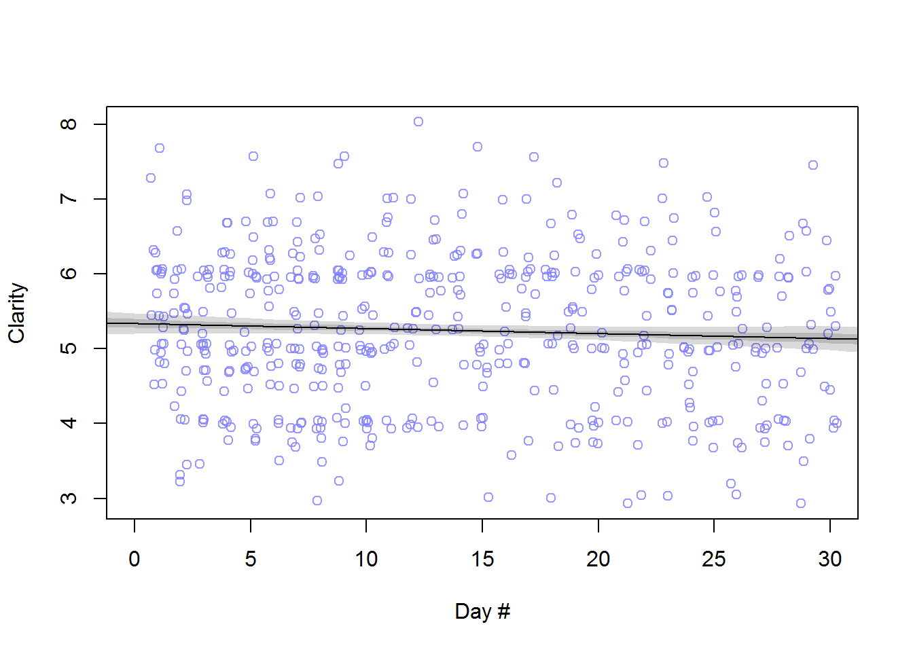
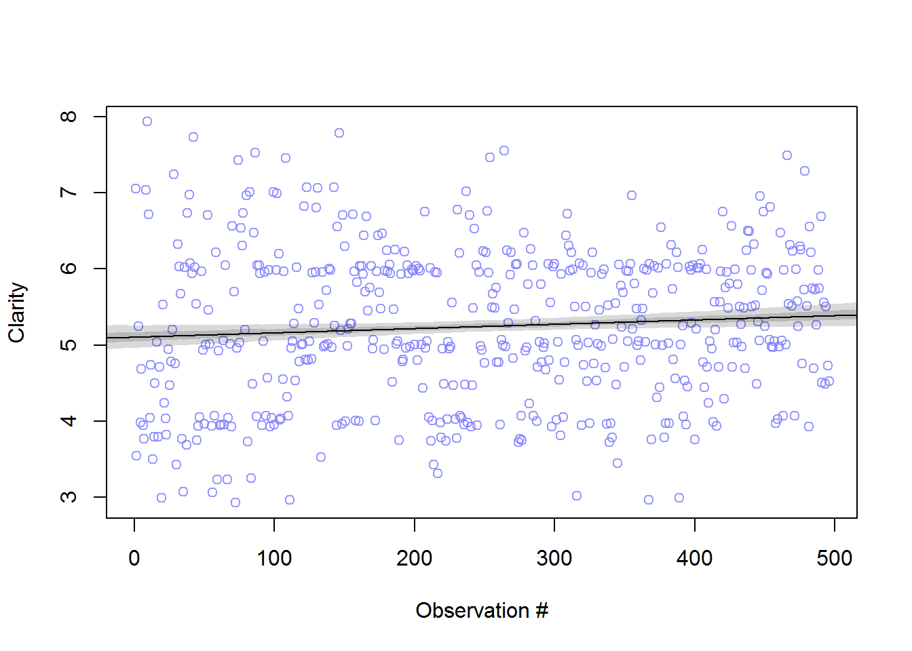

[Update: Short Twitter-discussion on the issue w/ Headspace's Andy Puddicombe [here](https://twitter.com/Heinonmatti/status/695005104706080768)]

*Quick summary: In this post, I evaluate the effect of the “anchoring heuristic” on my meditation data by dabbling with Bayesian(ish?) model fitting. I also find that my perceived clarity is not improving with time. I ask for your favourite explanations. Markdown code for the analysis can be found [here](http://rpubs.com/mattiheino/bias-meditation-clarity).*

For a while now, I’ve been collecting data to keep me motivated with my daily meditation practice. This is the first time I took a sneak peek into it, just to see how much my assessments depend on the so-called anchoring effect.

Roughly speaking, the anchoring effect is said to be a cognitive bias, where people base (“anchor”) their estimates on unrelated previous information. For example, in one classic study, people were asked for the proportion of African countries in the United Nations after spinning a wheel of fortune to obtain a random number. Those who got a big number guessed a high proportion, and those who got a low number went for a low proportion.

 This [app](https://www.headspace.com/) helped me develop a sticking meditation habit a couple of years ago.

My meditation practice is 120 minutes a day, broken down into a combination of 30/60/90 minute blocks. One of the 30 minute blocks is a 20 minute Headspace session (the extra 10 minutes come from the time it takes to feel out and log the variables I’m interested in).

This is how my spreadsheet begins every day. There are, in total, ~45 columns, including pre- and post-meditation assessments of calm, reaction times (Stroop test) etc. I'll write more about these if/when I find the time for analysis!

Column A is the date, column B is the “package”, or type of meditation, column C is the day within the package. There are 30 days per package, so column C is a number that runs from 1 to 30 for each package number. Finally, column D is my subjective sense of clarity, from 1 (completely unclear) through 5 (not clear nor unclear) to 10 (completely clear).

Now, because I jot down the clarity assessment right after the day number, I would expect higher day numbers to boost my clarity assessment because of the anchoring effect. Why? Because Kahneman, in his famous book [Thinking Fast and Slow](https://books.google.fi/books?id=ZuKTvERuPG8C&pg=PA57&hl=en&sa=X&ved=0ahUKEwjxls-DrNLKAhXCmHIKHU4ZCQEQ6AEIHTAA#v=onepage&q&f=false), proclaims:
> [D]isbelief is not an option. […] You have no choice but to accept that the major conclusions of these studies are true. More important, you must accept that they are true about *you*. **- Daniel Kahneman**

Without going too deep into the sorry state of replicability in priming effects ([anchoring seems robust, though](http://www.talyarkoni.org/blog/2013/12/27/what-we-can-and-cant-learn-from-the-many-labs-replication-project/)), let’s see how this particular effect may have affected my assessments:

**D’oh!** If anchoring was affecting my clarity assessment, the line in the plot should have gone up from left to right. It clearly does not.

[*In technical blahblah:* The plot above shows (slightly jittered) values for clarity for each day number and the Maximum A Posteriori (MAP) line. It’s basically linear regression with priors, and with this much data the priors don’t matter much. Darker shade hugging the line shows the 50% highest probability density interval (top 50% of most probable lines) and the lighter shade shows the 90% interval. Read more about priors [here](https://jimgrange.wordpress.com/2016/01/18/pesky-priors/) and learn everything you ever need to know about making inferences [here](https://www.youtube.com/playlist?list=PLDcUM9US4XdMdZOhJWJJD4mDBMnbTWw_z)]

I would have expected the slope of the line to be positive, maybe something like 0.15. Instead, the most credible (90%) interval for the slope of the line is from -0.0148 to 0.

## What if the magic hides in row numbering?

If you look again at the picture of my spreadsheet in the beginning of this post, you’ll notice that left to the date cell, there’s the row number. Perhaps **that’s** where I tend to anchor at?

So let’s see how clarity changes with the running number of the row:

**Yay!** At least now the slope is positive. Although, upon closer inspection, the 90% interval is from 0 to 0.0011. Which is pretty much zero.

**Another thing this plot reveals, is that my clarity assessment hasn’t gone up during the past 500+ days**. This might be because there has not been an effect (I wasn’t exactly a meditation newbie when I started). Alternatively, I may unconsciously keep shifting the scale (what I would have considered “clear” a year ago, now seems less so). What do you think?

And why am I not seeing an anchoring effect here, what am I missing?

Any thoughts?
