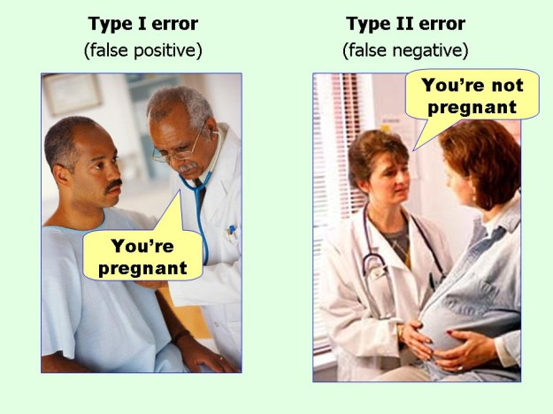
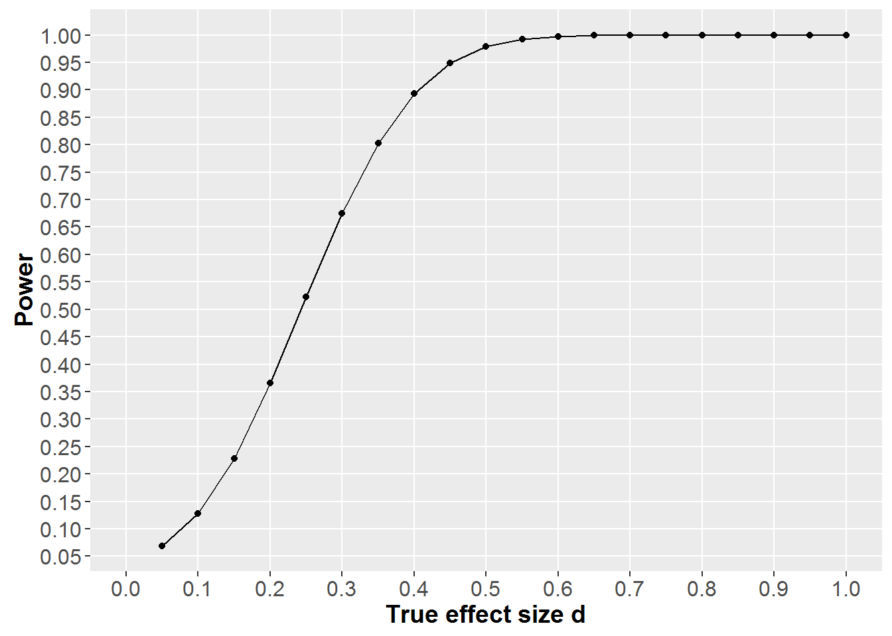
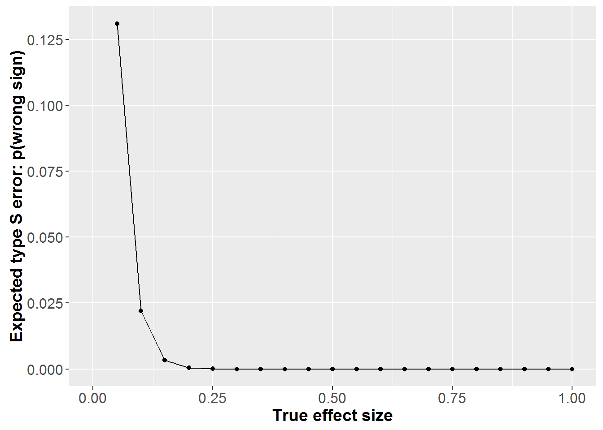
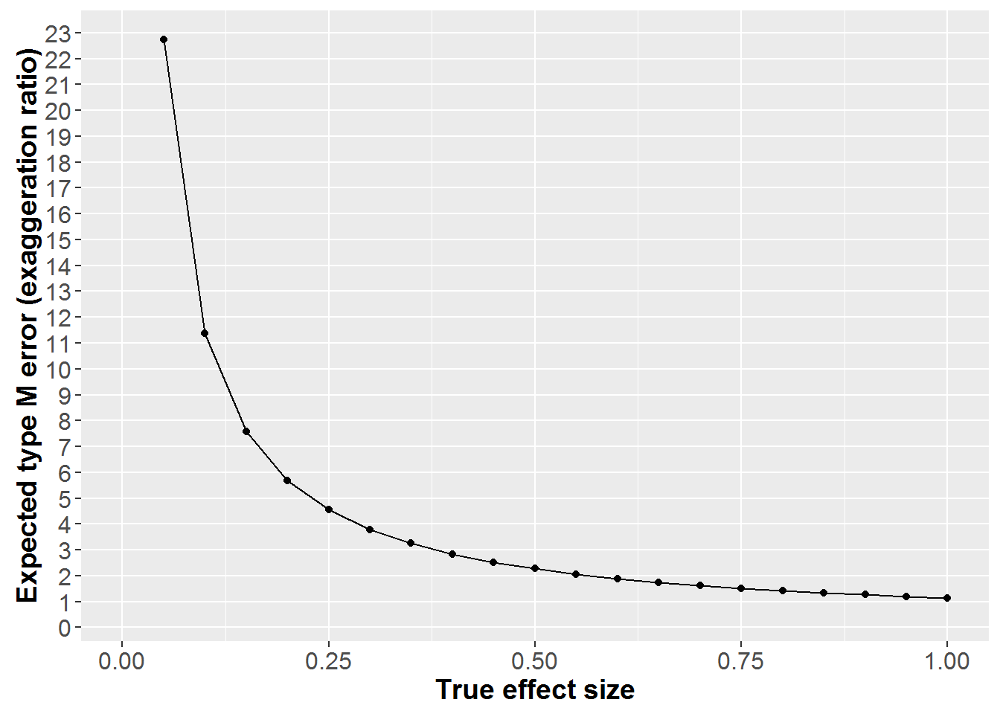
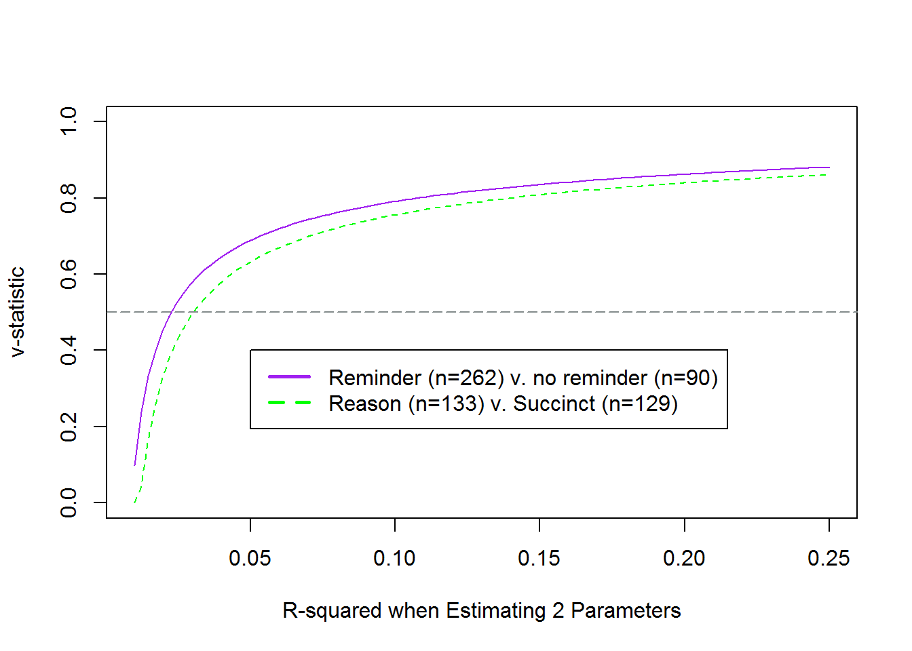

*In this post, I demonstrate how one could use Gelman & Carlin's ([2014](http://pps.sagepub.com/content/9/6/641)) method to analyse a research design for Type S (wrong sign) and Type M (exaggeration ratio) errors, when studying an unknown real effect. Please let me know if you find problems in the code presented [here](http://rpubs.com/mattiheino/design-analysis).*
**[Concept recap:]**
***Statistical power*** is the probability you detect an effect, when it's really there. Conventionally disregarded completely, but often set at 80% (more is better, though).
***Alpha*** is the probability you'll say there's something when there's really nothing, in the long run (as put by [Daniel Lakens](https://twitter.com/lakens/status/700322019271950337)). Conventionally set at 5%.
 Two classic types of errors. Mnemonic: with type 1, there's one person and with type 2, there are two people. Not making a type 2 error is called 'power' (feel free to make your own mnemonic for that one). Photo [source](http://blog.geekpress.com/2015_12_01_archive.html).

## Why do we need to worry about research design?

If you have been at all exposed to the [recent turbulence](http://mattiheino.com/2015/10/10/defeating-the-crisis-of-confidence-in-science-3-3-ideas/) in the psychological sciences, you may have bumped into discussions about the importance of a bigger-than-conventional sample sizes. The reason is, in a nutshell, that if we find a "statistically significant" effect with an underpowered study, the results are likely to be grossly overestimated and perhaps fatally wrong.
Traditionally, if people have considered their design at all, they have done it in relation to Type 1 and Type 2 errors. Gelman and Carlin, in a cool [paper](http://pps.sagepub.com/content/9/6/641), bring another perspective to this thinking. They propose considering two things:
Say you have discovered a "statistically significant" effect (p < alpha)...

1. How probable is it, that you have in your hands a result that's of the wrong sign?  Call this a Type S (sign) error.
2. How exaggerated is this finding likely to be? Call this a Type M (magnitude) error.

Let me exemplify this with a research project we're writing up at the moment. We had two groups with around 130 participants each, and exposed one of them to a message with the word "because" followed by a reason. The other received a succinct message, and we observed their subsequent behavior. Note, that you can't use the observed effect size to figure out your power (see this [paper](http://journal.frontiersin.org/article/10.3389/fpsyg.2014.00781/full) by Dienes). That's why I figured out a minimally interesting effect size of around d=.40 [defined by calculating the mean difference considered meaningful, and dividing the result by the standard deviation we got in a another study].
First, see how we had an ok power to detect a wide array of decent effects:

So, unless the (unknown) effect is smaller than what we care about, we should be able to detect it.

Next, above we see that the probability we would observe an effect of the wrong sign would be miniscule for any effect over d=.2. This would mean it'd look like the succinct message worked better than the reason message, when it really was the other way around. 
Finally, and a little surprisingly, we can see that even relatively large true effects would actually **be exaggerated by a factor of two**!
Dang.
But what can you do, those were all the participants we could muster up with our resources. An interesting additional point is brought by looking at the "v-statistic". This is the measure of how your model compares to random guessing. 0.5 represents coin flipping accuracy (see [here](http://daniellakens.blogspot.fi/2014/11/evaluating-estimation-accuracy-with.html) for full explanation and the original code I used).

Figure above shows how we start exceeding random guessing at R^2 around 0.25 (d=.32 according to [this](https://www.google.com/url?sa=t&rct=j&q=&esrc=s&source=web&cd=12&ved=0ahUKEwjfoNCDzarMAhXDXiwKHRTxBzAQFghKMAs&url=http%3A%2F%2Fwww.stat-help.com%2Fspreadsheets%2FConverting%2520effect%2520sizes%25202012-06-19.xls&usg=AFQjCNGGELYb6QFKz6K0uozfa41Yf5TOng&sig2=2Yoti8UQMX4B4L3QbJkB0Q&cad=rja)). The purple line is in there to show how an additional 90 people help a little but do not do wonders. I'll write about the results of this study in a later post.
Until then, please let me know if you spot errors or find this remotely helpful. In case of the latter, you might be interested in [how to calculate power in cluster randomised designs](http://mattiheino.com/2015/10/10/taking-back-the-power-in-cluster-randomization/).
Oh, and the heading? I believe it's better to do as much of this sort of thinking, before someone looking to have your job (or, perhaps, reviewer 2) does it for you.
