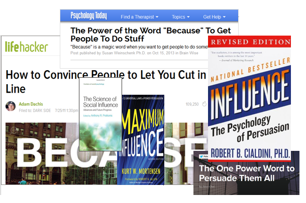

*In this post I try to answer the call for increased transparency in psychological science by presenting my master's thesis. I ask for feedback about the idea and the methods. I'd also appreciate suggestions for which journal it might be wise to submit the paper I'm now starting to write with co-authors. Check out [OSF](https://osf.io/89mhu/) for the Master's thesis documents and a [supplementary website](https://heinonmatti.github.io/sms-persuasion/sms-persuasion-supplement.html) for analyses in the manuscript in preparation (I presented the design analysis in a previous [post](http://mattiheino.com/2016/04/26/analyse-your-design/)).*

In my previous career as a marketing professional, I was often enchanted by news about behavioral science. Such small things could have such large effects! When I moved into social psychology, it turned out that things [weren't quite so simple](http://mattiheino.com/2015/10/10/defeating-the-crisis-of-confidence-in-science-3-3-ideas/).

One study that intrigued me was done in the 70's, and has since gained huge publicity (see [here](https://www.psychologytoday.com/blog/brain-wise/201310/the-power-the-word-because-get-people-do-stuff) and [here](http://lifehacker.com/5824481/how-to-convince-people-to-let-you-cut-in-line), for examples). The basic story is, that you could use the word *because* to get people to do things, due to a learned "reason → compliance" link.

Long story short, I was able to experiment in a within-trial setting of a health psychology intervention. Here's a slideshow adapted from what I presented in the annual conference of the European Health Psychology Society:

[slideshare id=61639428&doc=heinoblog-160503194435&w=429&h=357]

**[No use reasoning with adolescents? A randomised controlled trial comparing persuasive messages](//www.slideshare.net/MatinHeino/no-use-reasoning-with-adolescents-a-randomised-controlled-trial-comparing-persuasive-messages "No use reasoning with adolescents? A randomised controlled trial comparing persuasive messages ")**  from **[Matti Heino](//www.slideshare.net/MatinHeino)**

*Things I'm happy about:*

- Maintaining a Bayes Factor / p-value ratio of about 1:2. It's not "[a B for every p](https://twitter.com/lakens/status/692635225558491136)", but it's a start...
- Learning basic R and redoing all analyses in the last minute, so I wouldn't have to mention SPSS :)
- Figuring out how this pre-registration thing works, and registering before end of data collection.
- Using the word "significant" only twice and not in the context of results.

*Things I'm not happy about:*

- Not having pre-registered before starting data collection.
- Not knowing what I now know, when the project started. Especially about theory formation and appraisal ([Meehl](http://www.tandfonline.com/doi/pdf/10.1207/s15327965pli0102_1)).
- Not having an in-depth understanding of the mathematics underlying the analyses (although math and logic are priority items on my stuff-to-learn-list).
- Not having the data public... yet. It will be in 2017 the latest, but hopefully already this autumn.

A key factor for fixing psychological science is transparency; making analyses, intentions and data available for all researchers. As a consequence, anyone can point out inconsistencies and use the findings to elaborate on the theory, making accumulation of knowledge possible.

Science is all about predicting, and everyone knows how anyone can say "yeah, I knew that'd happen". The most impressive predictions are those made well before things start happening. So don't be like me, and pre-register your study before the start of data collection. It's not as hard as it sounds! For clinical trials, this can be done for free in the WHO-approved German Clinical Trials Register ([DRKS](https://drks-neu.uniklinik-freiburg.de/drks_web/)). For all trials, the Open Science Framework (OSF) [website](https://osf.io) can be used for pre-registering plans and protocols, as well as making study data available for researchers everywhere.There's also an extremely easy-to-use pre-registration site [AsPredicted](http://datacolada.org/44).

One can also use the OSF website as a cloud server to privately manage one’s workflow (for free). As a consequence, automated version control protects the researcher in the case of accusations of fraud or questionable research practices.

ps. If there's anything weird in that thesis, it's probably because I have disregarded some piece of advice from [Nelli Hankonen](https://twitter.com/NHankonen), [Keegan Knittle](https://twitter.com/keeganknittle) and [Ari Haukkala](https://twitter.com/AriHaukkala), for whose comments I'm indebted to.
