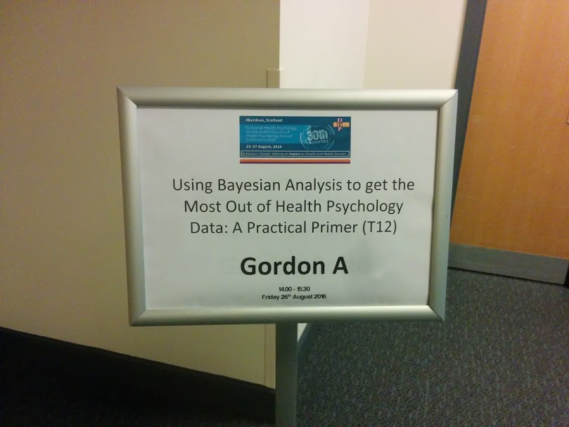

*This post presents a Bayesian roundtable I convened for the [EHPS/DHP 2016](http://www.ehps2016.org/) health psychology conference. Slides for the three talks are included.*

So, we kicked off the session with [Susan Michie](https://twitter.com/SusanMichie) and acknowledged [Jamie Brown](https://twitter.com/jamiebrown10) who was key in making it happen, but could not attend.

[Robert West](https://twitter.com/robertjwest) was the first to present, you'll find his slides "**Bayesian analysis: a brief introduction**" [here](/files/bayes-talk-1-robert-west.pptx "bayes-talk-1-robert-west"). This presentation gave a brief introduction to Bayes and how belief updating with Bayes Factors works.

I was the second speaker, building on Robert's presentation. [Here](/files/heino_26august_1427_bayesiandataanalysisgetting.pptx) are slides for my talk, where I introduced some practical resources to get started with Bayes. The slides are also embedded below (some slides got corrupted by Slideshare, so the ones in the .ppt link are a bit nicer).

<iframe src="https://drive.google.com/file/d/1b8qIsjCMugOCLDuaz_tRD6h8iSv8KQh7/preview" title="Presentation slides" loading="lazy" allowfullscreen></iframe>

The third and final presentation was by [Niall Bolger](https://twitter.com/ardollam). In his talk, he gave a great example of how using Bayes in a multilevel model enabled him to incorporate more realistic assumptions and—consequently—evaporate a finding he had considered somewhat solid. His slides, "**Bayesian Estimation: Implications for Modeling Intensive Longitudinal Data**", are [here](/files/bolger-ehps-bayesian-2016.pdf).

Let me know if you don't agree with something (especially in my presentation) or have ideas regarding how to improve the methods in (especially health) psychology research!
