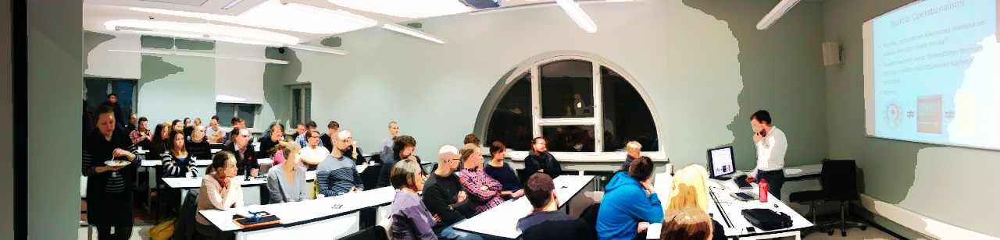

*This is a presentation I held for the young researchers branch of the Finnish Psychological Society. I show how low power and lack of transparency can lead to weird situations, where the published literature con**tains little or no knowledge.*

We had big fun with [Markus Mattsson](https://twitter.com/markus_tm) and Leo Aarnio in a seminar, presenting to a great audience of eager young researchers.

The slides for my talk are here:

<iframe src="https://drive.google.com/file/d/0B1e6QwtA-tDVT01Memh3SWtmM0E/preview?resourcekey=0-Pq5yH-SnGfdNRkhEKeKVZQ" title="Presentation slides" loading="lazy" allowfullscreen></iframe>

If you're interested in more history and solutions, check out [Felix Schönbrodt](https://twitter.com/nicebread303)'s slides [here](https://osf.io/tajp5/). Some pictures were made adapting code from a wonderful Coursera [MOOC](https://www.coursera.org/learn/statistical-inferences/home/welcome) by [Daniel Lakens](https://twitter.com/lakens). For Bayes, check out [Alexander Etz](https://twitter.com/alxetz)'s [blog](http://alexanderetz.com/).

Oh, and for the monster analogy; [this piece](http://www.thenewatlantis.com/publications/saving-science) made me think of it.
