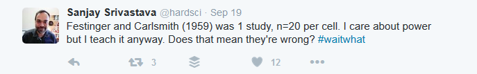
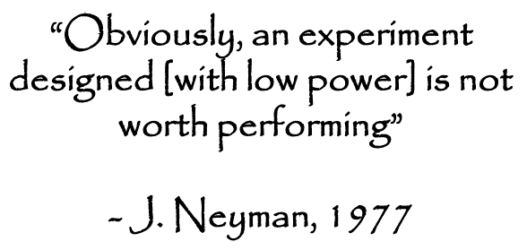
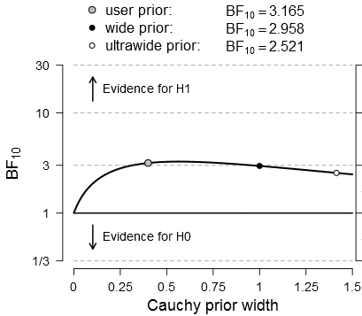
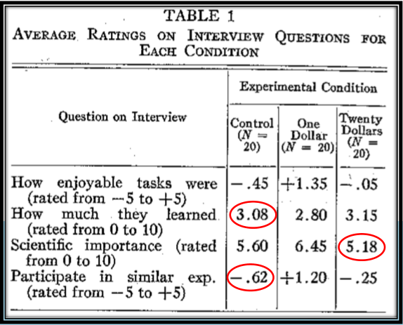

**To anyone teaching psychology.**

*In this post I express some concerns about the prestige given to 'classic' studies, which are widely taught in undergraduate social psychology courses around the world. I argue that rather than just demonstrating a bunch of clever but dodgy experiments, we could teach undergraduates to evaluate studies for themselves. To exemplify this, I quickly demonstrate power, Bayes factors, the p-checker app and the GRIM test.*

> psychology’s foundations are built not of theory but with the rock of classic experiments
>
> – [Christian Jarrett](https://thepsychologist.bps.org.uk/volume-21/edition-9/foundations-sand)

Here is an out-of-context quote from [Sanjay Srivastava](https://hardsci.wordpress.com/) from a while back:

This got me thinking about why and how we teach classic studies.

Psychologists usually lack the luxury of well-behaving theories. Some have thus proposed that the classic experiments, which have survived in the literature until the present, serve as the bedrock of our knowledge 1. In the introduction to a book retelling the stories of classic studies in social psychology 2, the authors note that classical studies have “played an important role in setting the research agenda for the field as it has progressed over time” and “serve as common points of reference for researchers, teachers and students alike”. The authors continue by pointing out that many of these classics lacked sophistication, but that this in fact is a feature of their enduring appeal, as laypeople can understand the “points” the studies make. Exposing the classics to modern statistical methods, would thus miss their point.

Now, this makes me wonder; if the point of a study is not to assess the existence of a phenomenon, what in the world may it be? One answer would be to serve as historical examples of practices no longer considered scientific, but I doubt this is what’s normally thought. Notwithstanding, I wanted to dip into the “foundations” of our knowledge by demostrating the use of some more-or-less recently developed tools on a widely known article. According to Google Scholar, the Festinger and Carlsmith cognitive dissonance experiment 3 has been cited for over three thousand times, so its influence is hard to downplay.

But first, a necessary digression: statistical power is the probability of detecting a “significant” effect of the postulated size, if the null hypothesis is false. As explained in Brunner & Schimmack 4, it is an interesting anomaly that the statistical power of studies in psychology is usually small, but almost all of them end up finding these “significant” results. As to how small, power doubtfully exceeds 50% 5–7, and for small (conventional?) effect sizes, the mean has been shown to be as low as 24%. As a recent replication project regarding the ego depletion effect 8 exemplified, a highly “replicable” (as judged by the published record) phenomenon may turn out to be a fluke, when null findings are taken into account. This has recently made psychologists consider the uncomfortable possibility, that entire research lines consisting of “accumulated scientific evidence” may in fact not contain that much evidence 9,10.

So, what is the statistical power of Festinger and Carlsmith? Using G\*Power 11, it turns out that they had 80% chance to discover a humongous effect of d = 0.9, and only a coin flip’s probability to find a (still large) effect of d = 0.64. Now, if an underpowered study finds an effect, with current practices it is likely to be exaggerated, and/or even of the wrong sign 12. Here would be a nice opportunity to demonstrate these concepts to students.

Considering the low power, it may not come as a surprise that the evidence the study provided was low to begin with. A Bayes Factor (BF) is an indicator of evidence for one hypothesis, in relation to another. In this case, a BF of ~3 moves an impartial observer from being 50% sure the experiment works to being 75% sure, or a skeptic from being 25% sure to being 43% sure that the effect is small instead of nil.

It would be relatively simple to introduce Bayes Factors with this study. The effect of a prior scale in this case does not matter much for reasonable choices, as exemplified with a plot made in [JASP](http://jasp-stats.org/) with two clicks:

 Figure 1: Bayes factor robustness check for the main finding of the dissonance study. Plotted by JASP 0.8.0.0, using n=20 for both groups, a t-value of 2.48 and a cauchy prior scale of 0.4.

Nowadays it is possible to easily check, whether a paper correctly reports test statistics and their associated p-values. The p-checker app [(this link feeds the relevant statistics to the app)](http://shinyapps.org/apps/p-checker/?syntax=t%2838%29%20%3D%202.48%2C%20p%20%3C%200.02%0At%2838%29%20%3D%202.22%2C%20p%20%3C%200.03%0At%2838%29%20%3D%201.78%2C%20p%20%3C%200.08%0At%2838%29%20%3D%201.46%2C%20p%20%3C%200.15%0At%2838%29%20%3D%201.79%2C%20p%20%3C%200.08%0At%2838%29%20%3D%201.21%0At%2838%29%20%3D%200.58%0A) can do this, and it turns out that most of the t-values in the paper are incorrectly rounded down (assuming, that “significant at the 0.08 level” means p < 0.08). You can demonstrate this by including the link on your slides, using it to go to p-checker and choosing “p-values correct?”.

Finally, you can look at the study using the [GRIM](http://www.prepubmed.org/grim_test/) test 13, which evaluates if the reported means are mathematically possible. As it turns out, a quarter of the reported means in the table with the main results do not pass the test. One more time: 25% of the reported means are **mathematically impossible**. The most likely explanation for this is shoddy reporting of means or accidental misreporting of sample sizes, but I find it telling that—to my knowledge, at least—the issue has not come up in fifty years of scientific investigation.

 *Figure 2: Main results table of the Festinger & Carlsmith study. Circled means are mathematically impossible given the reported sample sizes.*

Now, even though I have doubts about this study, as well as the process by which the theory has “evolved” 14, it does not mean that cognitive dissonance effects do not exist. It is just that the research may not have been able to capture the essence of this everyday phenomenon (which, if it exists, can influence behaviour without the help of academics). Under the traditional paradigm of psychological science, fraught with publication bias and unhelpful incentives 10, a [Registered Replication Report](http://www.psychologicalscience.org/publications/replication) (RRR) -type of work would be needed, and even that could only test one operationalisation. As an undergraduate, I would have been exhilarated to hear *early* about how and why such initiatives work, and why the [curatescience.org](http://curatescience.org/) approach is much more informative than any singular experiments.

Returning to the notion of the bedrock of psychology, consisting of classic experiments instead of theories as in the natural sciences 1. Perhaps we need a more solid foundation, regardless of whether some flashy findings from decades ago happened to spur out a progressive-ish 15,16 line of research.

How would such foundation come to be? Maybe teaching could play a role?

**Bibliography**

1. Jarrett, C. Foundations of sand? *The Psychologist* **21,** 756–759 (2008).
2. Smith, J. R. & Haslam, S. A. *Social psychology: Revisiting the classic studies*. (SAGE Publications, 2012).
3. Festinger, L. & Carlsmith, J. M. Cognitive consequences of forced compliance. *The Journal of Abnormal and Social Psychology* **58,** 203–210 (1959).
4. Brunner, J. & Schimmack, U. How replicable is psychology? A comparison of four methods of estimating replicability on the basis of test statistics in original studies. (2016).
5. Button, K. S. *et al.* Power failure: why small sample size undermines the reliability of neuroscience. *Nat Rev Neurosci* **14,** 365–376 (2013).
6. Cohen, J. Things I have learned (so far). *American psychologist* **45,** 1304 (1990).
7. Sedlmeier, P. & Gigerenzer, G. Do studies of statistical power have an effect on the power of studies? *Psychological bulletin* **105,** 309 (1989).
8. Hagger, M. S. *et al.* A multi-lab pre-registered replication of the ego-depletion effect. *Perspectives on Psychological Science* (2016).
9. Earp, B. D. & Trafimow, D. Replication, falsification, and the crisis of confidence in social psychology. *Front. Psychol* **6,** 621 (2015).
10. Smaldino, P. E. & McElreath, R. The Natural Selection of Bad Science. *arXiv preprint arXiv:1605.09511* (2016).
11. Faul, F., Erdfelder, E., Lang, A.-G. & Buchner, A. G\*Power 3: a flexible statistical power analysis program for the social, behavioral, and biomedical sciences. *Behav Res Methods* **39,** 175–191 (2007).
12. Gelman, A. & Carlin, J. Beyond Power Calculations Assessing Type S (Sign) and Type M (Magnitude) Errors. *Perspectives on Psychological Science* **9,** 641–651 (2014).
13. Brown, N. J. L. & Heathers, J. A. J. The GRIM Test: A Simple Technique Detects Numerous Anomalies in the Reporting of Results in Psychology. *Social Psychological and Personality Science* (2016). doi:10.1177/1948550616673876
14. Aronson, E. in *The science of social influence: Advances and future progress* (ed. Pratkanis, A. R.) 17–82 (Psychology Press, 2007).
15. Lakatos, I. *History of science and its rational reconstructions*. (Springer, 1971).
16. Meehl, P. E. Appraising and amending theories: The strategy of Lakatosian defense and two principles that warrant it. *Psychological Inquiry* **1,** 108–141 (1990).
