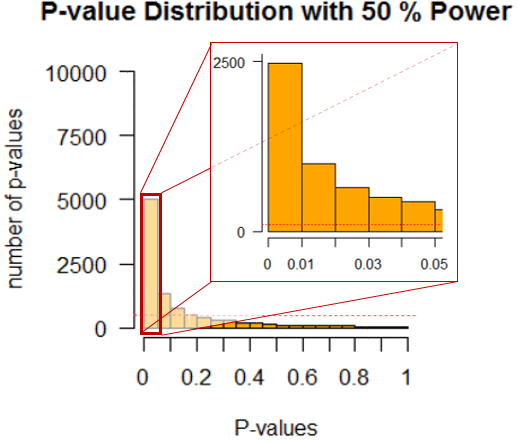
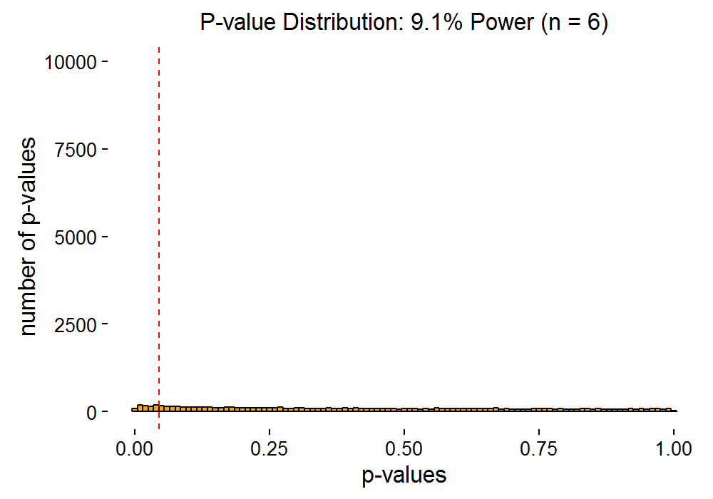
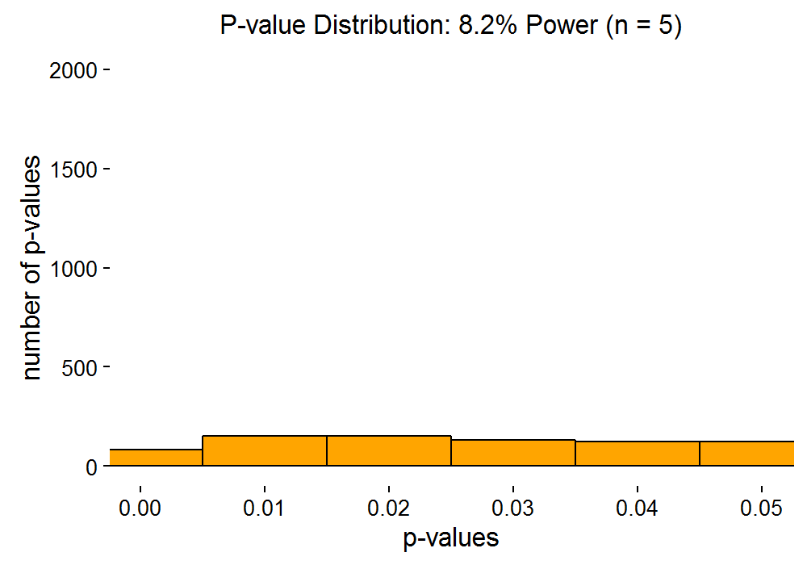
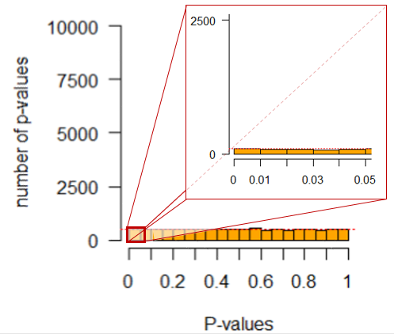
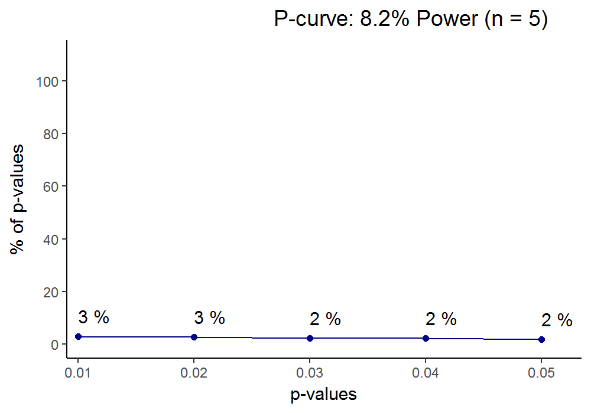
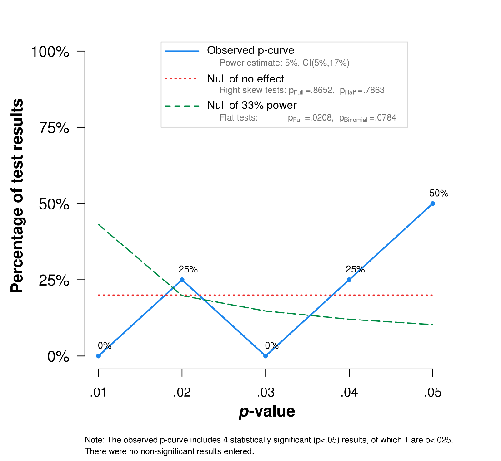

*In this post, I try to present the intuition behind the fact that, when studying real effects, one usually should **not expect** p-values near the 0.05 threshold. If you don't read quantitative research, you may want to skip this one. If you think I'm wrong about something, please leave a comment and set the record straight!*
Recently, I attended a presentation by a visiting senior scholar. He spoke about how their group had discovered a surprising but welcome correlation between two measures, and subsequently managed to replicate the result. What struck me, was his choice of words:
*“We found this association, which was barely significant. So we replicated it with the same sample size of ~250, and found that the correlation was almost the same as before and, **as expected**, of similar statistical significance (p < 0.05)“.*
This highlights a threefold, often implicit (but WRONG), mental model:
[EDIT: due to Markus' comments, I realised the original, off-the-top-of-my-head examples were numerically impossible and changed them a bit. Also, added stuff in brackets that the post hopefully clarifies as you read on.]

1. “Replications with a sample size similar to the original, should produce p-values similar to the original.”
   - Example: in subsequent studies with n = 100 each, a correlation (p = 0.04) should replicate as the same correlation (p ≈ 0.04) [this happens about 0.02% of the time when population r is 0.3; in these cases you actually observe an r≈0.19]
2. “P-values are linearly related with sample size, i.e. bigger sample gives you proportionately more small p-values.”
   - Example: a correlation (n = 100, p = 0.04), should replicate as a correlation of about the same, when n = 400, with e.g. a p ≈ 0.02. [in the above-mentioned case, the replication gives observed r±0.05 about 2% of the time, but the p-value is smaller than 0.0001 for the replication]
3. “We study real effects.” [we should think a lot more about how our observations could have come by in the absence of a real effect!]

It is obvious that the third point is contentious, and I won’t consider it here much. But the first two points are less clear, although the confusion is understandable if one has learned and always applied Jurassic (pre-Bem) statistics.
[Note: "statistical power" or simply "power" is the probability of finding an effect, if it really exists. The more obvious an effect is, and the bigger your sample size, the better are your chances of detecting these real effects – i.e. you have bigger power. You want to be pretty sure your study detects what it's designed to detect, so you may want to have a power of 90%, for example.]
 Figure 1. A lottery machine. Source: [Wikipedia](https://en.wikipedia.org/wiki/Lottery_machine#/media/File:Revolving_lottery_machine,kaitenshiki-cyusenki,japan.JPG)
To get a handle of how the p behaves, we must understand the nature of p-values as random variables 1. They are much like the balls in a lottery machine, with values between zero and one marked on them. The lottery machine of real effects has disproportionately more low (e.g. < 0.01) values on the balls, while the lottery machine of null effects contains a “fair” distribution of numbers on balls (where each number is as likely as any other). If this doesn't make sense yet, read on.
Let us exemplify this with a simulation. Figure 2 shows the expected distribution of p-values, when we do 10 000 studies with one t-test each, and every time report the p of the test. You can think of this as 9999 replications with the same sample size as the original.
 Figure 2: p-value distribution for 10 000 simulated studies, under 50% power when the alternative hypothesis is true. (When power increases, the curve gets pushed even farther to the left, leaving next to no p-values over 0.01)
Now, if we would do just five studies with the parameters laid out above, we could see a set of p-values like {**0.002**, **0.009**, **0.024**, 0.057, 0.329, 0.479}, half of them being “significant” (in bold). If we had 80% power to detect the difference we are looking for, about 80% of the p-values would be "significant". As an additional note, with 50% power, **4%** of the 10 000 studies give a **p between 0.04 and 0.05**. With 80% power, this number goes down to **3%**. For 97.5% power, **only 0.5%**  of studies (yes, five for every thousand studies) are expected to give such a “barely significant” p-value.
The senior scholar, who was mentioned in the beginning, was studying correlations. They work the same way. The animation below shows, how p-values are distributed for different sample sizes, if we do 10 000 studies with every sample size (i.e. every frame is 10 000 studies with that sample size). The samples are from a population where the real correlation is 0.3. The red dotted line is p = 0.05.
 Figure 3. P-value distributions for different sample sizes, when studying a real correlation of 0.3. Each frame is 10 000 replications with a given sample size. If pic doesn't show, click [here](https://mattiheino.com/wp-content/uploads/2016/12/corrplot_varyspeed.gif) for the gif (and/or try another browser).
The next animation zooms in on “significant” p-values in the same way as in figure 2 (though the largest bar goes off the roof quickly here). As you can see, it is almost impossible to get a p-value close to 5% with large power. Thus, there is no way we should “*expect*” a p-value over 0.01 when we replicate a real effect with large power. Very low p-values are always more probable than “barely significant” ones.
 Figure 4. Zooming in on the "significant" p-values. It is more probable to get a very low p than a barely significant one, even with small samples. If pic doesn't show, click [here](https://mattiheino.com/wp-content/uploads/2016/12/zoomplot_quick.gif) for the gif.
But what if there is no effect? In this case, every p-value is equally likely (see Figure 5). This means, that in the long run, getting a p = 0.01 is just as likely as getting a p = 0.97, and by implication, 5% of all p-values are under 0.05. Therefore, the number of studies that generated a p between 0.04 and 0.05, is 1%. Remember, how this percentage was 0.5% (five in a thousand) when the alternative hypothesis was true under 97.5% power? Indeed, when power is high, these “barely significant” p-values may actually speak for the null, not the alternative hypothesis! Same goes for e.g. p=0.024, when power is 99% [[see here](http://daniellakens.blogspot.fi/2014/05/the-probability-of-p-values-as-function.html)].
 Figure 5. p-value distribution when the null hypothesis is true. Every p is just as likely as any other.
Consider the lottery machine analogy again. Does it make better sense now?
> The lottery machine of real effects has disproportionately more low (e.g. < 0.01) values on the balls, while the lottery machine of null effects contains a “fair” distribution of numbers on balls (each number is as likely as any other).

Let's look at one more visualisation of the same thing:
 Figure 6. The percentages of "statistically significant" p-values evolving as sample size increases. If the gif doesn't show, you'll find it [here](https://mattiheino.com/wp-content/uploads/2016/12/pcurveplot_quick.gif).
*Aside: when the effect one studies is enormous, sample size naturally matters less. I calculated Cohen’s d for the Asch* 2 *line segment study, and a whopping d = 1.59 emerged. This is surely a very unusual effect size in psychological experiments, and leads to high statistical power even un**der low sample sizes. In such a case, by the logic presented above, one should be extremely cautious of p-values closer to 0.05 than zero.*
Understanding all this is vital in interpreting past research. We never know what the data generating system has been (i.e. are p-values extracted from a distribution under the null, or under the alternative), but the data gives us hints about what is more likely. Let us take an example from a social psychology classic, Moscovici’s “Towards a theory of conversion behaviour” 3. The article reviews results, which are then used to support a nuanced theory of minority influence. Low p-values are taken as evidence for an effect.
Based on what we learned earlier about the distribution of p-values under the null vs. the alternative, we can now see, under which hypothesis the p-values are more likely to occur. The tool to use here is called the *p-curve* 4, and it is presented in Figure 6.
 Figure 6. A quick-and-dirty p-curve of Moscovici (1980). See this [link](https://drive.google.com/file/d/0B1e6QwtA-tDVQk8xSWtOWEt3dFE/view?usp=sharing) for the data you can paste onto [p-checker](http://shinyapps.org/apps/p-checker/) or [p-curve](http://www.p-curve.com/).
You can directly see, how a big portion of p-values is in the 0.05 region, whereas you would expect them to cluster near 0.01. The p-curve analysis (from the p-curve [website](http://www.p-curve.com/)) shows that evidential value, if there is any, is inadequate (Z = -2.04, p = .0208). Power is estimated to be 5%, consistent with the null hypothesis being true.
The null being true may or may not have been the case here. But looking at the curve might have helped researchers, who spent some forty years trying to unsuccessfully replicate the pattern of Moscovici’s afterimage study results 5.
In a recent [talk](https://mattiheino.com/2016/11/01/feed-the-beast/), I joked about a bunch of researchers who tour around holiday resorts every summer, making people fill in IQ tests. Each summer they keep the results which show p < 0.05 and scrap the others, eventually ending up in the headlines with a nice meta-analysis of the results.
Don’t be those guys.

*Disclaimer: the results discussed here may not generalise to some more complex models, where the p-value is not uniformly distributed under the null. I don't know much about those cases, so please feel free to educate me!*
Code for the animated plots is [here](https://drive.google.com/file/d/0B1e6QwtA-tDVTDl3aXNPbjA0ZU0/view?usp=sharing). It was inspired by code from Daniel Lakens, whose [blog post](http://daniellakens.blogspot.fi/2014/05/the-probability-of-p-values-as-function.html) inspired this piece. Check out his MOOC [here](https://www.coursera.org/learn/statistical-inferences/home/welcome). Additional thanks to [Jim Grange](https://jimgrange.wordpress.com/blog/) for advice on gif making and [Alexander Etz](http://alexanderetz.com/) for constructive [comments](https://www.facebook.com/groups/psychmap/permalink/349390912104504/).
**Bibliography:**

1. Murdoch, D. J., Tsai, Y.-L. & Adcock, J. P-Values are Random Variables. *The American Statistician* **62,** 242–245 (2008).
2. Asch, S. E. Studies of independence and conformity: I. A minority of one against a unanimous majority. *Psychological monographs: General and applied* **70,** 1 (1956).
3. Moscovici, S. in *Advances in Experimental Social Psychology* **13,** 209–239 (Elsevier, 1980).
4. Simonsohn, U., Simmons, J. P. & Nelson, L. D. Better P-curves: Making P-curve analysis more robust to errors, fraud, and ambitious P-hacking, a Reply to Ulrich and Miller (2015). *J Exp Psychol Gen* **144,** 1146–1152 (2015).
5. Smith, J. R. & Haslam, S. A. *Social psychology: Revisiting the classic studies*. (SAGE Publications, 2012).
