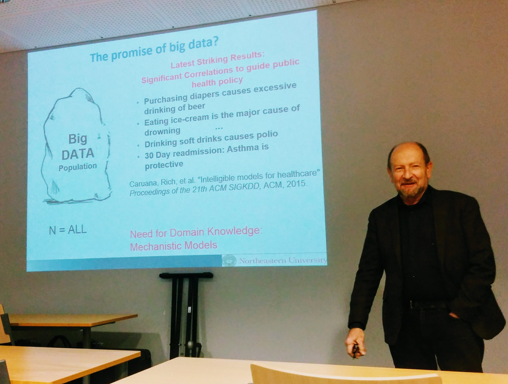
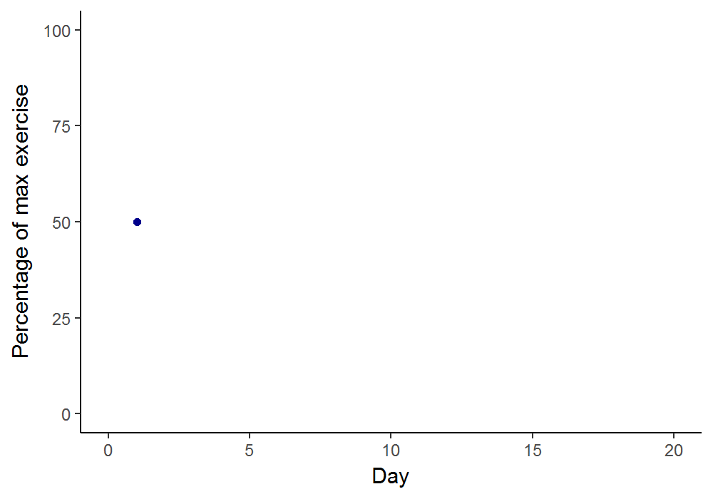
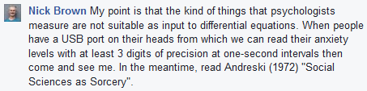

*In this post, I argue against the intuitively appealing notion that, in a deterministic world, we just need more information and can use it to solve problems in complex systems. This presents a problem in e.g. psychology, where more knowledge does not necessarily mean cumulative knowledge or even improved outcomes.*

Recently, I attended a talk where [Misha Pavel](http://www.ccis.northeastern.edu/people/misha-pavel/) happened to mention how big data can lead us astray, and how we can't just look at data but need to know mechanisms of behaviour, too.

 Misha Pavel arguing for the need to learn how mechanisms work.

Later, a couple of my psychologist friends happened to present arguments discounting this, saying that the problem will be solved due to determinism. Their idea was that the world is a deterministic place—if we knew everything, we could predict everything (an argument also known as [Laplace's Demon](https://en.wikipedia.org/wiki/Laplace's_demon))—and that we eventually a) will know, and b) can predict. I'm fine with the first part, or at least agnostic about it. But there are more mundane problems to prediction than "quantum randomness" and other considerations about whether truly random phenomenon exist. The thing is, that *even simple and completely deterministic systems can be utterly unpredictable* to us mortals. I will give an example of this below.

> *Even simple and completely deterministic systems can be utterly unpredictable.*

Let's think of a very simple made-up model of physical activity, just to illustrate a phenomenon:

Say today's amount of exercise depends only on motivation and exercise of the previous day. Let's say people have a certain maximum amount of time to exercise each day, and that they vary from day to day, in what proportion of that time they actually manage to exercise. To keep things simple, let's say that if a person manages to do more exercise on Monday, they give themselves a break on Tuesday. People also have different motivation, so let's add that as factor, too.

Our completely deterministic, but definitely wrong, model could generalise to:

Exercise percentage today = (motivation) \* (percentage of max exercise yesterday) \* (1 - percentage of max exercise yesterday)

For example, if one had a constant motivation of 3.9 units (whatever the scale), and managed to do 80% of their maximum exercise on Monday, they would use 3.9 times 80% times 20% = 62% of their maximum exercise time on Tuesday. Likewise, on Wednesday they would use 3.9 times 62% times 38% = 92% of the maximum possible exercise time. And so on and so on.

We're pretending this model is *the* reality. This is so that we can perfectly calculate the amount of exercise on any day, given that we know a person's motivation and how much they managed to exercise the previous day.

Imagine we measure a person, who obeys this model with a constant motivation of 3.9, and starts out on day 1 reaching 50% of their maximum exercise amount. But let's say there is a slight measurement error: instead of 50.000%, we measure 50.001%. In the graph below we can observe, how the error (red line) quickly diverges from the actual (blue line). The predictions we make from our model after around day 40 do not describe our target person's behaviour at all. The slight deviation from the deterministic system has made it practically chaotic and random to us.

 Predicting this simple, fully deterministic system becomes impossible to predict in a short time due to a measurement error of 0.001%-points. Blue line depicts actual, red line the measured values. They diverge around day 35 and are soon completely off. [[Link to gif](https://mattiheino.com/wp-content/uploads/2016/12/chaosplot_animation.gif)]

# What are the consequences?

The model is silly, of course, as we probably would never try to predict an individual's exact behaviour on any single day (averages and/or bigger groups help, because usually no single instance can kill the prediction). But this example does highlight a common feature of complex systems, known as *sensitive dependence to initial conditions:* even small uncertainties cumulate to create huge errors. It is also worth noting, that increasing model complexity doesn't necessarily help us with prediction, due to a problems such as overfitting (thinking the future will be like the past; see also why [simple heuristics can beat optimisation](http://library.mpib-berlin.mpg.de/ft/gg/GG_Why_2008.pdf)).

Thus, predicting long-term path-dependent behaviour, even if we knew the exact psycho-socio-biological mechanism governing it, may be impossible in the absence of *perfect* measurement. Even if the world was completely deterministic, we still could not predict it, as even trivially small things left unaccounted for could throw us off completely.

> Predicting **long-term path-dependent behaviour**, even if we knew the exact psycho-socio-biological mechanism governing it, may be impossible in the absence of ***perfect*** measurement.

The same thing happens when trying to predict as simple a thing as how billiard balls impact each other on the pool table. The first collision is easy to calculate, but to compute the ninth you already have to take into account the gravitational pull of people standing around the table. By the 56th impact, every elementary particle in the universe has to be included in your assumptions! Other examples include trying to predict the sex of a human fetus, or trying to predict the weather 2 weeks out (this is the famous idea about the butterfly flapping its wings).

Coming back to Misha Pavel's points regarding big data, I feel somewhat skeptical about being able to acquire invariant "domain knowledge" in many psychological domains. Also, as shown here, knowing the exact mechanism is still no promise of being able to predict what happens in a system. Perhaps we should be satisfied when we can make predictions such as "intervention x will increase the probability that the system reaches a state where more than 60% of the goal is reached on more than 50% of the days, by more than 20% in more than 60% of the people who belong in a group it was designed to affect"?

But still: for determinism to solve our prediction problems, the amount and accuracy of data needed is beyond the wildest sci-fi fantasies.

I'm happy to be wrong about this, so please share your thoughts! Leave a comment below, or on these relevant threads: [Twitter](https://twitter.com/Heinonmatti/status/813762613855342592), [Facebook](https://www.facebook.com/groups/psychmap/permalink/361251267585135/).

References and resources:

- Code for the plot can be found [here](https://drive.google.com/file/d/0B1e6QwtA-tDVLUpZQ2NkZHlRc0U/view?usp=sharing).
- The billiard ball example [explained](http://www.anecdote.com/2007/10/the-billiard-ball-example/) in context.
- A short paper on the history about the [butterfly (or seagull) flapping its wings](http://phys.csuchico.edu/ayars/427/handouts/AJP000425.pdf)-thing.
- To learn about dynamic systems and chaos, I highly recommend [David Feldman's course](https://www.complexityexplorer.org/courses/61-introduction-to-dynamical-systems-and-chaos-summer-2016) on the topic, next time it comes around at Complexity Explorer.
- ... Meanwhile, the equation I used here is actually known as the "logistic map". See [this post](http://geoffboeing.com/2015/03/chaos-theory-logistic-map/) about how it behaves.

*Post scriptum:*

Recently, I was happy and surprised to see a paper attempting to create a computational model of a major psychological theory. In a [conversation](https://www.facebook.com/groups/psychmap/permalink/353016345075294/), Nick Brown expressed doubt:

Do you agree? What are the alternatives? Do we have to content with vague statements like "the behaviour will fluctuate" *(*perhaps as in: *fluctuat nec mergitur)*? How should we study the dynamics of human behaviour?

Also: do see Nick Brown's [blog](http://steamtraen.blogspot.com/), if you don't mind non-conformist thinking.
