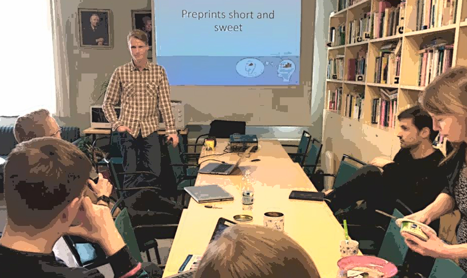
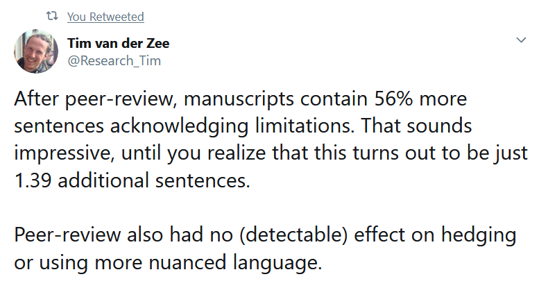

 Photo courtesy of [Nelli Hankonen](https://twitter.com/NHankonen)
*These are slides (with added text content to make more sense) from a small presentation I held at the University of Helsinki. Mainly of interest to academic researchers.* 
TL;DR: To get the most out of scientific publishing, we may need imitate physics a bit, and bypass the old gatekeepers. If the slideshare below is of crappy quality, check out the slides [here](https://drive.google.com/file/d/0B1e6QwtA-tDVbGhGNlVTSHVjMmc/view).
UPDATE: There's a new (September 2019) [paper](https://researchintegrityjournal.biomedcentral.com/articles/10.1186/s41073-019-0078-2) out on peer review effectiveness. Doesn't look superfab:

ps. if you prefer video, [this](https://www.youtube.com/watch?v=2zMgY8Dx9co) explains things in four minutes :)
[slideshare id=73562658&doc=preprints-170323210454]
