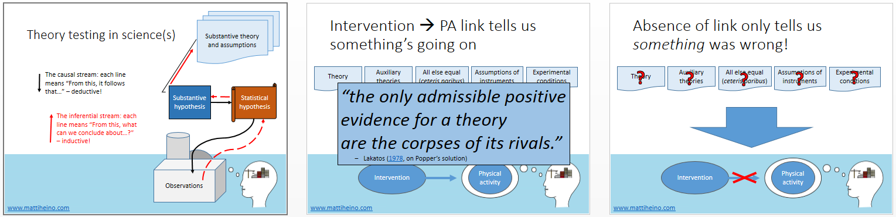

*How do we figure out, whether our ideas worked out? To me, it seems that in psychology we seldom rigorously think about this question, despite having been criticised for dubious inferential practices for at least half a century.* *You can download a pdf  of my talk at the Finnish National Institute for Health and Welfare (THL) [here](https://mattiheino.com/wp-content/uploads/2017/05/program-theory-evaluation.pdf), or see the slide show in the end of this post. Please solve the three problems in the summary slide! :)*

TLDR: is there a reason, why evaluating intervention program theories shouldn’t follow the process of scientific inference?

<iframe src="https://drive.google.com/file/d/0B1e6QwtA-tDVZGlEZkZRYkJyVGs/preview?resourcekey=0-tmquYYYYUVKpGmm-H2cz2w" title="Presentation slides" loading="lazy" allowfullscreen></iframe>

