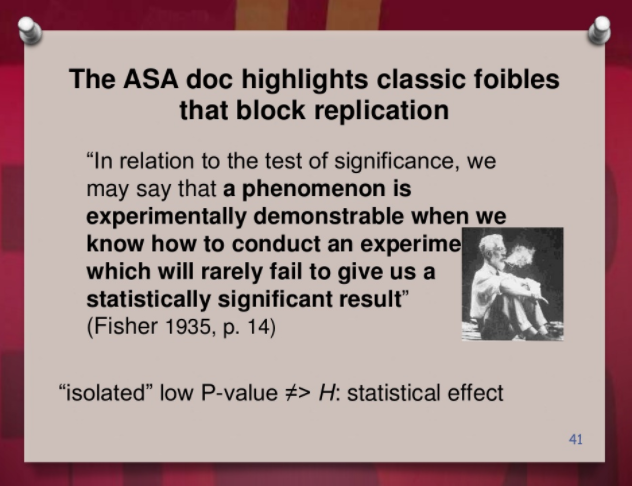
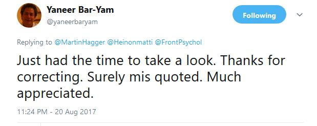

 Is psychology headed towards being a science conducted by "zealots", or to a post-car (or train) crash metaphysics, where anything goes because nothing is even supposed to replicate?

I recently peer reviewed a partly shocking [piece](http://journal.frontiersin.org/article/10.3389/fpsyg.2017.00879/full?&utm_source=Email_to_rerev_&utm_medium=Email&utm_content=T1_11.5e5_reviewer&utm_campaign=Email_publication&journalName=Frontiers_in_Psychology&id=237147) called “Reproducibility in Psychological Science: When Do Psychological Phenomena Exist?“ (Iso-Ahola, 2017). In the article, the author makes some very good points, which unfortunately get drowned under very strange statements and positions. Me, [Eiko Fried](http://www.eiko-fried.com) and [Etienne LeBel](http://etiennelebel.com/) addressed those shortly in a commentary ([preprint](https://osf.io/preprints/psyarxiv/6b95w); UPDATE: [published piece](http://journal.frontiersin.org/article/10.3389/fpsyg.2017.01004/full?&utm_source=Email_to_authors_&utm_medium=Email&utm_content=T1_11.5e1_author&utm_campaign=Email_publication&field=&journalName=Frontiers_in_Psychology&id=279168)). Below, I’d like to expand upon some additional thoughts I had about the piece, to answer Martin Hagger's [question](https://twitter.com/MartinHagger/status/870554254120861696).

## On complexity

When all parts do the same thing on a certain scale (planets on Newtonian orbits), their behaviour is relatively easy to predict for many purposes. Same thing, when all molecules act independently in a random fashion: the risk that most or all beer molecules in a pint move upward at the same time is ridiculously low, and thus we don’t have to worry about the yellow (or black, if you’re into that) gold escaping the glass. Both situations are easy-ish systems to describe, as opposed to complex systems where the interactions, sensitivity to initial conditions etc. can produce a huge variety of behaviour and states. Complexity science is the study of these phenomena, which have become increasingly common since the 1900s (Weaver, 1948).

Iso-Ahola (2017) quotes (though somewhat unfaithfully) the complexity scientist Bar-Yam (2016b): “for complex systems (humans), all empirical inferences are false… by their assumptions of replicability of conditions, independence of different causal factors, and transfer to different conditions of prior observations”. He takes this to mean that “phenomena’s existence should not be defined by any index of reproducibility of findings” and that “falsifiability and replication are of secondary importance to advancement of scientific fields”. But this is a highly misleading representation of the complexity science perspective.

In Bar-Yam’s article, he used an information theoretic approach to analyse the limits of what we can say about complex systems. The position is that while full description of systems via empirical observation is impossible, we should aim to identify the factors which are meaningful in terms of **replicability** of findings, or the **utility** of the acquired knowledge. As he elaborates elsewhere: “There is no utility to information that is only true in a particular instance. Thus, all of scientific inquiry should be understood as an inquiry into universality—the determination of the degree to which information is general or specific” (Bar-Yam, 2016a, p. 19).

This is fully in line with the Fisher quote presented in Mayo’s [slides](https://errorstatistics.com/2017/03/26/slides-from-the-boston-colloquium-for-philosophy-of-science-severe-testing-the-key-to-error-correction/?utm_content=buffer6d059&utm_medium=social&utm_source=twitter.com&utm_campaign=buffer):

The same goes for replications; no single one-lab study can disprove a finding:

“’Thus a few stray basic statements contradicting a theory will hardly induce us to reject it as falsified. We shall take it as falsified only if we discover a reproducible effect which refutes the theory. In other words, we only accept the falsification if a low-level empirical hypothesis which describes such an effect is proposed and  corroborated’ (Popper, 1959, p. 66)” (see Holtz & Monnerjahn, 2017)

So, if the high-quality non-replication replicates, one must consider that something may be off with the original finding. This leads us to the question of what researchers should study in the first place.

## On research programmes

Lakatos (1971) posits a difference between progressive and degenerating research lines. In a progressive research line, investigators explain a negative result by modifying the theory in a way which leads to new predictions that subsequently pan out. On the other hand, coming up with explanations that do not make further contributions, but rather just explain away the negative finding, leads to a degenerative research line. Iso-Ahola quotes Lakatos to argue that, although theories may have a “poor public record” that should not be denied, falsification should not lead to abandonment of theories. Here’s Lakatos:

“One may rationally stick to a degenerating [research] programme until it is overtaken by a rival and even after. What one must not do is to deny its poor public record. […] It is perfectly rational to play a risky game: what is irrational is to deceive oneself about the risk” (Lakatos, 1971, p. 104)

As Meehl (1990, p. 115) points out, the quote continues as follows:

"This does not mean as much licence as might appear for those who stick to a degenerating programme. For they can do this mostly only in private. Editors of scientific journals should refuse to publish their papers which will, in general, contain either solemn reassertions of their position or absorption of counterevidence (or even of rival programmes) by ad hoc, linguistic adjustments. Research foundations, too, should refuse money." (Lakatos, 1971, p. 105)

Perhaps researchers should pay more attention which program they are following?

As an ending note, here’s one more interesting quote: *“Zealotry of reproducibility has unfortunately reached the point where some researchers take a radical position that the original results mean nothing if not replicated in the new data.”* (Iso-Ahola, 2017)

For explorative research, I largely agree with these zealots. I believe exploration is fine and well, but the results do mean nearly nothing unless replicated in new data (de Groot, 2014). One cannot hypothesise and confirm with the same data.

Perhaps I focus too much on the things that were said in the paper, not what the author actually meant, and we do apologise if we have failed to abide with the [principle of charity](https://en.wikipedia.org/wiki/Principle_of_charity) in the commentary or this blog post. I do believe the paper will best serve as a pedagogical example to aspiring researchers, on how strangely arguments could be constructed in the olden times.

ps. Bar-Yam later commented on this blog post, confirming the mis(present/interpr)etation of his research by the author of the reproducibility paper:

pps. Here's [Fred Hasselman](https://twitter.com/fredhasselman)'s comment on the article, from the Frontiers website (when you scroll down all the way to the bottom, there's a comment option):

> 1. Whether or not a posited entity (e.g. a theoretical object of measurement) exists or not, is a matter of ontology.
>
> 2. Whether or not one can, in principle, generate scientific knowledge about a posited entity, is a matter of epistemology.
>
> 3. Whether or not the existence claim of a posited entity (or law) is scientifically plausible depends on the ability of a theory or nomological network to produce testable predictions (predictive power) and the accuracy of those predictions relative to measurement outcomes (empirical accuracy).
>
> 4. The comparison of the truth status of psychological theoretical constructs to the Higgs Boson is a false equivalence: One is formally defined and deduced from a highly corroborated model and predicts the measurement context in which its existence can be verified or falsified (the LHC), the other is a common language description of a behavioural phenomenon "predicted" by a theory constructed from other phenomena published in the scientific record of which the reliability is... unknown.
>
> 5. It is the posited entity itself -by means of its definition in a formalism or theory that predicts its existence- that decides how it can be evidenced empirically. If it cannot be evidenced using population statistics, don't use it! If the analytic tools to evidence it do not exist, develop them! Quantum physics had to develop a new theory of probability, new mathematics to be able to make sense of measurement outcomes of different experiments. Study non-ergodic physics, complexity science, emergence and self-organization in physics, decide if it is sufficient, if not, develop a new formalism. That is how science advances and scientific knowledge is generated. Not by claiming all is futile.
>
> To summarise: The article continuously confuses ontological and epistemic claims, it does not provide a future direction even though many exist or are being proposed by scholars studying phenomena of the mind, moreover the article makes no distinction between sufficiency and necessity in existence claims, and this is always problematic.
>
> Contrary to the claim here, a theory (and the ontology and epistemology that spawned it) can enjoy high perceived scientific credibility even if some things cannot be known in principle, or if there's always uncertainty in measurements. It can do so by being explicit about what it is that can and cannot be known about posited entities.
>
> E.g. Quantum physics is a holistic physical theory, also in the epistemic sense: It is in principle not possible to know anything about a quantum system at the level of the whole, based on knowledge about its constituent parts. Even so, quantum physical theories have the highest predictive power and empirical accuracy of all scientific theories ever produced by human minds!
>
> As evidenced by the history of succession of theories in physics, successful scientific theorising about the complex structure of reality seems to be a highly reproducible phenomenon of the mind. Let's apply it to the mind itself!

Bibliography:

Bar-Yam, Y. (2016a). From big data to important information. *Complexity*, *21*(S2), 73–98.

Bar-Yam, Y. (2016b). The limits of phenomenology: From behaviorism to drug testing and engineering design. *Complexity*, *21*(S1), 181–189. https://doi.org/10.1002/cplx.21730

de Groot, A. D. (2014). The meaning of “significance” for different types of research [translated and annotated by Eric-Jan Wagenmakers, Denny Borsboom, Josine Verhagen, Rogier Kievit, Marjan Bakker, Angelique Cramer, Dora Matzke, Don Mellenbergh, and Han L. J. van der Maas]. *Acta Psychologica*, *148*, 188–194. https://doi.org/10.1016/j.actpsy.2014.02.001

Holtz, P., & Monnerjahn, P. (2017). Falsificationism is not just ‘potential’ falsifiability, but requires ‘actual’ falsification: Social psychology, critical rationalism, and progress in science. *Journal for the Theory of Social Behaviour*. https://doi.org/10.1111/jtsb.12134

Iso-Ahola, S. E. (2017). Reproducibility in Psychological Science: When Do Psychological Phenomena Exist? *Frontiers in Psychology*, *8*. https://doi.org/10.3389/fpsyg.2017.00879

Lakatos, I. (1971). *History of science and its rational reconstructions*. Springer. Retrieved from http://link.springer.com/chapter/10.1007/978-94-010-3142-4\_7

Meehl, P. E. (1990). Appraising and amending theories: The strategy of Lakatosian defense and two principles that warrant it. *Psychological Inquiry*, *1*(2), 108–141.

Weaver, W. (1948). Science and complexity. *American Scientist*, *36*(4), 536–544.
