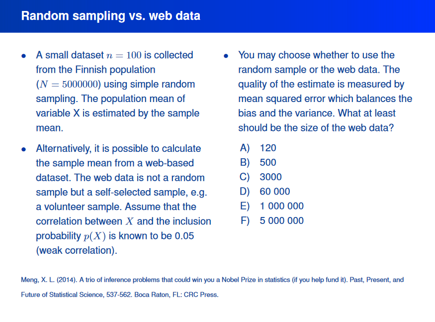

Last week, I attended the Methods festival 2017 in Jyväskylä. Slides and program for the first day are [here](https://www.jyu.fi/edupsy/fi/tutkimus/ihme/metodifestivaali-2017/ohjelma/tiistai-30-5), and for the second day, [here](https://www.jyu.fi/edupsy/fi/tutkimus/ihme/metodifestivaali-2017/ohjelma/keskiviikko-31-5) (some are in Finnish, some in English).

One interesting presentation was on missing data by [Juha Karvanen](http://www.tilastotiede.fi/juha_karvanen.html) [[twitter profile](https://twitter.com/JuhaKarvanen)] ([slides](https://www.jyu.fi/edupsy/fi/tutkimus/ihme/metodifestivaali-2017/ohjelma/karvanen_missing_data_may_bias_your_conclusions.pdf) for the talk). It involved toilet paper and Hans Rosling, so I figured I'll post my recording of the display. Thing is, missing data lurks in the shadows and if you don't do your utmost to get full information, *it may be lethal*.

1. Intro and missing completely at random (MCAR): [Video](https://goo.gl/photos/vhKSeWDa4VyUvbeB6). Probability of missingness for all cases is the same. Rare in real life?
2. Missing at random (MAR): [Video](https://goo.gl/photos/no3zuXdaWvnWir2JA). Probability of missingness depends on something we know. For example, if men leave more questions unanswered than women, but among men and women, the missingness is MCAR.
3. Missing not at random (MNAR): [Video](https://goo.gl/photos/tNHvSCu493HbJXYf6). Probability of missingness depends on unobserved values. Your analysis becomes misleading and you may not know it; misinformation reigns and angels cry.

There was an exciting question on a slide. I'll post the answer in [this thread](https://twitter.com/Heinonmatti/status/874007258954432513) later.

By the way, one of Richard McElreath's Statistical Rethinking [lectures](https://www.youtube.com/watch?v=qD7yqFjgJeI) has a nice description on how to do Bayesian imputation when one assumes MCAR. He also discusses of how irrational complete case analysis (throwing away the cases that don't have full data) is, when you really think about it. Also, **never substitute a missing value with the mean of other values!**

p.s. I would love it if someone dropped a comment saying "this problem is actually not too dire, because..."
