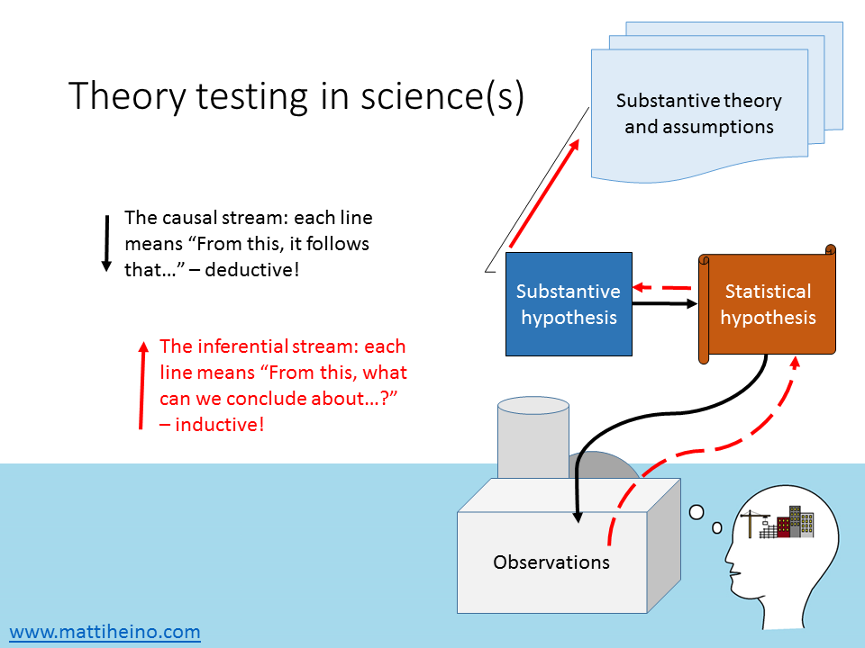
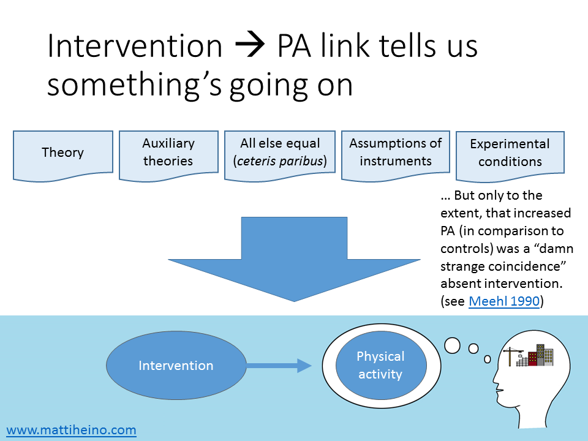
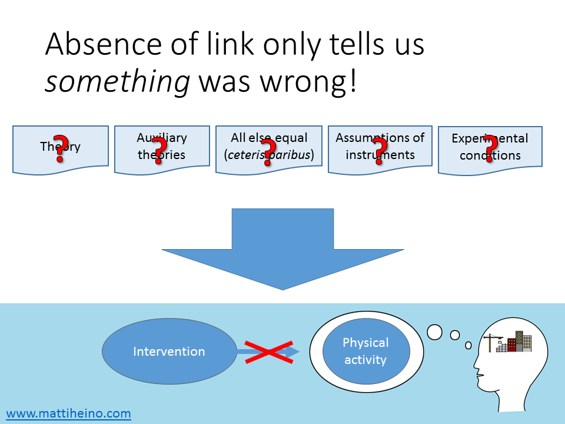

*In the post-replication-crisis world, people are increasingly arguing, that even applied people should actually know what they're doing when they do what they call science. In this post I expand upon some points I made in [these slides](https://mattiheino.com/2017/05/01/evaluating-intervention-program-theories/) about the philosophy of science behind hypothesis testing in interventions.*
How does knowledge grow when we do intervention research? Evaluating whether an intervention worked can be phrased in relatively straightforward terms; “there was a predicted change in the pre-specified outcome“. This is, of course, a simplification. But try and contrast it with the attempt to phrase what you mean when you want to claim *how* the intervention worked, or *why* it did not. To do this, you need to spell out the *program theory\** of the intervention, which explicates the logic and causal assumptions behind intervention development.
\* Also referred to as programme logic, intervention logic, theory-based (or driven) evaluation, theory of change, theory of action, impact pathway analysis, or programme theory-driven evaluation science... (Rogers, 2008). These terms are equivalent for the purposes of this piece.
The way I see it (for a more systematic approach, see [intervention mapping](https://interventionmapping.com/)), we have background theories (Theory of Planned Behaviour, Self-Determination Theory, etc.) and knowledge from earlier studies, which we synthesise into a program theory. This knowledge informs us about how we believe an intervention in our context would achieve its goals, regarding the factors ("determinants") that determine the target behaviour. From (or during the creation of) this mesh of **substantive theory and accompanying assumptions,** we deduce a boxes-and-arrows diagram, which describes the causal mechanisms at play. These assumed causal mechanisms then help us derive a **substantive hypothesis** (e.g. “intervention increases physical activity”), which informs a **statistical hypothesis** (e.g. “accelerometer-measured metabolic equivalent units will be statistically significantly higher in the intervention group than the control group”). The statistical hypothesis then dictates what sort of **observations** we should be expecting. I call this the *causal stream*; each one of the entities follows from what came before it.

The *inferential stream* runs to the other direction. Hopefully, the **observations** are informative enough so that we can make judgements regarding the **statistical hypothesis**. The statistical hypothesis’ fate then informs the **substantive hypothesis**, and whether our **theory** upstream get corroborated (supported). Right?
Not so fast. What we derived the substantive and statistical hypotheses from, was not *only* the program theory (T) we wanted to test. We also had *all the other* theories the program theory was drawn from (i.e. auxiliary theories, At), as well as an assumption that the accelerometers measure physical activity as they are supposed to, and other *assumptions about instruments* (Ai). Not only this, we assume that the intervention was delivered as planned and all other presumed *experimental conditions* (Cn) *hold*, and that there are *no other* *systematic*, unmeasured contextual effects that mess with the results (“all other things being equal”; a *ceteris paribus* condition, Cp).

We now come to a logical implication (“observational conditional”) for testing theories (Meehl, 1990b, p. 119, 1990a, p. 109). Oi is the observation of an intervention having taken place, and Op is an observation of increased physical activity:
(T and At and Ai and Cn and Cp) → (Oi → Op)
[Technically, the first arrow should be logical entailment, but that’s not too important here.] The first bracket can be thought of as “all our assumptions hold”, the second bracket as “if we observe the intervention, then we should observe increased physical activity”. The whole thing thus roughly means “if our assumptions (T, A, C) hold, we should observe a thing (i.e. Oi → Op)”.
Now here comes falsifiability: if we observe an intervention but no increase in physical activity, the logical truth value of the second bracket comes out false, which also destroys the conjunction in the first bracket. By elementary logic, we must conclude that one or more of the elements in the first bracket is false – the big problem is that we don’t know *which* element(s) was or were false! And what if the experiment pans out? It’s not just our theory that’s been corroborated, but the bundle of assumptions as a whole. This is known as the Duhem-Quine problem, and it has brought misery to countless induction-loving people for decades.
EDIT: As Tal Yarkoni [*pointed out*](https://www.facebook.com/groups/psychmap/permalink/474608399582754/?comment_id=475195199524074&reply_comment_id=476873222689605&ref=notif&notif_t=group_comment_reply&notif_id=1503454297226033), this corroboration can be negligible unless one is making a risky prediction. See the *damn strange coincidence* condition below.

EDIT: There was a great [comment](https://www.facebook.com/groups/853552931365745/permalink/1480058538715178/?comment_id=1480069232047442&reply_comment_id=1480072805380418&ref=notif&notif_t=group_comment_reply&notif_id=1503093047152670) by Peter Holtz. Knowledge grows when we identify the weakest links in the mix of theoretical and auxiliary assumptions, and see if we can falsify them. And things do get awkward if we abandon falsification.
If wearing an accelerometer increases physical activity in itself (say people who receive an intervention are more conscious about their activity monitoring, and thus exhibit more pronounced measurement effects when told to wear an accelerometer), you obviously don’t conclude the increase is due to the program theory’s effectiveness. Also, you would not be very impressed by setups where you’d likely get the same result, whether the program theory was right or wrong. In other words, you want a situation where, if the program theory was false, you would doubt *a priori* that among those who increased their physical activity, many would have underwent the intervention. This is called the theoretical risk; prior probability p(Op|Oi)—i.e. probability of observing increase in physical activity, given that the person underwent the intervention—should be low absent the theory (Meehl, 1990a, p. 199, mistyped in Meehl, 1990b, p. 110), and the lower the probability, the more impressive the prediction. In other words, spontaneous improvement absent the program theory should be a *damn strange coincidence*.
Note that solutions for handling the Duhem-Quine mess have been proposed both in the frequentist (e.g. error statistical piecewise testing, Mayo, 1996), and Bayesian (Howson & Urbach, 2006) frameworks.

## What is a theory, anyway?

A lot of the above discussion hangs upon what we mean by a “theory” – and consequently, should we apply the process of theory testing to intervention program theories. [Some previous discussion [here](http://sciencer.eu/2017/05/theories-versus-logic-models/).] One could argue that saying "if I push this button, my PC will start" is not a scientific theory, and that interventions *use* theory but logic models do not capture them. It has been said that if the theoretical assumptions underpinning an intervention don't hold, the intervention will fail, but that doesn't make an intervention evaluation a test of the theory. This view has been defended by arguing that behaviour change theories underlying an intervention may work, but e.g. the intervention targets the wrong cognitive processes.
To me it seems like these are all part of the intervention program theory, which we’re looking to make inferences from. If you're testing statistical hypotheses, you should have substantive hypotheses you believe are informed by the statistical ones, and those come from a theory – it doesn't matter if it's a general theory-of-everything or one that applies in very specific context such as the situation of your target population.
Now, here's a question for you:
> **If the process described above doesn't look familiar and you do hypothesis testing, how do you reckon your approach produces knowledge?**

Note: I'm not saying it doesn't (though that's an option), just curious of alternative approaches. I know that e.g. Mayo's error statistical perspective is superior to what's presented here, but I'm yet to find an exposition of it I could thoroughly understand.
Please share your thoughts and let me know where you think this goes wrong!
With thanks to Rik Crutzen for comments on a draft of this post.
*ps. If you’re interested in replication matters in health psychology, there’s an upcoming symposium on the topic in EHPS17 featuring Martin Hagger, Gjalt-Jorn Peters, Rik Crutzen, Marie Johnston and me. My presentation is titled “Disentangling replicable mechanisms of complex interventions: What to expect and how to avoid fooling ourselves?“*
pps. Paul Meehl's wonderful seminar Philosophical Psychology can be found in video and audio formats [here](http://meehl.umn.edu/recordings/philosophical-psychology-1989).
**Bibliography:**
Abraham, C., Johnson, B. T., de Bruin, M., & Luszczynska, A. (2014). Enhancing reporting of behavior change intervention evaluations. *JAIDS Journal of Acquired Immune Deficiency Syndromes*, *66*, S293–S299.
Dienes, Z. (2008). *Understanding Psychology as a Science: An Introduction to Scientific and Statistical Inference*. Palgrave Macmillan.
Dienes, Z. (2014). Using Bayes to get the most out of non-significant results. *Quantitative Psychology and Measurement*, *5*, 781. https://doi.org/10.3389/fpsyg.2014.00781
Hilborn, R. C. (2004). Sea gulls, butterflies, and grasshoppers: A brief history of the butterfly effect in nonlinear dynamics. *American Journal of Physics*, *72*(4), 425–427. https://doi.org/10.1119/1.1636492
Howson, C., & Urbach, P. (2006). *Scientific reasoning: the Bayesian approach*. Open Court Publishing.
Lakatos, I. (1971). *History of science and its rational reconstructions*. Springer. Retrieved from http://link.springer.com/chapter/10.1007/978-94-010-3142-4\_7
Mayo, D. G. (1996). *Error and the growth of experimental knowledge*. University of Chicago Press.
Meehl, P. E. (1990a). Appraising and amending theories: The strategy of Lakatosian defense and two principles that warrant it. *Psychological Inquiry*, *1*(2), 108–141.
Meehl, P. E. (1990b). Why summaries of research on psychological theories are often uninterpretable. *Psychological Reports*, *66*(1), 195–244. https://doi.org/10.2466/pr0.1990.66.1.195
Moore, G. F., Audrey, S., Barker, M., Bond, L., Bonell, C., Hardeman, W., … Baird, J. (2015). Process evaluation of complex interventions: Medical Research Council guidance. *BMJ*, *350*, h1258. https://doi.org/10.1136/bmj.h1258
Rogers, P. J. (2008). Using Programme Theory to Evaluate Complicated and Complex Aspects of Interventions. Evaluation, 14(1), 29–48. https://doi.org/10.1177/1356389007084674
Shiell, A., Hawe, P., & Gold, L. (2008). Complex interventions or complex systems? Implications for health economic evaluation. *BMJ*, *336*(7656), 1281–1283. https://doi.org/10.1136/bmj.39569.510521.AD
