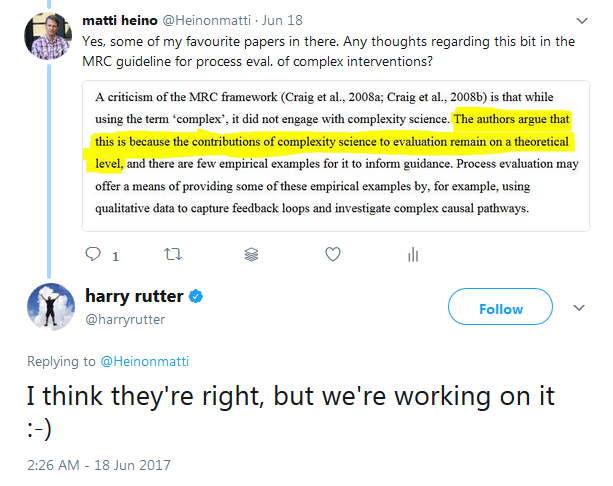

*In this post, I wonder what complex systems, as well as the nuts and bolts of mediation analysis, imply for studying processes of health psychological interventions.*

Say we make a risky prediction and find an intervention effect that replicates well (never mind for now that replicability is practically never tested in health psychology). We could then go on to investigating boundary conditions and intricacies of the effect. What’s sometimes done is a study of “mechanisms of action”, also endorsed by the MRC guidelines for process evaluation (1), as well as the Workgroup for Intervention Development and Evaluation Research (WIDER) (2). In such a study, we investigate whether the intervention worked as we thought it should have worked (in other words, to test the program theory; see [previous post](http://mattiheino.com/2017/08/18/scientific-evaluation/)). It would be spectacularly useful to decision makers, if we could disentangle the mechanisms of the intervention; “by increasing autonomy support, autonomous motivation goes up and physical activity ensues”. But attempting to evaluate this opens a spectacular can of worms.

Complex interventions include multiple interacting components, targeting several facets of a behaviour on different levels of the environment the individual operates in (1). This environment itself can be described as a complex system (3). In complex, adaptive systems such as the society or a human being, causality is thorny issue (4): Feedback loops, manifold interactions between variables over time, path-dependence and sensitivity to initial conditions make it challenging at best to state “a causes b” (5). But what does it even mean to say something causes something else?

Bollen (6) presents three conditions for causal inference: isolation, association and direction. *Isolation* means that no other variable can reasonably cause the outcome. This is usually impossible to achieve strictly, which is why researchers usually aim to control for covariates and thus reach a condition of *pseudo-isolation*. A common, but not often acknowledged problem is overfitting; adding covariates to a model leads to also fitting the measurement error they carry with them. *Association* means there should be a connection between the cause and the effect – in real life, usually a probabilistic one. In social sciences, a problem arises as everything is more or less correlated with everything else, and high-dimensional datasets suffer of the “[*curse of dimensionality*](https://stats.stackexchange.com/a/130635)”. *Direction*, self-evidently, means that the effect should flow from one direction to the other, not the other way around. This is highly problematic in complex systems. For an example in health psychology, it seems obvious that depression symptoms (e.g. anxiety and insomnia) feed each other, resulting in self-enforcing feedback loops (7).

When we consider the act of making efficient inferences, we want to be able to falsify our theories of the world (9); something that’s only recently really starting to be understood among psychologists (10). An easy-ish way about this, is to define the smallest effect size of interest (SESOI) a priori, ensure one has proper statistical power and attempt to reject the hypotheses that effects are larger than the upper bound of the SESOI, *and* lower than the lower bound. This procedure, also known as equivalence testing (11) allows for rejecting the falsification of statistical hypotheses in situations, where a SESOI can be determined. But when testing program theories of complex interventions, there may be no such luxury.

The notion of non-linear interactions with feedback loops makes the notion of causality in a complex system an evasive concept. If we're dealing with complexity, it is a situation where even miniscule effects can be meaningful when they interact with other effects: even small effects can have huge influences down the line (“the butterfly effect” in nonlinear dynamics; 8). It is hence difficult to determine the SESOI for intermediate links in the chain from intervention to outcome. And if we only say we expect an effect to be "any positive number", this leads to the postulated processes, as described in intervention program theories, being unfalsifiable: If a correlation of 0.001 between intervention participation and a continuous variable would corroborate a theory, one would need more than six million participants to detect it (at 80% power and an alpha of 5%; see also 12, p. 30). If researchers are unable to reject the null hypothesis of no effect, they cannot determine whether there is evidence for a null effect, or if a more elaborate sample was needed (e.g. 13).

Side note: One could use Bayes factors to compare whether a point null data generator (effect size being zero) would predict the data better than, for example, an alternative model where most effects are near zero but half of them over d = 0.2. But still, the smaller effects you consider potentially important, the less the data can distinguish between alternative and null models. A better option could be to estimate, how probable it is that the effect has a positive sign (as demonstrated [here](https://osf.io/preprints/psyarxiv/xmgwv)).

In sum, researchers are faced with an uncomfortable trade-off: Either they must specify a SESOI (and thus, a hypothesis) which does not reflect the theory under test or, on the other hand, unfalsifiability.

A common way to study mechanisms is to conduct a mediation analysis, where one variable’s (X) impact on another (Y) is modelled to pass through a third variable (M). In its classical form, one expects the path X-Y to go near zero, when M is added to the model.

The good news is, that nowadays we can do power analyses for both simple and complex mediation models (14).  The bad news is, that in the presence of randomisation of X but not M, the observed M-Y relation entails strong assumptions which are usually ignored (15). Researchers should e.g. justify why there exist no other mediating variables than the ones in the model; leaving variables out is effectively the same as assuming their effect to be zero. Also, the investigator should demonstrate why no omitted variables affect both M and Y – if there are such variables, the causal effect may be distorted at best and misleading at worst.

Now that we know it’s bad to omit variables, how do we avoid overfitting the model (i.e. be fooled by looking too much into what the data says)? It is very common for seemingly supported theories to fail to generalise to slightly different situations or other samples (16), and subgroup claims regularly fail to pan out in new data (17). Some solutions include ridge regression in the frequentist framework and regularising priors in the Bayesian one, but the simplest (though not the easiest) solution would be *cross-validation*. In cross-validation, you basically divide your sample in two (or even up to *n*) parts, use the first one to explore and the second one to “replicate” the analysis. Unfortunately, you need to have a large enough sample so that you can break it down to parts.

What does all this tell us? Mainly, that investigators would do well to heed Kenny’s (18) admonition: “mediation is not a thoughtless routine exercise that can be reduced down to a series of steps. Rather, it requires a detailed knowledge of the process under investigation and a careful and thoughtful analysis of data”. I would conjecture that researchers often lack such process knowledge. It may also be, that under complexity, the exact processes become both unknown and *unknowable* (19). Tools like structural equation modelling are wonderful, but I’m curious if they are up to the task of advising us about how to live in interconnected systems, where trends and cascades are bound to happen, and everything causes everything else.

These are just relatively disorganised thoughts, and I’m curious to hear if someone can shed hope to the situation. Specifically, hearing of interventions that work consistently and robustly, would definitely make my day.

ps. If you’re interested in replication matters in health psychology, there’s an upcoming symposium on the topic in EHPS17 featuring Martin Hagger, Gjalt-Jorn Peters, Rik Crutzen, Marie Johnston and me. My presentation is titled “*Disentangling replicable mechanisms of complex interventions: What to expect and how to avoid fooling ourselves?*“

pps. A recent piece in Lancet (20) called for a complex systems model of evidence for public health. Here’s a small conversation with the main author, regarding the UK Medical Research Council’s take on the subject. As you see, the science seems to be in some sort of a limbo/purgatory-type of place currently, but smart people are working on it so I have hope :)

<https://twitter.com/harryrutter/status/876219437430517761>

# Bibliography

1. Moore GF, Audrey S, Barker M, Bond L, Bonell C, Hardeman W, et al. Process evaluation of complex interventions: Medical Research Council guidance. BMJ. 2015 Mar 19;350:h1258.
2. Abraham C, Johnson BT, de Bruin M, Luszczynska A. Enhancing reporting of behavior change intervention evaluations. JAIDS J Acquir Immune Defic Syndr. 2014;66:S293–S299.
3. Shiell A, Hawe P, Gold L. Complex interventions or complex systems? Implications for health economic evaluation. BMJ. 2008 Jun 5;336(7656):1281–3.
4. Sterman JD. Learning from Evidence in a Complex World. Am J Public Health. 2006 Mar 1;96(3):505–14.
5. Resnicow K, Page SE. Embracing Chaos and Complexity: A Quantum Change for Public Health. Am J Public Health. 2008 Aug 1;98(8):1382–9.
6. Bollen KA. Structural equations with latent variables. New York: John Wiley. 1989;
7. Borsboom D. A network theory of mental disorders. World Psychiatry. 2017 Feb;16(1):5–13.
8. Hilborn RC. Sea gulls, butterflies, and grasshoppers: A brief history of the butterfly effect in nonlinear dynamics. Am J Phys. 2004 Apr;72(4):425–7.
9. LeBel EP, Berger D, Campbell L, Loving TJ. Falsifiability Is Not Optional. Accepted pending minor revisions at Journal of Personality and Social Psychology. [Internet]. 2017 [cited 2017 Apr 21]. Available from: https://osf.io/preprints/psyarxiv/dv94b/
10. Morey R D, Lakens D. Why most of psychology is statistically unfalsifiable. GitHub [Internet]. in prep. [cited 2016 Oct 23]; Available from: https://github.com/richarddmorey/psychology\_resolution
11. Lakens D. Equivalence Tests: A Practical Primer for t-Tests, Correlations, and Meta-Analyses [Internet]. 2016 [cited 2017 Feb 24]. Available from: https://osf.io/preprints/psyarxiv/97gpc/
12. Dienes Z. Understanding Psychology as a Science: An Introduction to Scientific and Statistical Inference. Palgrave Macmillan; 2008. 185 p.
13. Dienes Z. Using Bayes to get the most out of non-significant results. Quant Psychol Meas. 2014;5:781.
14. Schoemann AM, Boulton AJ, Short SD. Determining Power and Sample Size for Simple and Complex Mediation Models. Soc Psychol Personal Sci. 2017 Jun 15;194855061771506.
15. Bullock JG, Green DP, Ha SE. Yes, but what’s the mechanism? (don’t expect an easy answer). J Pers Soc Psychol. 2010;98(4):550–8.
16. Yarkoni T, Westfall J. Choosing prediction over explanation in psychology: Lessons from machine learning. FigShare Httpsdx Doi Org106084m9 Figshare. 2016;2441878:v1.
17. Wallach JD, Sullivan PG, Trepanowski JF, Sainani KL, Steyerberg EW, Ioannidis JPA. Evaluation of Evidence of Statistical Support and Corroboration of Subgroup Claims in Randomized Clinical Trials. JAMA Intern Med. 2017 Apr 1;177(4):554–60.
18. Kenny DA. Reflections on mediation. Organ Res Methods. 2008;11(2):353–358.
19. Bar-Yam Y. The limits of phenomenology: From behaviorism to drug testing and engineering design. Complexity. 2016 Sep 1;21(S1):181–9.
20. Rutter H, Savona N, Glonti K, Bibby J, Cummins S, Finegood DT, et al. The need for a complex systems model of evidence for public health. The Lancet [Internet]. 2017 Jun 13 [cited 2017 Jun 17];0(0). Available from: http://www.thelancet.com/journals/lancet/article/PIIS0140-6736(17)31267-9/abstract
