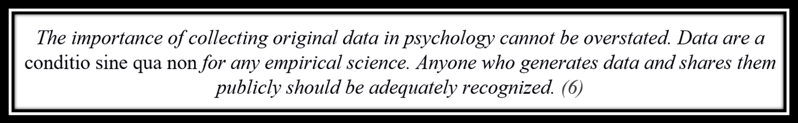

With the realisation that even linked data may not be enough for scientists (1), and as the European Union decided to embrace open access and best practices in data management (2–4), many psychologists find themselves treading on an unfamiliar terrain. Given that ~85% of health research [is wasted](http://blogs.bmj.com/ce/2016/02/11/is-85-of-health-research-really-wasted/), this is nothing short of a pressing issue in related fields.

Here, I comment on the FAIR Guiding Principles for scientific data management and stewardship (5) for the benefit of myself and perhaps others, who have not been involved with data management best practices.

*[Note: all this does NOT mean that you are forced to share sensitive data. But if your work can not be checked or reused (even after anonymisation), calling it scientific might be a stretch.]*

# What goes in a data management plan?

A necessary document to accompany any research plan is the data management plan. This plan should first of all specify the purpose of the data collection, and how it relates to the objectives of one’s research project. It should state which types of data are collected – for an example in the context of an intervention to promote physical activity, one might collect survey data, as well as accelerometer and body composition measures. The steps to assure the quality of the data can be described, too.

Next, the file formats for this data should be specified, along with which parts of the data will be made openly available, if the whole data is not made so. When and where will the data be made available, and what software is needed to read it? Will there be restrictions to access? Will there be an embargo, and if so, why?

The data management plan should also state, whether existing data is being re-used. The researcher should clarify the origin of data, whether existing or new, comment on its size (if known), and outline for whom the data will be useful to (4).

Bad practices leading to unusable data are still common, so adopting proper data management practices can incur costs. The data management plan should explicate these, how they are covered and who is responsible for the data management process.

> *The importance of collecting original data in psychology cannot be overstated. Data are a c*onditio sine qua non *for any empirical science. Anyone who generates data and shares them publicly should be adequately recognized.* (6)

Note: [**metadata**](https://en.wikipedia.org/wiki/Metadata) means any information about the data. For example, *descriptive metadata* increases discovery and identification; includes elements such as keywords, title, abstract, author. *Administrative metadata* informs the management of the data; creation dates, file types, version numbers.

# The FAIR principles for data management

The FAIR principles have been composed to help both machines and humans (such as meta-analysts) to find and use existing data. The principles consist of four requirements: Findability, Accessibility, Interoperability and Reusability. Note that the adherence to these principles is not just a yes-no question, but a gradient where data stewards should aspire for an increased uptake.

Below, the exact formulation of the (sub-)principles is in italics, my comments in bullet points.

**Findability:**

*F1. data are assigned a globally unique and eternally persistent identifier.*

- This is mostly handled in psychological research by making sure the research document is supplied with a DOI (Digital Object Identifier (7)). In addition to journals (for published research), most repositories where one can deposit any material (such as [FigShare](http://figshare.com) or [Zenodo](https://zenodo.org/)), or preprints (such as [PsyArxiv](http://psyarxiv.com)), assign the work a DOI automatically.

*F2. data are described with rich metadata.*

- This relates to R1 below. There should be data about the data telling you what the data is. Also: What is your approach to making versioning clear? In the Open Science Framework (OSF), you can upload new versions of your document and it automatically saves the previous version behind the new one, given that the new file has the same name as the old one.
- Your data archiver helps you with metadata. E.g. the Finnish Social Science Data Archive (FSD) uses the [DDI 2.1.](http://www.ddialliance.org/Specification/DDI-Codebook/2.1/) metadata standard.

*F3. data are registered or indexed in a searchable resource.*

- The researcher should deposit the data in a searchable repository. Your own website, or the website of your research group, is unfortunately not enough.

*F4. metadata specify the data identifier.*

- Make sure your data actually shows its DOI somewhere, and include a link to the dataset in the metadata. As far as I know, repositories such as the OSF do this for you.

 Non-transparent, inaccessible data. [Photo by [Maarten van den Heuvel](https://unsplash.com/photos/zqR4Fpi6Lyo?utm_source=unsplash&utm_medium=referral&utm_content=creditCopyText) on [Unsplash](https://unsplash.com/?utm_source=unsplash&utm_medium=referral&utm_content=creditCopyText).]**Accessibility:**

- From what I understand, these are not too relevant to individual researchers. Basically, if your work can be accessed via “http://”, you are complying with this. You should also be mindful of storing your data in one repository only, and avoid having multiple DOIs. Regarding A2: if your data is sensitive and you cannot share it openly, the description of the data should still be accessible to researchers. I am not certain about how repositories deal with accessibility after the data has been taken offline.

*A1. data are retrievable by their identifier using a standardized communications protocol.*

*A1.1 the protocol is open, free, and universally implementable.*

*A1.2 the protocol allows for an authentication and authorization procedure, where necessary.*

*A2. metadata are accessible, even when the data are no longer available.*

**Interoperability:**

- Behind these items (and the FAIR principles in general) is the idea that machines could read the data and mine it for e.g. meta-analyses. I am blissfully unaware of the intricacies related to that endeavour, so I just comment from the perspective of a common researcher here.

*I1. data use a formal, accessible, shared, and broadly applicable language for knowledge representation.*

- It is better to prefer simple formats (e.g. spreadsheets with comma-separated values, “file.csv”) that can be opened without special software (e.g. SPSS, “file.sav”).

*I2. data use vocabularies that follow FAIR principles.*

- This principle may seem somewhat vague and hard for others than computer scientists to grasp. It relates to index terms or glossaries used. In psychology, one possibility would be the [APA thesaurus](http://www.apa.org/pubs/databases/training/thesaurus.aspx) used by Psycinfo.

*I3. data include qualified references to other (meta)data.*

- This should be a given, and the citation culture of psychology seems well-equipped to follow. But it is still important to cite the original source of questionnaires, accelerometer algorithms etc.

 Accessible, transparent and FAIR data. [Photo by [Pahala Basuki](https://unsplash.com/photos/B2mq60Ksrsg?utm_source=unsplash&utm_medium=referral&utm_content=creditCopyText) on [Unsplash](https://unsplash.com/?utm_source=unsplash&utm_medium=referral&utm_content=creditCopyText).]**Re-usability:**

*R1. data have a plurality of accurate and relevant attributes.*

- This means that the research should be accompanied with e.g. tags or a description, which provides sufficient information to determine the value of reuse for the information seekers.

*R1.1. data are released with a clear and accessible data usage license.*

- You should state what licence is the work under. It is commonly recommended to use “CC0”, which allows all reuse, even without attribution. The second-best alternative, “CC-BY” (which *requires* attribution), can lead to interpretation problems of attribution stacking, when licences pile on each other (see chapter 10.4 in reference 8). It is a commonly accepted practice to cite others’ work in psychology, so CC0 seems a reasonable option, though I sympathise with the (almost invariably unfounded) fear of being scooped.

R1.2. data are associated with their provenance.

- This means that the source of the data is clear, so that the data can be cited.

R1.3. data meet domain-relevant community standards.

- In psychology, there are not many well-known community standards, but e.g. the DFG guidelines (6) are showing the way.

# Conclusion

The FAIR principles can be hard to comply with exhaustively, as they are sometimes difficult to interpret (even by people who work in data archives) and take a lot of effort implement. Hence, everyone should consider whether their data is FAIR *enough*. As with open data in general, one should be able to describe why best practices could not be followed, when that is the case. But—for the sake of ethics if nothing else—we should aim to do the best we can.

Additional information on the FAIR principles can be found [here](https://www.force11.org/fairprinciples), and some difficulties in assessing the adherence to them in ([9](https://openworking.wordpress.com/2017/02/10/fair-principles-connecting-the-dots-for-the-idcc-2017/)). A 20min webinar in Finnish is available [here](https://moniviestin.uta.fi/videot/yhteiskuntatieteellinen-tietoarkisto/2017/webinaarit/aineiston-avaajan-abc).

**Bibliography**

1. Bechhofer S, Buchan I, De Roure D, Missier P, Ainsworth J, Bhagat J, et al. Why linked data is not enough for scientists. Future Gener Comput Syst. 2013;29(2):599–611.
2. Khomami N. All scientific papers to be free by 2020 under EU proposals. The Guardian [Internet]. 2016 May 28 [cited 2017 Mar 29]; Available from: https://web.archive.org/web/20170329092259/https://www.theguardian.com/science/2016/may/28/eu-ministers-2020-target-free-access-scientific-papers
3. European Commission. Open access - H2020 Online Manual [Internet]. [cited 2017 Mar 29]. Available from: https://web.archive.org/web/20170329092016/https://ec.europa.eu/research/participants/docs/h2020-funding-guide/cross-cutting-issues/open-access-data-management/open-access\_en.htm
4. European Commission. Guidelines on data management in Horizon 2020 [Internet]. 2016 [cited 2017 Mar 29]. Available from: https://ec.europa.eu/research/participants/data/ref/h2020/grants\_manual/hi/oa\_pilot/h2020-hi-oa-data-mgt\_en.pdf
5. Wilkinson MD, Dumontier M, Aalbersberg IjJ, Appleton G, Axton M, Baak A, et al. The FAIR Guiding Principles for scientific data management and stewardship. Sci Data. 2016 Mar 15;3:160018.
6. Schönbrodt F, Gollwitzer M, Abele-Brehm A. Data Management in Psychological Science: Specification of the DFG Guidelines [Internet]. 2017 [cited 2017 Mar 29]. Available from: https://osf.io/preprints/psyarxiv/vhx89
7. International DOI Foundation. Digital Object Identifier System FAQs [Internet]. [cited 2017 Mar 29]. Available from: https://www.doi.org/faq.html
8. Briney K. Data Management for Researchers: Organize, maintain and share your data for research success [Internet]. Pelagic Publishing Ltd; 2015 [cited 2017 Mar 29]. Preview available from: https://books.google.fi/books?id=gw1iCgAAQBAJ&lpg=PT7&dq=Data%20management%20for%20researchers%3A%20organize%2C%20maintain%20and%20share%20your%20data%20for%20research%20success&lr&hl=fi&pg=PT6#v=onepage&q&f=false
9. Dunning A. FAIR Principles – Connecting the Dots for the IDCC 2017 [Internet]. Open Working. 2017 [cited 2017 Mar 29]. Available from: https://openworking.wordpress.com/2017/02/10/fair-principles-connecting-the-dots-for-the-idcc-2017/
