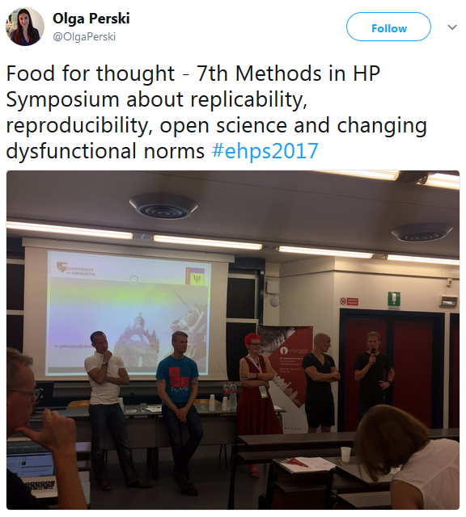

The field of psychology hit a critical mass in the 2010s, when fraud scandals coalesced with extrasensory perception and an increased awareness of a dodgy research practices (see [here](https://osf.io/rfmy3/) if this is news to you). Now, transparency, openness and reproducibility are becoming recognised as necessary elements of science: the Transparency  and Openness Promotion (TOP) [guidelines](https://www.theguardian.com/science/head-quarters/2015/jun/25/the-first-imperative-science-that-isnt-transparent-isnt-science) are already supported by over 700 journals. In Finland, the Ministry of Education and Culture set some [ambitious open science goals](http://openscience.fi/about) for the period 2014-2017.

Entering this field only recently, it has been easy for me to accept these new standards (slides from a recent talk [here](https://mattiheino.com/2016/11/01/feed-the-beast/)). That is also why it stings, when I see how difficult reproducibility is in intervention research.

In a recent Nature [paper](http://www.nature.com/articles/s41562-016-0021) "A manifesto for reproducible science",  a group of esteemed individuals outlined five themes in improving the efficiency and reliability of scientific research. Below, I present some of my impressions from my own field of behaviour change.

**Methods:** in the (health) intervention research I've seen, methods are emulated from medicine and thus in a somewhat better shape than e.g. mainstream social psychology (which may not be much to say). Whether they truly serve us in complex systems, though, [can be contested](http://www.necsi.edu/projects/yaneer/phenomenology/). As everywhere, methodologists and statisticians are a rare species and collaboration between research groups (e.g. combining resources to conduct an intervention in two different countries) is in its infancy.

- **What I worry about:** Do traditional methods serve us in complex interventions, which target complex systems? Where can we find statisticians who have time to check our measurements, research designs and models?

**Reporting and dissemination:** the practice of publishing protocols (essentially extended pre-registrations of studies) comes from medicine, too. It also suffers from the same problems: as pre-registration in psychology becomes more common, we will probably realise that they need to be checked against published reports, too. Prestigious medical journals [don't seem to care](http://compare-trials.org/blog/are-your-results-unusual-or-how-often-are-outcomes-switched/), so I expect things to get worse before they get better.

Reporting issues are in my opinion largely acknowledged, though the lure of HARKing may be especially seductive in health psychology interventions. A respected comrade noted, that complex interventions can be psychologically "too big to fail" for the investigators. When a single experiment takes years, the wish to see positive results can lead to taking (bona fide) advantage of researcher degrees of freedom.

Issues regarding conflicts of interest are rampant if you [ask James Coyne](http://blogs.plos.org/mindthebrain/category/conflict-of-interest-2/), but I haven't observed that myself yet.

- **What I worry about:** Will reviewers ever have time or interest to investigate outcome switching and/or researcher degrees of freedom? I find this particularly important in health psychology interventions, where the investigators can be exceptionally invested in finding positive results.

Reproducibility: This is a biggie. There has been squabble about whether effects like ego depletion can be "exactly" replicated. Proponents of the effect usually consider the replicators incompetent (i.e. they have ignored important contextual effects), and the replicators say the proponents are making up ad hoc criteria for boundary conditions, without empirically testing those criteria. This is all well and good, but these sorts of effects can be tested hundreds of times. I say that again: *hundreds*. The reality of complex interventions is a different universe.

Now, I've been involved in [a multi-site, multi-level complex intervention](https://bmcpublichealth.biomedcentral.com/articles/10.1186/s12889-016-3094-x). The project was started in 2012 and now—five years later—we are able to *begin* data analysis. If anyone ever was to get the funding for a replication study, it would most likely involve not only a different sample, but major changes in measurement, the tailored materials, too. When I follow the UK Medical Research Council [guidelines](https://www.mrc.ac.uk/documents/pdf/mrc-phsrn-process-evaluation-guidance-final/) and explore the mechanisms of impact, how do I guard against e.g. overfitting? Splitting the dataset into modelling and holdout/testing sets could help. I can also pre-register an analysis plan and share my code.

- **What I worry about:** Is reproducibility of complex, expensive interventions inherently impossible?
- **A proposed solution:** If results are hard to confirm with new data sets, perhaps we should routinely split our samples into test- and holdout sets (see [this](http://www.dcscience.net/Young-Karr-2011.pdf) great paper). Are there other options?

With this kind of data, sharing gets a bit trickier, too. Here are some concerns I've encountered:

1. "We are writing (or planning to write) other papers on the same data, and—having spent years collecting—we don't want others to analyse & publish those results before us."
2. "Health-related data has serious confidentiality issues, so we don't want to put it out in the open."
3. "The only incentive for me to share data that it gets cited. Those citations are useless to me unless I'm an author in the paper."

- **What I worry about:** Will early data sharing ever become a norm?
- **A proposed solution:** If researchers are worried about getting scooped, could they publish data under a licence that forbids publishing on the data set for e.g. 2 years?

**Evaluation (diversifying peer review):** I haven't seen many preprints or much post-publication peer review in this area, but don't foresee problems regarding them.

**Incentives (rewarding open and reproducible practices):** I've seen institutions promote openness in speech but not that much in practice. Data sharing

Relevant papers:

What should we aim for?

- [Choosing prediction over explanation in psychology: Lessons from machine learning](http://jakewestfall.org/publications/Yarkoni_Westfall_choosing_prediction.pdf)

Degrees of replication (exact - conceptual)

- [Falsifiability is not optional](https://osf.io/preprints/psyarxiv/dv94b/)

Paul Lutus has [argued](http://arachnoid.com/no_theory_no_science/) that psychology should be considered an applied science, which itself is not science. If you concede to this view, it's even more obvious in intervention research. The only way to get closer to actual practice is by dropping measurement, along with design considerations that make it possible.

https://twitter.com/OlgaPerski/status/903173941677711361
