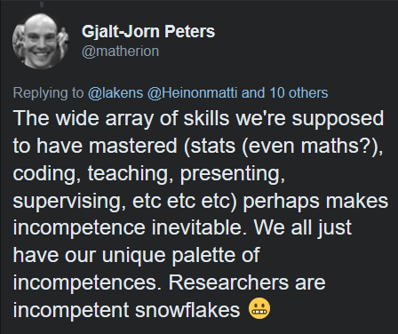

After a long conversation on Twitter, I wanted to summarise some of my current beliefs about the tone debate in science. For those unfamiliar with the issue, some people think others are being too harsh, discouraging people to take part in the scientific enterprise, while others think harshness is sometimes necessary.
I think there were some particularly good points which came up.
 

https://twitter.com/matherion/status/956143738421764097
