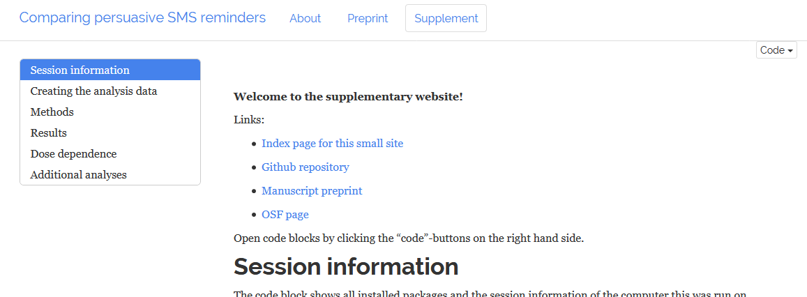

When [Roger Giner-Sorolla](https://approachingblog.wordpress.com/) three years ago lamented to me, how annoying it can be to dig out interesting methods/results information from a manuscript with a carefully crafted narrative, I wholeheartedly agreed. When I saw the [100%CI post](http://www.the100.ci/2017/02/19/reproducible-websites-for-fun-and-profit/) on reproducible websites a year ago, I thought it was cool but way too tech-y for me.

Well, it turned out that when you learn a tiny bit of [elementary R Markdown](https://crsh.github.io/papaja_man/), you can follow [idiot-proof instructions](https://debruine.github.io/acadweb/) on how to make cool websites out of your analysis code. I was also working on the manuscript-version of my Master's thesis, and realised several commenters thought much of the methods stuff I considered interesting, was just unnecessary and/or boring.

So I made [this thing](https://heinonmatti.github.io/sms-persuasion/sms-persuasion-supplement.html) of what I thought was the beef of the paper (also, to motivate me to finally submit that damned piece):

It got me thinking: Perhaps we could create a parallel form of literature, where (open) highly technical and (closed) traditionally narrated documents coexist. The R Markdown research notes could be read with only a preregistration or a blog post to guide the reader, while the journals could just continue with business as usual. The great thing is that, as Ruben Arslan pointed out in the 100%CI post, you can present *a lot* of results and analyses, which is nice if you'd do them anyway and data sharing a no-no in your field. In general, if there's just too much conservative inertia in your field, this could be a way around it: Let the to-be-extinct journals build paywalls around your articles, but put the important things openly available. The people who get pissed off by that sort of stuff rarely look at technical supplements anyway :)

I'd love to hear your thoughts of the feasibility of the approach, as well as how to improve such supplements!

## Afterthought

After some insightful comments by [Gjalt-Jorn Peters](http://www.twitter.com/matherion), I started thinking how this could be abused. We've already seen how e.g. preregistration can be used as a signal of illusory quality ([1](https://twitter.com/hardsci/status/966096799151747072), [2](https://twitter.com/maltoesermalte/status/964171076761735173)), and supplements like this could do the same thing. Someone could just bluff by cramming the thing full of difficult-to-interpret analyses, and claim "hey, it's all there!". One helpful thing is to expect heavy use of visualisations, which are less morbid to look at than numeric tables and raw R output. Another option would be creating a [wonderful shiny app](https://emoriebeck.shinyapps.io/pairs_graphicalvar/), like [Emorie Beck](https://twitter.com/EmorieBeck) did.

Actually, let's take a moment to marvel at how super awesomesauce that thing is.

Thanks.

So, to continue: I don't know how difficult it really is to make such a thing. I'm sure a lot of tech-savvy people readily say it's the simplest thing in the world, and I'm sure a lot of people will see the supplements I presented here as a shitton of learning to do. I don't have a solution. But if you're a PI, you can do both yourself and your doctoral students a favour by nudging them towards learning R; maybe they'll make a shiny app (or whatever's in season then) for you one day!

*ps. If I'd do the R Markdown all over again, I'd do more and better plots, as well as put more emphasis on readability, including better annotation of my code and decisions. Some of that code is from when I first learned R, and it's a bit ... rough. (In the last moment before submitting my Master's thesis I decided, in a small state of frustrated fury, to re-do all analyses in R so that I needn't mention SPSS or Excel in the thesis...)*

*pps. In the manuscript, I link to the page via a GitHub Pages url shortener, but provide permalink (web page stored with the* *[Wayback Machine](https://archive.org/web/)**) in the references. We'll see what the journal thinks of that.*

*ppps. There are probably errors lurking around, so please notify me when you see them :)*
