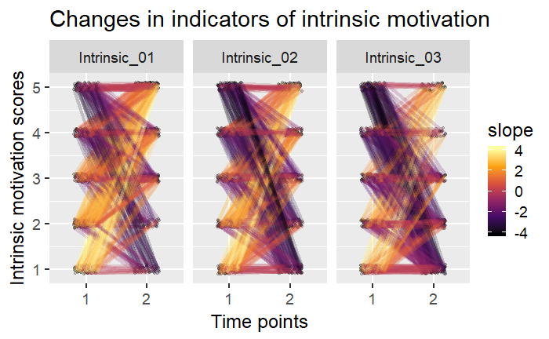

*I recently had a great experience with a [StackOverflow question](https://stackoverflow.com/questions/50181772/line-color-and-width-by-slope-in-ggplot2), when I was thinking about how to visualise ordinal data. This post shows an option for how to do that. Code for the plots is in the end of this post.*

> Update: here's an [FB discussion](https://www.facebook.com/groups/853552931365745/permalink/1732814396772923/), which mentions e.g. a good idea of making stacked % graphs (though I like to see the individuals, so they won't sneak up behind me) and using the package TramineR to visualise and analyse change.

> Update 2: Although they have other names too, I'm going to call these things flamethrower plots. Just because it reflects the fact, that even though you have the opportunity to do it, it may not always be the best idea to apply them.

Say you have scores on some likert-type scale questionnaire items, like motivation, in two time points, and would like to visualise them. You're especially interested in whether you can see detrimental effects, e.g. due to an intervention. One option would be to make a plot like this: each line in the plot below is one person, and the lighter lines indicate bigger increases in motivation scores, whereas the darker lines indicate [iatrogenic](https://en.wikipedia.org/wiki/Iatrogenesis) development. The data is simulated so, that the highest increases take place in the item in the leftmost plot, the middle is randomness and the right one shows iatrogenics.

I have two questions:

1. Do these plots have a name, and if not, what should we call them?
2. How would you go about superimposing model-implied-changes, i.e. lines showing that when someone starts off at, for example, a score of four, where are they likely to end up in T2?

The code below first simulates 500 participants for two time points, then draws plot. If you want to use it on your own data, transform the variables in the form scaleName\_itemNumber\_timePoint (e.g. "motivation\_02\_T1").

[code lang=text]
 # Simulate data:
data <- data.frame(id = 1:500,
Intrinsic\_01\_T1 = sample(1:5, 500, replace = TRUE),
Intrinsic\_02\_T1 = sample(1:5, 500, replace = TRUE),
Intrinsic\_03\_T1 = sample(1:5, 500, replace = TRUE),
Intrinsic\_01\_T2 = sample(1:5, 500, replace = TRUE, prob = c(0.1, 0.1, 0.2, 0.3, 0.3)),
Intrinsic\_02\_T2 = sample(1:5, 500, replace = TRUE),
Intrinsic\_03\_T2 = sample(1:5, 500, replace = TRUE, prob = c(0.3, 0.3, 0.2, 0.1, 0.1)))

pd <- position\_dodge(0.4) # X-axis jitter to make points more readable

# Draw plot:

data %>%
tidyr::gather(variable, value, -id) %>%
tidyr::separate(variable, c("item", "time"), sep = "\_T") %>%
dplyr::mutate(value = jitter(value, amount = 0.1)) %>% # Y-axis jitter to make points more readable
group\_by(id, item) %>%
mutate(slope = (value[time == 2] - value[time == 1]) / (2 - 1)) %>%
ggplot(aes(x = time, y = value, group = id)) +
geom\_point(size = 1, alpha = .2, position = pd) +
geom\_line(alpha = .2, position = pd, aes(color = slope), size = 1.5) +
scale\_color\_viridis\_c(option = "inferno")+
ggtitle('Changes in indicators of motivation scores') +
ylab('Intrinsic motivation scores') +
xlab('Time points') +
facet\_wrap("item")

[/code]
