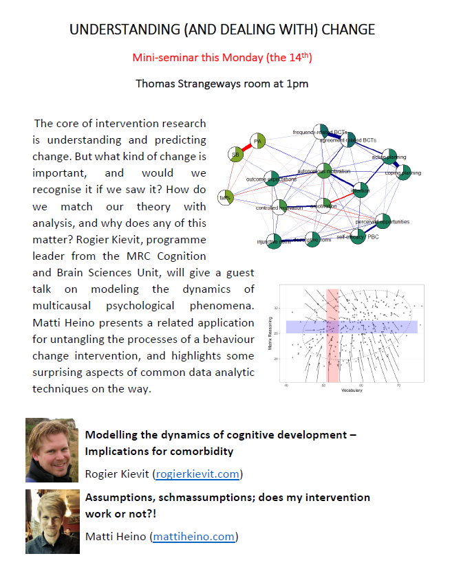

*I organised a mini-seminar in Cambridge (ad below), relating to compatibility of theories and models of change. Please find my slides below, or download them [here](https://drive.google.com/file/d/1rQe-Ox2_1M-xhHM-cHQdMbQYyyOaksuN/view?usp=sharing).*

<iframe src="https://drive.google.com/file/d/1rQe-Ox2_1M-xhHM-cHQdMbQYyyOaksuN/preview" title="Presentation slides" loading="lazy" allowfullscreen></iframe>

