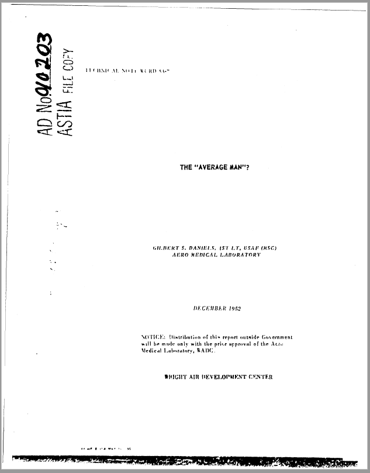
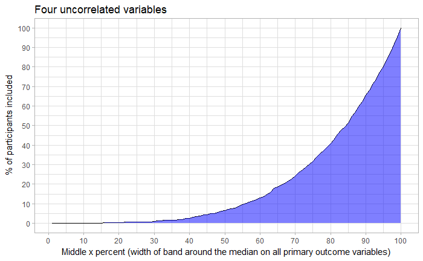
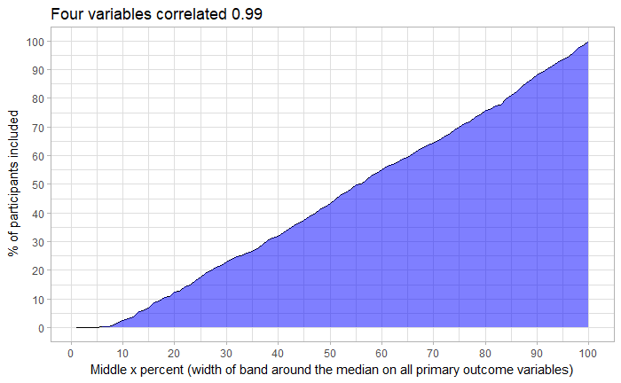
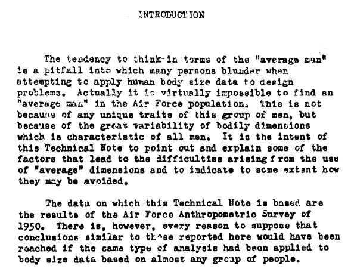

*In this post, I present a property of averages I found surprising. Undoubtedly this is self-evident to statisticians and people who can think multi-variately, but personally I needed to see it to get a grasp of it. If you're a researcher, make sure you do the **[single-item quiz](https://goo.gl/forms/u6ATv6dhZbnUsccx2)** before reading, to see how well your intuitions compare to those of others!*

*UPDATE: The finding regarding average intervention participants' prevalence is published in [this paper](https://www.tandfonline.com/doi/full/10.1080/21642850.2019.1646136), in case you want a citable reference for it.*

> Ooo-oh! Don't believe what they say is true
> Ooo-oh! Their system doesn't work for you
> Ooo-oh! You can be what you want to be
> Ooo-oh! You don't have to join their f\*king army
>
> - Anti-Flag: Their System Doesn't Work For You

In his book "The End of Average", Todd Rose relates a curious [story](https://www.thestar.com/news/insight/2016/01/16/when-us-air-force-discovered-the-flaw-of-averages.html). In the late 1940s, the US Air Force saw a lot of planes crashing, and those crashes couldn't be attributed to pilot error nor equipment malfunction. On one particularly bad day, 17 pilots crashed without an obvious reason. As everything from cockpits to helmets had been built to conform to the average pilot of the 1926, they brought in Lt. Gilbert Daniels to see if pilots had gotten bigger since then. Daniels measured 4063 pilots—who were preselected to not deviate from the average too much—on ten dimensions: height, chest circumference, arm length, thigh circumference, and so forth.

Before Daniels began, the general assumption was, that these pilots were mostly if not exclusively average, and Daniels' task was to find the most accurate point estimate. But he had a more fundamental idea in mind. He defined "average" generously as person who falls within the 30% band around the middle, i.e. the median ±15%, and looked at whether each individual fulfills that criterion for all the ten bodily dimensions.

So, how big a proportion of pilots were found to be average by this metric?

Zero.

 Daniels, Gilbert S. “The" Average Man"?” AIR FORCE AEROSPACE MEDICAL RESEARCH LAB WRIGHT-PATTERSON AFB OH, 1952.

This may be surprising, until you realise that each additional dimension brings with it a new "objective", making it less likely that someone achieves *all* of them. But actually, only a fourth were average on a single dimension, and already less than ten percent were average on two dimensions.

As you saw in the quiz, I wanted to figure out how big a proportion of [our intervention](https://bmcpublichealth.biomedcentral.com/articles/10.1186/s12889-016-3094-x) participants could be described as "average" by Daniels' definition, on **four** outcome measures. The answer?

*A lousy 1.5 percent*.

I'm a bit slow, so I had to do a of simulation to get a better grasp of the phenomenon (code [here](https://drive.google.com/file/d/14puAXiw61gofoRJ1WhaSn1Aq0NuapU4B/view?usp=sharing)). First, I simulated 700 intervention participants, who were hypothetically measured on four random, uncorrelated, normally distributed variables. What I found was that 0.86 % of this sample were "average" by the same definition as before. But what if we changed the definition?

Here's what happens:

As you can see, you'll describe more than half of the sample only when you extend the definition of "average" to about the middle 85% percent (i.e. median ±42.5%).

But what if the variables were highly correlated? I also simulated 700 independent participants with four variables, which were correlated almost perfectly (within-individual r = 0.99) with each other. Still, only 22.9 % percent of participants were described by defining average as the middle 30% around the median. For other definitions, see the plot below.

What have we learned? First of all: When you see averages, *do not go assuming that they describe individuals*. If you're designing an intervention, you don't just want to see which determinants correlate highly with the target behaviour on average, or seem changeable in the sense that the mean on those variables is not very high to begin with in your target group (see the [CIBER](https://www.frontiersin.org/articles/10.3389/fpubh.2017.00165/full) approach, if you're starting from scratch and want to get a preliminary handle on the data). This, because a single individual is unlikely to have the average standing on more than, say, two of the determinants, and individuals are who you're generally looking to target. One thing you could do, is a cluster analysis where you'd look for the determinant *profile*, which is best associated with e.g. hospital visits (or, attitude/intention), and try to target the changeable determinants within that.

As a corollary: If you, your child, or your relationship doesn't seem to conform to the dimensions of an average person in your city, or a particular age group, or whatever, *this is completely normal!* Whenever you see yourself falling behind the average, remember that there are plenty of dimensions where you land above it.

But wait, what happened to USAF's problem of planes crashing? Well, the air force told the plane manufacturers to fix the problem of cockpits which don't fit any individuals. The manufacturers said it was impossible and extremely costly. But when the air force said didn't listen to excuses, cheap and easy solutions appeared quickly. Adjustable seats—now standard equipment in cars—are an example of the new design philosophy of *individual fit,* where we don't try to fit the individual to the system, but the system to the individual.

Let us conclude with Daniels' introduction section:

Three additional notes about the average:

> Note 1: Here's a very nice [Google Talks presentation](https://www.youtube.com/watch?v=_cMXWcME_vQ) of this and extended topics!

> Note 2: There's a curious tendency to think that deviations from the average represent "error" regardless of domain, whereas it's self-evident that individuals can survive both if they're e.g. big and bulky, or small and fast. With psychological measurement, is it not madness to think all participants have an attitude score, which comes from a normal distribution with a common mean for all participants? To inject reality in the situation, each participant may have their own mean, which changes over time. But that's a story for another post.

> Note 3:  I'm taking it for granted, that we already know that the average is a useless statistic to begin with, unless you know the variation around the average, so I won't pound on that further. But remember that variables generally aren't perfectly normally distributed, as in the above simulations; my guess is that the situation would be even worse in those cases. Here's a blog post you may want to check out: [On Average, You’re Using the Wrong Average](https://towardsdatascience.com/on-average-youre-using-the-wrong-average-part-ii-b32fcb41527e).

> Note 4: Did I already say, that you generally shouldn't make individual-level conclusions based on between-individual data, unless [ergodicity](https://larspsyll.wordpress.com/2016/11/23/what-is-ergodicity-2/) holds (which, in psychology, would be quite weird)? See short video [here](https://www.youtube.com/watch?v=dwu-1ahai8Q)!
