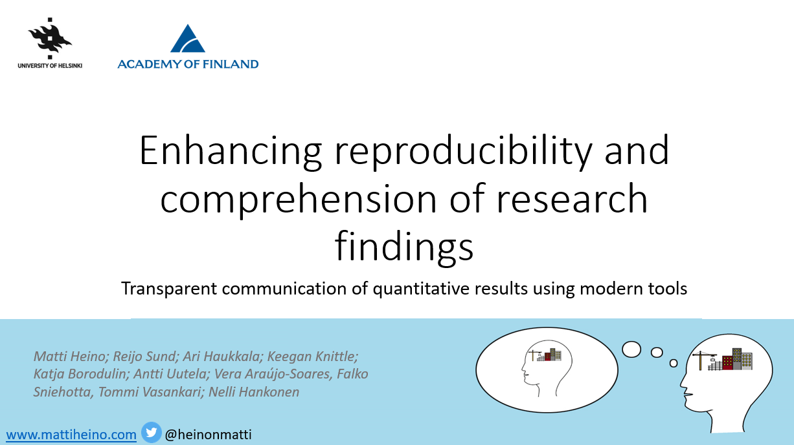
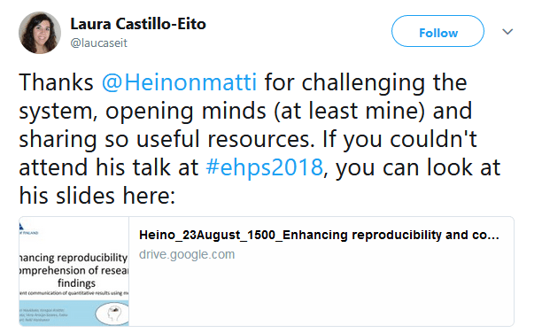

*These are the slides of my presentation at the annual conference of the European Health Psychology Society. It's about presenting data visually, and taking publishing culture from the journals to our own hands. I hint to a utopia, where the journal publication is a side product of a comprehensively reported data set.*

Please find a 14min video walkthrough of the slides (which can be found [here](https://drive.google.com/file/d/1kYYYeQdG4NyLJmpr4fY3oyYvOz85xkj1/view)) below. The site presented in the slides is [here](http://heinonmatti.github.io/baseline-visu), and the tutorial by the most awesome [Lisa DeBruine](https://twitter.com/lisadebruine) is [here](https://debruine.github.io/acadweb/)!

https://www.youtube.com/watch?v=6rJaIRYLSLY

After the talk, I saw what was probably the best tweet about a presentation of mine ever. For a fleeting moment, I was happy to exist:

Big thanks to everyone involved, especially [Gjalt-Jorn Peters](https://twitter.com/matherion) for helpful suggestions on code and the plots. For the diamond plots, check out [diamondplots.com](http://diamondplots.com).

**Authors of the conference abstract:**

Matti Heino; Reijo Sund; Ari Haukkala; Keegan Knittle; Katja Borodulin; Antti Uutela; Vera Araújo-Soares, Falko Sniehotta, Tommi Vasankari; Nelli Hankonen

# Abstract

**Background:** Comprehensive reporting of results has traditionally been constrained by limited reporting space. In spite of calls for increased transparency, researchers have had to choose carefully what to report, and what to leave out; choices made based on subjective evaluations of importance. Open data remedies the situation, but privacy concerns and tradition hinder rapid progress. We present novel possibilities for comprehensive representation of data, making use of recent software developments.

**Methods:** We illustrate the opportunities using the Let’s Move It trial baseline data (n=1084). Descriptive statistics and group comparison results on psychosocial correlates of physical activity (PA) and accelerometry-assessed PA were reported in an easily accessible html-supplement, directly created from a combination of analysis code and data using existing tools within R.

**Findings:** Visualisations (e.g. network graphs, combined ridge and diamond plots) enabled presenting large amounts of information in an intelligible format. This bypasses the need to create narrative explanations for all data, or compress nuanced information into simple summary statistics. Providing all analysis code in a readily accessible format further contributed to transparency.

**Discussion:** We demonstrate how researchers can make their extensive analyses and descriptions openly available as website supplements, preferably with abundant visualisation to avoid overwhelming the reader with e.g. large numeric tables. Uptake of such practice could lead to a parallel form of literature, where highly technical and traditionally narrated documents coexist. While we may have to wait for fully open and documented data, comprehensive reporting of results is available to us now.
