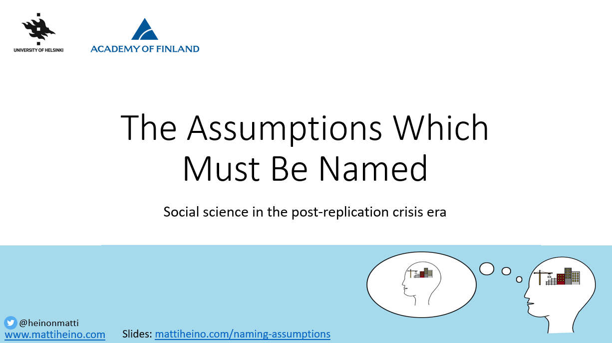

*The gist: to avoid getting fooled by them, we need to name our simplifying assumptions when modeling social scientific data. I'm experimenting with this visual approach to delivering information to those who think modeling is boring; feedback and improvement suggestions very welcome! [Similar presentation with between-individual longitudinal physical activity networks, presented at the Finnish Health Psychology conference: [here](https://drive.google.com/file/d/11x3-iXeQUliXhlatb0zyrm5ZcrJ0vdrI/view?usp=sharing)]*

I'm not as smooth as those talking heads on the interweb, so you may want just the slides. Download by clicking on the image below or watch at [SlideShare](https://www.slideshare.net/MatinHeino/assumptions-which-must-be-named).

SLIDE DECK:

Mini-MOOC:

https://youtu.be/FW7tCplWbOY

Note: Jan Vanhove thinks we shouldn't  become paranoid with model assumptions; check his related blog post [here](https://janhove.github.io/analysis/2018/04/25/graphical-model-checking)!
