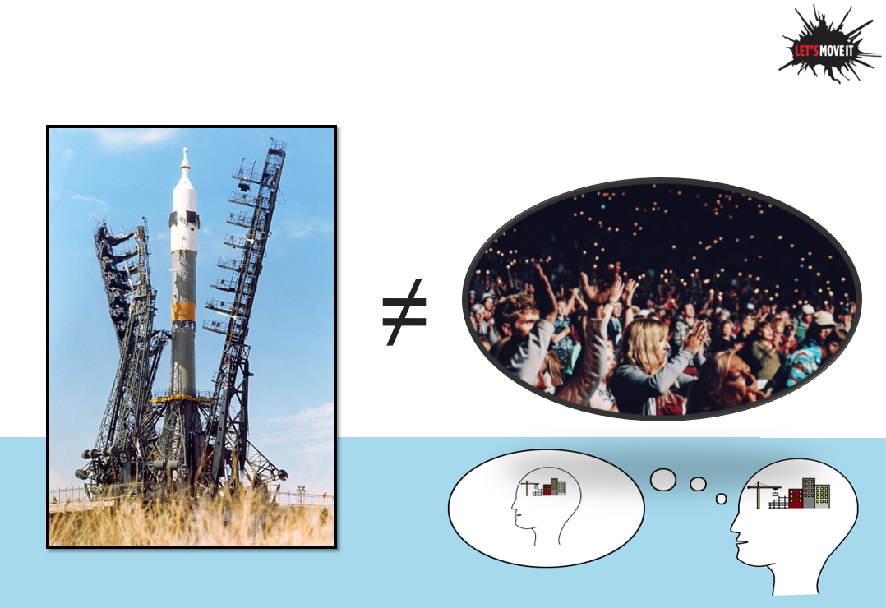

For some years, I've been partly involved in the Let's Move It intervention project, which targeted dysfunctional physical activity and sedentary behaviour patterns of older adolescents, by affecting their school environment as well as social and psychological factors.

I held a talk at the closing seminar; it was live streamed and is available [here](https://www.helsinki.fi/fi/unitube/video/21067) (on stage starting from about 1:57:00 in the recording). But if you were there, or are otherwise interested in the slides I promised, they are now [here](https://drive.google.com/file/d/1MieKICd1XjlKbHXz7BHCwhcdtHR2JW4J/view?usp=sharing).

For a demonstration of non-stationary processes (which I didn't talk about but which are mentioned in these slides), check out [this video](https://www.youtube.com/watch?v=Gx49W3ZOG64) and an experimental [mini-MOOC](https://mattiheino.com/2018/10/25/naming-assumptions/) I made. Another blog post touching on some of the issues is found [here](https://mattiheino.com/2017/08/25/mechanisms-under-complexity/).

