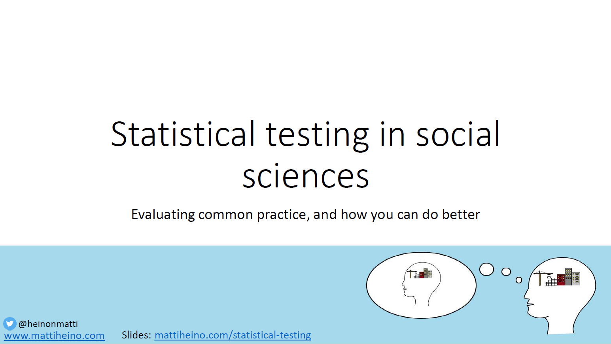

These are slides from my lecture on significance testing, which took place in a course on research methods for social scientists. Some thoughts:

- I tried to emphasise that this stuff is difficult, that people shouldn't be afraid to say they don't know, and that academics should try doing that more, too.
- I tried to instill a deep memory that many uncertainties are involved in this endeavour, and that mistakes are ok as long as you report the choices you made transparently.
- Added a small group discussion exercise at about 2/3 of the lecture: What was the most difficult part to understand so far? I think this worked quite well, although "Is this what an existential crisis feels like?" was not an uncommon response.

I really think statistics is mostly impossible to teach, and people learn when they get interested and start finding things out on their own. Not sure how successful this attempt was in doing that. Anyway, slides are available [here](https://drive.google.com/file/d/1q6NiqdXOxhcaTRrxyZDty0JLfFzzgX8o/view?usp=sharing).

TLDR: If you're a seasoned researcher, see [this](https://errorstatistics.com/2019/01/03/sist-blog-posts-excerpts-mementos-to-dec-31-2018/). If you're an aspiring one, start [here](https://www.coursera.org/learn/statistical-inferences) or [here,](https://www.youtube.com/watch?v=4WVelCswXo4) and read [this](https://www.mpib-berlin.mpg.de/pubdata/gigerenzer/Gigerenzer_2018_Statistical_rituals.pdf).

