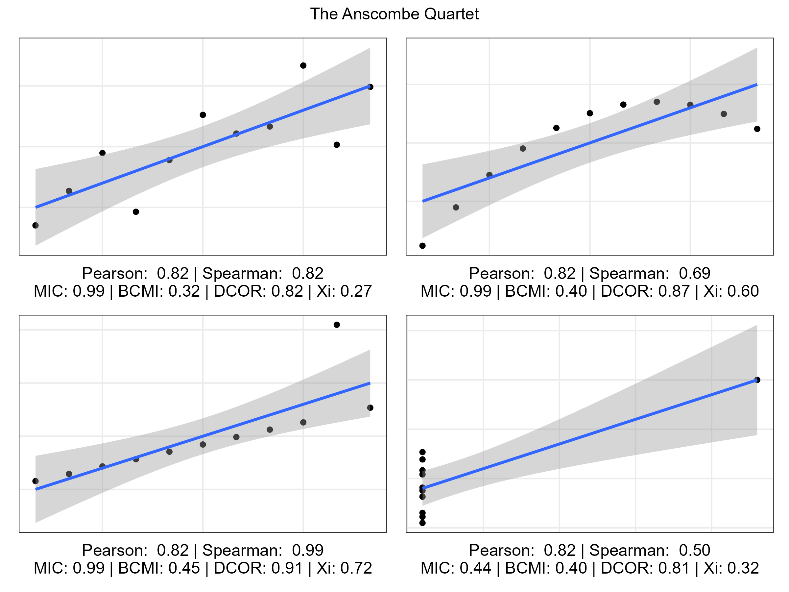
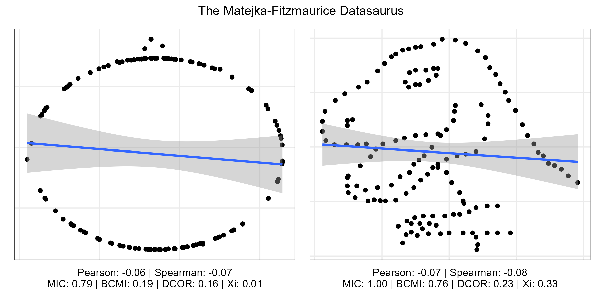
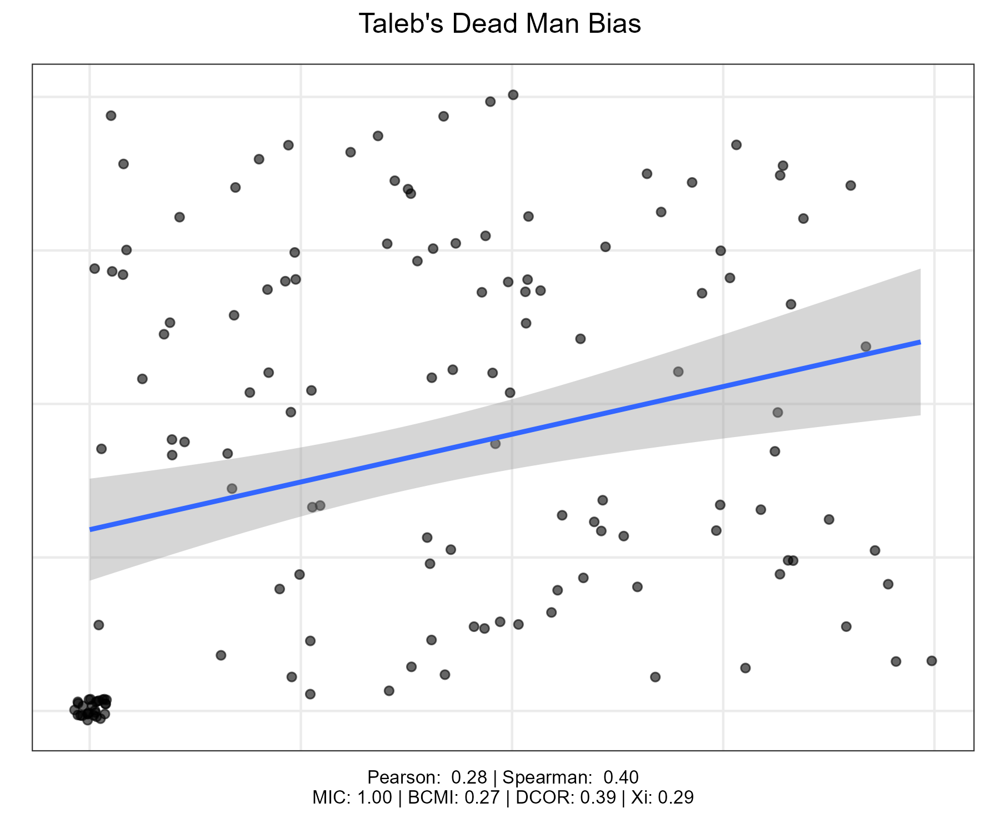

*I've become increasingly anxious about properties of correlation I never knew existed. I collect resources and stuff on the topic in this post, so that have everything in one place. Some resources for beginners in the end of the post. This post was originally written in 2019, and has been updated in December 2024.*

Correlation isn't causation, and [causation doesn't need correlation](https://twitter.com/profnfenton/status/1111973463487627265). Ok, we all know this, which is why researchers say things like "physical activity and mental well-being were *associated*, p<0.05". But does correlation even measure association? Ain't that an unsettling question. Correlation, like regression analysis, is based on covariance. And as Shay Allen Hill describes visually in his [excellent, short blog](https://shayallenhill.com/correlation-pitfalls):

> [C]ovariance doesn’t actually measure “Does y increase when x increases?” it only measures “Is y above average when x is above average (and by how much)?” And when covariance is broken [i.e. mean doesn't coincide with median], our correlation function is broken.

There are [situations](https://twitter.com/nntaleb/status/1115021175254659077), where only 20% of people in a sample drive the association between two variables, leading to *at least* a correlation of 37%. Nassim Nicholas Taleb calls this the Dead Man Bias. Imagine setting up a study, where the real correlation between two performance indicators is zero. Then you hit 20% of participants in the head with a hammer. Now, the (literally) hammered participants' performance is zero, while the rest do randomly, et voilá! A correlation of almost 40%. I show an example with real data in a behaviour change context [here](https://threadreaderapp.com/thread/1382359552285347844.html).

As you may know, in psychology, it's quite rare to see a correlation of 0.5. Such a "high" correlation can carry 4.5 times more information than a correlation of 0.25, but [only gives](https://twitter.com/nntaleb/status/1135781185014181890) 13% more information than random. So, let us explore some examples and try to get a visual intuition about alternatives.

Many promising options are based on [mutual information](https://medium.com/swlh/a-deep-conceptual-guide-to-mutual-information-a5021031fad0) (see this [post](https://twitter.com/nntaleb/status/1111966227503689728) and this [paper draft](https://www.academia.edu/39797871/Common_Misapplications_and_Misinterpretations_of_Correlation_in_Social_Science_) for more information). In what follows, I explore these alternatives to traditional correlation measures:

- MIC is the Maximal Information Coefficient, from something called "maximal information-based nonparametric exploration" ([documentation](https://cran.r-project.org/web/packages/minerva/index.html))
- BCMI stands for Jackknife Bias Corrected Mutual Information ([documentation](https://cran.r-project.org/package=mpmi))
- DCOR is Distance Correlation ([documentation](https://cran.r-project.org/web/packages/energy/energy.pdf), also see comments)
- Xi is a new measure of interdependence explained in [this article](https://doi.org/10.1080/01621459.2020.1758115). It was designed as a relatively simple alternative to make up for other measures' faults; e.g. MIC can show a perfect relationship when there is none.

Let us first look at the [Anscombe's Quartet](https://en.wikipedia.org/wiki/Anscombe%27s_quartet), which should be familiar to everyone who ever sat in a stats class. I have added linear regression lines as a visualisation of correlation.

Anscombe originally created these plots to illustrate the importance of data visualisation. They all have the same mean, variance, and Pearson correlation, but tell a wildly different story about the data. It seems like MIC most clearly depicts the expected behaviour: low on the bottom-right plot, while high on the others. There are only 11 data points, though, so it's limited what we can infer from the measures' performance. The next two plots picked from the [Datasaurus Dozen](https://www.research.autodesk.com/publications/same-stats-different-graphs/) also have the matching mean, variance, and correlation:

As we can see, traditional correlation measures fail miserably, and distance correlation is not great either. MIC and BCMI see the dinosaur. It is also quite curious that Xi fails to see the circle.

Finally, let's illustrate the Dead Man Bias with an imaginary sample. So, imagine the vertical axis being one performance measure, and the horizontal axis another one. 20% of people got the hammer (scoring zero on both measures) while the rest performed randomly. This sample has the same number of points as the earlier plot, making it possible to compare performances. Points are jittered to avoid overplotting.

As we can see, while Pearson correlation is driven entirely by the hammered folks, Spearman is *even worse*. MIC shows a perfect relationship, illustrating the issue we discussed earlier when introducing Xi. But Xi is seeing a much interdependence as with the dinosaur, which isn't great. Of course, none of these measures know about the hammer routine, so maybe it's not entirely their fault.

## What have we learned?

Well, the most obvious conclusion is to PLOT YOUR DATA, FOR GOD'S SAKE. The second lesson is to not blindly believe in *any* summary statistics – we all need to develop a curiosity towards what lies underneath. I encourage reviewers of scientific work to ask for data visualisations: Everyone claims to have inspected them in detail before quantitative analysis, but I suspect few actually do.

And what about the dependence measures we explored here? There's not enough space to cover the actual *meaning* of the less conventional measures introduced here, and many caveats apply. But it should be clear that correlation only describes linear relationships – at best. This can be a problem because, as the mathematician and author Steven Strogatz stated, “most of everyday life is nonlinear”.

I'd be happy to hear thoughts and caveats regarding the use of information-based dependency measures from people who know their entropy!

---

ps. If this is your first brush with uncertainties related to correlations, and/or have little or no statistics background, you may not know how correlation can vary spectacularly in small samples. Taleb's stuff (mini-moocs [[1](https://www.youtube.com/watch?v=p76bQlnVuBM), [2](https://www.youtube.com/watch?v=yUooqL47akM)]) can sometimes be difficult to grasp without math background, so perhaps get started with this [visualisation](https://shiny.rit.albany.edu/stat/rectangles/), or these [Excel sheets](https://sites.google.com/site/obintlab/wiki/stats). A while ago I animated some elementary [simulations of p-value distributions](https://mattiheino.com/p-walks-into-a-bar-chart/) for statistical significance of correlations; selective reporting makes things a lot worse than what's depicted there. If you're a psychology student, also be sure to check out the [p-hacker app](http://shinyapps.org/apps/p-hacker/).

⊂This post has been a formal sacrifice to [Rexthor](https://xkcd.com/1725/).⊃
