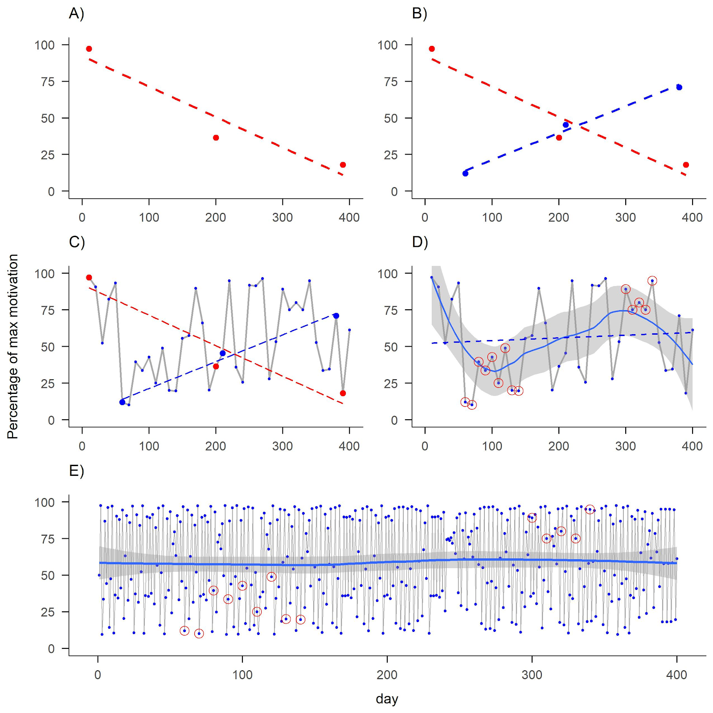
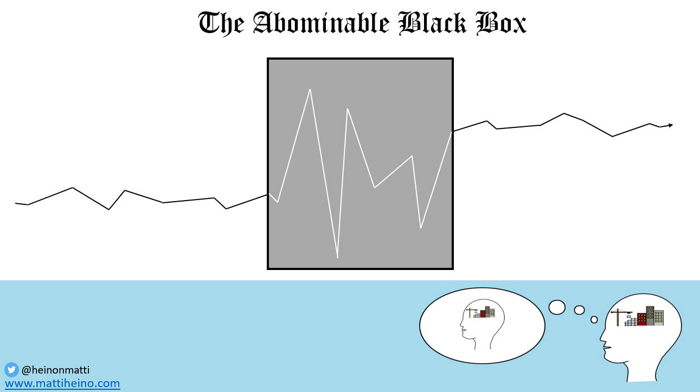

*This post contains slides I made to illustrate some points about phenomena, which will remain forever out of reach, if we continue the common practice of always averaging individual data. For another post on perils of averaging, [check this out](https://mattiheino.com/2018/05/19/averagerianism/), and for an overview of idiographic research with resources, see [here](https://psych-networks.com/idiography-where-have-we-come-from/).*

(Almost the same presentation with some narration is included in [this thread](https://threadreaderapp.com/thread/1125840462709952515.html), in case you want more explanation.)

[slideshare id=144993337&doc=190508teammeetingwithin-individualstrangephenomena-190511161104]

Here's one more illustration of why you need the right sampling frequency for whatever it is you study – and the less you know, the denser sampling you need initially. From a paper I'm drafting:

The figure illustrates a hypothetical percentage of a person’s maximum motivation (y-axis) measured on different days (x-axis). Panels: 

- **A)** measurement on three time points—representing conventional evaluation of baseline, post-intervention and a longer-term follow-up—shows a decreasing trend.
- **B)** Measurement on slightly different days shows an opposite trend.
- **C)** Measuring 40 time points instead of three would have accommodated both phenomena.
- **D)** New linear regression line (dashed) as well as the LOESS regression line (solid), with potentially important processes taking place during the circled data points.
- **E)** Having measured 400 time points instead, would have revealed a process of "deterministic chaos" instead. Not knowing the equation and the starting points, it would be [impossible to predict accurately](https://mattiheino.com/2016/12/27/deterministic-not-predictable/), but this doesn't mean regression is helpful.

During the presentation, a question came up: How much do we need to know? Do we really care about the "real" dynamics? Personally, I mostly just want information to be *useful,* so I'd be happy just tinkering with trial and error. Thing is, tinkering may benefit from knowing what has already failed, and where fruitful avenues may lie. My curiosity ends, when we can help people change their behaviour in ways that fulfill the spirit of R.A. Fisher's criterion for an empirically demonstrable phenomenon:

> *In relation to the test of significance, we may say that a phenomenon is experimentally demonstrable when we know how to conduct an experiment which will* ***rarely fail*** *to give us a statistically significant result.* (Fisher 1935b/1947, p. 14; see [Mayo](https://errorstatistics.com/2018/05/19/the-meaning-of-my-title-statistical-inference-as-severe-testing-how-to-get-beyond-the-statistics-wars/) 2018)

So, if I was a physiology researcher studying the effects of exercise, I would have changed fields (to e.g. PA promotion) when the negative effects of low activity became evident, whereas other people want to learn the exact metabolic pathways by which the thing happens. And I will quit intervention research when we figure out how to create interventions that fail to work <5% of the time.

Some people say we're dealing with human phenomena that are so unpredictable and turbulent, that we cannot expect to do much better than we currently do. I disagree with this view, as all the methods I've seen used in our field so far are designed for [ergodic, stable, linear systems](https://mattiheino.com/2018/10/25/naming-assumptions/). But there are other kinds of methods, which physicists started using when they left behind the ones that stuck with us, around maybe the 19th century. I'm very excited about learning more at the Complexity Methods for Behavioural Science [summer school](https://www.ru.nl/radboudsummerschool/courses/2019/complexity-methods-behavioural-science-toolbox/) (here are [some slides](https://github.com/FredHasselman/The-Complex-Systems-Approach-Book/tree/master/slides) on what I presume will be among the topics).

---

Additional resources:

- Paper describing the dynamic complexity measure: [The identification of critical fluctuations and phase transitions in short term and coarse-grained time series—a method for the real-time monitoring of human change processes](https://link.springer.com/article/10.1007/s00422-009-0362-1)
- Paper using the measure (not sure how strong, but works as a demonstration): [Self-organization in psychotherapy: testing the synergetic model of change processes](https://www.ncbi.nlm.nih.gov/pmc/articles/PMC4183104/)
- A part of the process is "emotional inertia" / "critical slowing down". This has been discussed in this classic n-of-1 piece: [Critical Slowing Down as a Personalized Early Warning Signal for Depression](https://www.karger.com/Article/FullText/441458)
- Slide 4 of [this presentation](https://www.google.com/url?sa=t&rct=j&q=&esrc=s&source=web&cd=2&ved=2ahUKEwj1mIXAkJXgAhUsAxAIHSFHA_MQFjABegQIABAC&url=https%3A%2F%2Fwww.researchgate.net%2Fprofile%2FFred_Hasselman%2Fproject%2FSlides-Complex-Systems-Group-Nijmegen-2017-2018%2Fattachment%2F5ad9f8b84cde260d15d9f5c0%2FAS%3A617497355112449%401524234250256%2Fdownload%2FCS_Multiplex.pdf%3Fcontext%3DProjectUpdatesLog&usg=AOvVaw2hmeXNz6RA-5O51VkscqDf) is what inspired me to do that illustration. Might be a bit difficult to understand without more context on the subject matter.

I don't have examples on e.g. physical activity, because nobody's done that yet, and lack of good longitudinal within-individual data is a severe historical hindrance. But some research groups are gathering longitudinal continuous data, and one that I know of, has very long time series of machine vision data on school yard physical activity (those are systems, too, just like individuals). Plenty has [already been done](https://twitter.com/yaneerbaryam/status/1091310690319638530) in the public health sphere.

Hell do I know, this might turn out to be a dead-end, like most new developments tend to be.

But I'd be happy to be convinced that it is an inferior path to our current one ;)

