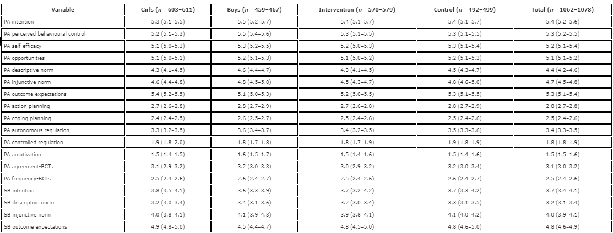
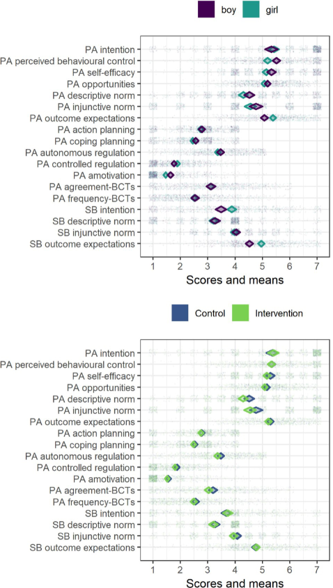
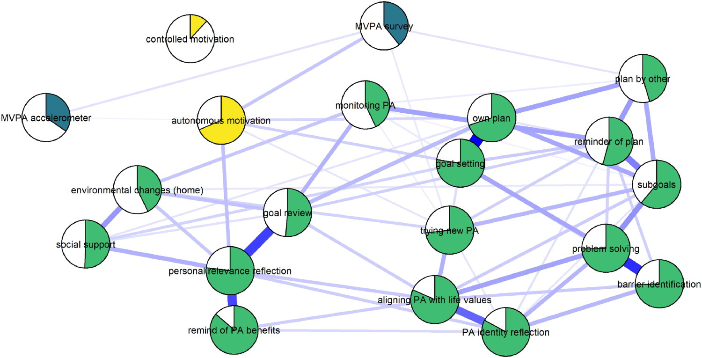

*This post summarises what I wanted to say with a recent [paper](https://www.tandfonline.com/doi/full/10.1080/21642850.2019.1646136) published in Health Psychology and Behavioural Medicine, which includes an RMarkdown [website supplement](https://heinonmatti.github.io/baseline-visu/) with code. Related slideshow and a video walkthrough is available [here](https://mattiheino.com/2018/09/04/tools-for-communicating/). Note: If it's not obvious, These are my opinions as the first author, and may or may not be shared with collaborators who are nice people and surely wouldn't use such foul language in public.*

## Some Problems in Summarising and Presenting Data

Many research reports include lots of variables, presented in tables comparing two or more groups, say an intervention and a control, or males and females. Readers often look at the means and standard deviations, looking for statistically significant differences between the two. What's the problem?

### 1. It's often not clear what significance even means, or whether some correction for multiple testing has been applied.

First of all, following the logic of Neyman-Pearson hypothesis testing, to keep error rate under the alpha level, one would have to correct for multiple testing, and *it is unclear how many tests one should correct for when hypotheses are not pre-specified*. Ignoring this – especially, where it is unclear how to heed the recommendation to justify one’s alpha level – error rates can become surprisingly high, much more than the conventionally assumed 5%.

### 2. In the absence of randomisation, increased sample size leads to detecting more and more tiny differences.

When there has not been randomisation (as in the case of genders or baseline cohort descriptions), the null hypothesis of zero difference is never true, and its rejection only depends on statistical power. We are pretty much never interested in whether the populations differ by *any* arbitrarily small amount on any of the presented variables. What usually matters, is whether this difference is large enough to make a difference, that is, how big is the effect size. Two caveats follow: Firstly, in behavioural field trials, your participants are rarely independent from each other, but come clustered in e.g. classrooms (students), hospitals (patients) or offices (9-to-5 mental patients). Secondly, you almost always need to randomise clusters instead of individuals ([here](https://mattiheino.com/2019/07/20/informing-policy/)'s why), which gives statistical power a huge ass-whooping.

Not accounting for the multilevel structure of the data when calculating effect sizes inflates the standard errors, possibly even making zero effects appear as medium-sized ones. But it is not a trivial task to derive trustworthy effect sizes for nested data (Lai & Kwok 2016). Although some solutions exist, they have not yet been empirically validated for finite populations in the second or third levels, nor is there currently a straightforward software implementation available – to my knowledge, that is. Therefore, a sensible option may be to present the means with their corresponding confidence intervals, encouraging the readers to refrain from merely considering non-overlapping intervals between groups as dichotomous hypothesis tests. In Shitty Table 1 you can see how this is done. That seem clear to you? Don't worry, there are alternatives!

 **Shitty Table 1.** Means and confidence intervals for lots of things. Click to enlarge. [Source](https://www.tandfonline.com/doi/full/10.1080/21642850.2019.1646136).

### 3. The shape of the distribution may matter much, much more than simple arithmetic mean.

Difference between two means is fun and neat, but only informative for approximately normal or symmetric distributions, which are not the norm in social and life sciences. See reading list in the end. But hey, surely everyone reports things like skewness and kurtosis? [Of course they don't, and even if they did, a minority of social scientists could actually interpret the numbers.] Look at Shitty Table 2 to see for yourself, whether you consider this a good way to convey information.

 **Shitty Table 2.** Means, standard deviations and some distributional properties of a single variable in different educational tracks the participants were nested in. Nur = Practical nurse, HRC = Hotel, restaurant and catering studies, BA = Business and administration, IT = Business information technology. Click to enlarge. [Source](https://www.tandfonline.com/doi/full/10.1080/21642850.2019.1646136).

*An aside as regards the means:* Few individual participants are described by the group-level summary statistics. In fact, using Daniels’ definition of an ‘approximately average individual’ as falling in the middle 30% of the range of values, only 1.50% of participants can be considered ‘average’ on all of the primary outcome measures (see supplementary website, section <https://git.io/fpOy1>). Also see [this](https://thenewapollo.wordpress.com/2019/02/12/motivated-statistics-how-to-create-a-narrative-with-statistics/) and [this](https://wordpress.com/post/mattiheino.com/3497) blog post, as well as the papers listed in the end.

## Data Wants to be Seen Naked

In our paper, we present some ways behaviour change researchers could visualise their data, discuss some limitations and provide links to R code. Many, many other dedicated sources do this better, so feel free to check out [this](https://serialmentor.com/dataviz/) or [this](https://www.data-to-viz.com/), for example. A principle I particularly like is to, whenever possible, include the raw data in the visualisation. This is because in abstractions, I personally have a hard time keeping in mind that I'm dealing with individuals operating in the world (complex dynamic systems in complex dynamic systems), and the raw data tends to ground me to some reality.

 **Pretty Picture 1.** Visualising the information in Shitty Table 1 with raw data. Click to enlarge.

Data-visualisation and data exploration techniques (e.g. network analysis) can help reveal the dynamics involved in complex multi-causal systems – a challenging task with Shitty Tables. Data visualisations are crucial supplements to large numerical tables of descriptive statistics. With visualisations, researchers can communicate large amounts of information – including the associated uncertainty – in an accessible format, without requiring extensive mathematical expertise from the reader. This is important for researchers who intend to build on previous results, and in [the paper](https://www.tandfonline.com/doi/full/10.1080/21642850.2019.1646136) we argue that such practices may also reduce problems that have led to the recent [loss of confidence](https://mattiheino.com/2018/01/23/crises-and-reforms/) in the reproducibility and replicability of research findings in social and life sciences. Fully open data sharing would be ideal, but this is not always possible due to privacy concerns and, at the time of writing, remains a lamentably rare practice. In addition, open data does not necessarily accommodate stakeholders with low technical expertise in data analysis and visualisation, such as clinicians, patients and policy makers.

The benefits of presenting complex data visually should encourage researchers to publish extensive analyses and descriptions as [website supplements](https://mattiheino.com/2018/09/04/tools-for-communicating/), which would increase the speed and quality of scientific communication, as well as help to address the crisis of reduced confidence in research findings.

 **Pretty Picture 2.** Visualising the information in Shitty Table 2. Shows hours of accelerometer-measured moderate-to-vigorous physical activity for different educational tracks. Midpoints of diamonds indicate means, endpoints 95% credible intervals. Individual observations are presented under the density curves, with random scatter on the y-axis to ease inspection. Nur = Practical nurse, HRC = Hotel, restaurant and catering, BA = Business and administration, IT = Information and communications technology.

In Pretty Picture 2, looking closely you can observe that boys did more moderate-to-vigorous physical activity (x-axis is average daily hours) in every educational track. In spite of this, girls appeared more active when combining the educational tracks (shown as rows in the figure), because there is much more people in the practical nurse track, ,as well as those people being mostly girls. This is also known as the Simpson’s paradox, and is best investigated by visualising data.

 **Pretty Picture 3.** See [paper](https://www.tandfonline.com/doi/full/10.1080/21642850.2019.1646136) for elaboration.

Conventional approaches would have e.g. left the reader with an impression that the means of the multimodal or skewed variables (see Pretty Picture 1) are interpretable as central tendencies, and that the sample is homogenous (see Pretty Picture 2). Transparent and accessible sharing of data characteristics, analyses and analytical choices is imperative for increasing confidence in research findings; if nothing else, the elaborate supplements can act as a platform to present robustness tests and assumption explorations in.

 **Pretty Picture 4.** See [paper](https://www.tandfonline.com/doi/full/10.1080/21642850.2019.1646136) for elaboration.

# Reading list

The paper described in this post:

- Heino, M. T. J., Knittle, K., Fried, E., Sund, R., Haukkala, A., Borodulin, K., … Hankonen, N. (2019). Visualisation and network analysis of physical activity and its determinants: Demonstrating opportunities in analysing baseline associations in the let’s move it trial. *Health Psychology and Behavioral Medicine*, *7*(1), 269–289. <https://doi.org/10.1080/21642850.2019.1646136>
- Supplementary website: [Link](https://git.io/fNHuf)

On data visualisation:

- Tay, L., Parrigon, S., Huang, Q., & LeBreton, J. M. (2016). Graphical descriptives a way to improve data transparency and methodological rigor in psychology. *Perspectives on Psychological Science*, *11*(5), 692–701.

On hypothesis testing for non-prespecified comparisons:

- de Groot AD. The meaning of “significance” for different types of research [translated and annotated by Eric-Jan Wagenmakers, Denny Borsboom, Josine Verhagen, Rogier Kievit, Marjan Bakker, Angelique Cramer, Dora Matzke, Don Mellenbergh, and Han L. J. van der Maas]. Acta Psychologica. 2014;148:188–94.
- Nosek BA, Ebersole CR, DeHaven AC, Mellor DT. The preregistration revolution. Proceedings of the National Academy of Sciences. 2018;201708274.

On effect sizes for cluster randomised situations:

- Lai MHC, Kwok O-m. Estimating Standardized Effect Sizes for Two- and Three-Level Partially Nested Data. Multivariate Behavioral Research. 2016;51:740–56.
- Lai MHC, Kwok O-m, Hsiao Y-Y, Cao Q. Finite population correction for two-level hierarchical linear models. Psychological methods. 2018;23:94.

On distributional shapes:

- Choi, S. W. (2016). Life is lognormal! What to do when your data does not follow a normal distribution. *Anaesthesia*, *71*(11), 1363-1366.
- Saxon, E. (2015). Beyond bar charts. *BMC Biology*, *13*(1), 60. doi: 10.1186/s12915-015-0169-6
- **Taleb, N. N. (2007). Black swans and the domains of statistics. *The American Statistician*, *61*(3), 198-200.**
- **van Rooij, M. M., Nash, B., Rajaraman, S., & Holden, J. G. (2013). A fractal approach to dynamic inference and distribution analysis. *Frontiers in physiology*, *4*, 1.**
- Weissgerber, T. L., Garovic, V. D., Savic, M., Winham, S. J., & Milic, N. M. (2016). From static to interactive: Transforming data visualization to improve transparency. *PLOS Biology*, *14*(6), e1002484. doi: 10.1371/journal.pbio.1002484
- Weissgerber, T. L., Milic, N. M., Winham, S. J., & Garovic, V. D.(2015). Beyond bar and line graphs: time for a new data presentation paradigm. *PLOS Biology*, *13*(4), e1002128. doi: 10.1371/journal.pbio.1002128

On averages:

- Daniels, G. S. (1952). *The“average man”?*. Wright-Patterson Air Force Base, OH: Air Force Aerospace Medical Research Lab.
- Rose, T. (2016). *The end of average: How to succeed in a world that values sameness*. Penguin UK.
- Rousselet, G. A., Pernet, C. R., & Wilcox, R. R. (2017). Beyond differences in means: Robust graphical methods to compare two groups in neuroscience. *European Journal of Neuroscience*, *46*(2), 1738–1748. doi: 10.1111/ejn.13610
- Trafimow, D., Wang, T., & Wang, C. (2018). Means and standard deviations, or locations and scales? That is the question!. *New Ideas in Psychology*, *50*, 34–37. doi: 10.1016/j.newideapsych.2018.03.001
