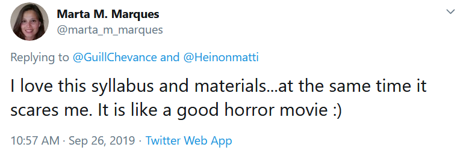

Update:**[2023 VERSION HERE.](https://mattiheino.com/training/)**
*This is the syllabus for my University of Helsinki course. Target audience is non-mathematical students in social sciences. The 2019 class consisted of social psychologists, social workers, sociologists and political scientists, so it's quite a mishmash of topics I considered of high importance in life, research and every**thing.* *Some people have been asking about how to cite this; OSF page with DOI, which includes the materials, is* *[here](https://osf.io/b3t5g/)**.* 

### Critical Appraisal of Research Methods and Analysis (CARMA) – Evaluating and not getting fooled by data in scientific and practical research contexts

### 

---

(the violence is real, though)

---

### 

Description: Research claims in news, science, and business can mislead people, either purposefully or inadvertently. How and why does this happen, and what mistakes, misconceptions and pitfalls should one avoid when evaluating data? This course will help participants assess data-based statements, and offer some tools to avoid getting fooled by them. It is meant for students who aspire to future careers, which involve undertaking, interpreting or commissioning research. This could include science in academic or other institutions, consumer/marketing research in business settings, evidence-based decision making as policy makers or journalists, among others. The course does not require specialising in quantitative methods, although basic familiarity can be useful.
**Note**: a lot of slides contain "animation" that doesn't work if you watch the presentation on a scrolling mode instead of having one full slide on the screen at a time. So, download or zoom in.

# I

- **The crisis of confidence in social and life sciences: State of affairs (4 September 2019) –** **[slides](https://drive.google.com/uc?export=download&id=1_MDGZ2r_o8Zzpd4x0ESa0X-jrRQFOtoy)**

*Learning objectives:* Become acquainted with the recent developments regarding the so-called "replication crisis". 

1. 1. 1. 1. Replication crisis: how it all started (this time around).
         2. Medicine, you were supposed to be the best of us!
         3. Consequences of problematic practices.
         4. You're not alone in misinterpreting p-values.

# II

- **From questionable research practices and biased stories, to better evidence and/or decisions (11 September 2019) –** **[slides](https://drive.google.com/uc?export=download&id=1yDKN5bKAS_zFZmlskcxpyKzKSjwkyBN5)**

*Learning objectives:* Understand what the research community is doing to improve the quality of published research. Extrapolate to non-academic settings.

1. 1. 1. 1. Transparency and Openness Promotion (TOP) guidelines to fight bad science.
         2. Transforming publication practices with pre-prints
         3. Disentangling confirmatory and exploratory research.
         4. Tricky rule-of-thumb questions to ask when being presented research (1/2: "null findings").

# III

- **Magnificient mistakes and where to find them (18 September 2019) –** **[slides](https://drive.google.com/uc?export=download&id=1hT3sH9PG3IZXOu4sIG20IzyPLSs44_zr)**

*Learning objectives:* Recognise some particular pitfalls in evidential statements. Understand that decisions in the field do not need to rely on correct predictive statements, let alone scientific evidence.

1. 1. 1. 1. Tricky rule-of-thumb questions to ask when being presented research (2/2: "statistically significant" findings).
         2. Ways tests can fail: Type I/II mistakes. Type M and Type S mistakes.
         3. The difference between evidence of absence and absence of evidence: Black Swans and the Turkey Problem.
         4. When you don’t *need* to be right: green lumber, and a first taste of convexity.
         5. Heuristics: Simple rules that make us smart.

# IV

- **On interpreting data nudes instead of summary tables (25 September 2019) –** **[slides](https://drive.google.com/uc?export=download&id=1WuTLd8-WOH0xOmH1bmA-b3bUXGgQgsDQ)**

*Learning objectives:* Understand the rationale for visualising data, and what can be hidden when reporting summary statistics only. Learn to spot some common tricks used to visualise data in a favourable way to the presenter.

1. 1. 1. 1. A crude redux to evidence of absence.
         2. Data Nudes vs. Shitty Tables.
         3. The End of Average.
         4. What gets lost in looking at numbers alone: Uncertainty hidden in the absence of distributions.
         5. Demons with(in) axes: Slaying or summoning effects with presentation tricks.
         6. Dose-response effects masked by averages.

# V

- **Complex systems and why they ruin everything straightforward (2 October 2019) –** **[slides](https://drive.google.com/uc?export=download&id=1arwbjJYQfN_73kNtgVhbQcpxK5Kh8X_a)**

*Learning objectives:* Become familiar with general features of so-called complex systems. Understand how they can be thought of in the context of practical interventions.

1. 1. 1. 1. Intro to complexity, and general features of complex systems.
         2. Interaction vs. component dominant systems.
         3. Don’t camp at 1st order effects in dragon season.
         4. Navigating the Four Quadrants

# VI

- **Never cross Heraclitus' river, if it's on average 1 meter deep: Interventions and their offspring (9 October 2019) –** **[slides](https://drive.google.com/uc?export=download&id=1Dv_mFeRZMM_8DXYAwTHZ1Mt7wKqwVmGK)**
  - [Roope Kaaronen](https://twitter.com/roopekaaronen) gave a visiting lecture on agent-based modeling to study complex systems; it was mostly NetLogo demos but [here are his slides](https://drive.google.com/file/d/1dN4L87u_flF1Sj5XD6szdZPCI7Zj6qKr/view?usp=sharing).

*Learning objectives:* Understand the rationale behind interventions and experimenting/intervening in complex systems, as well as some limitations of big data.

1. 1. 1. 1. Change comes in a triad.
         2. Sales tricks to counter, use and abuse.
         3. Pathway thinking & complexity thinking in behaviour change science.
         4. Failures and unexpected effects of social interventions.
         5. When is it safe(r) to intervene?

# VII

- **Dynamic/idiographic phenomena, and hidden assumptions (16 October 2019) –** **[slides](https://drive.google.com/uc?export=download&id=1Gfz1JiRSpyIPNP4yCB0TOVNG8DfoocT5)**

Learning objectives: Describe the concepts of ergodicity and stationarity. Understand how they can mislead when not taken into account when e.g. assessing risks. 

1. 1. 1. Assumptions, schmassumptions; mind your foundations!
      2. Damned world not sitting still: Ergodicity & stationarity
      3. The idiographic approach to science
      4. The best map fallacy
      5. The precautionary principle for policy and interventions
      6. Frequency vs. consequences of being wrong: What matters more?
      7. Recap on the course: The Fourth Quadrant will find you, so better put your house in order

## Student evaluations, comments, and feedback

Some students provided spontaneous feedback, and I everyone an opportunity to give evaluations. These are comprehensive answers i.e. **there is no publication bias or selective reporting here**!

---

Great course!! Even if the statistics are not exactly your thing, this course will give you a lot of useful information and a better look on the research field. I feel that I did benefit a lot from this course. The teaching was great and got me interested in the things that haven't interest me before.

- Anonymous student

---

Thank you Matti for this exiting and engaging course! I enjoyed substantially ambitious and well-prepared lectures. Even though I'm focusing on qualitative methodology in my own work, I found this course important and highly interesting.

- Valter, a Social Work major

---

Can highly recommend the course. It shows that the teacher knows what he is talking about and is interested in the topics presented. The course can be a bit difficult but it's teached in a fun way with concrete examples. Definitely not a boring course. The teacher is not boring either.

- Anonymous student

---

A great course, I learned a lot. After the course I find two learning outcomes especially important; learning to better evaluate research, but especially learning to treat academy as an institution.
The course had A LOT of stuff, and was sometimes a bit difficult to follow and keep up the connections between topics. With some improving for the structure and creating clear bridges from one topic to another, this course will be even more beneficial.

- Anonymous participant

---

This course is an eye opener, it makes you have a different but more clear understanding of research particularly and the world in general. The teaching style was excellent and the content was practical. Personally, I found it easy to relate to my field of study and i'm sure anyone else would find it very practical too, regardless of their research being qualitative or quantitative.

- Selestino, Public Policy major

---

Highly-stimulating overview of a range of interrelated complex topics. Presented in an engaging manner and involving multiple interdisciplinary perspectives, this course can change how you think.

- Antti, social psychology major

---

The course shows and discusses many issues of contemporary quantitative research methods and provides tools and tips how to become a better researcher. Not a critical course towards quantitiative research methods though, so don't think about taking the course as an excuse for not learning the methods!
I would recommend the course for first year master students who have some prior knowledge of quantitative research methods. You don't have to know how to use them though as there are no quantitative excercises in the course.
In summary, a great remedy for any traumas that you might have from trying to learn quantitative research methods. The course itself doesn't heal the wounds though as those skills are not teached but the lecturer does provide great sources where you can hone those skills on your own time. Hopefully, a second course where those skills are excercised will soon follow.

- Aku, a 6th year social psychology student

---

The course was well designed and teacher's enthusiasm and expertise motivated me to do my best. Altough, I was suprised to notice that the evaluation of the course was based on the assessment scale of pass and fail. After investing a lot of time and effort in doing the assignments, it would have been instructive to know in what scale did I performed. Nonetheless, I learned a lot in this course and it opened new perspectives which I can utilize in my masters thesis.

- Henna, a sociology major

---

Big thanks for the course! It was a very interesting and fun set even though it included a lot of new things to be learned in a fast phase. You are very skilled at explaining things very clearly and in an entertaining way by using (for some reason often fatal :D) examples. Not that entertainment is the most essential aspect of a course but at least it helps to concentrate and remember the content. The course had a good balance of lecturing and group discussions, albeit it wasn't always easy to come up with discussion points since there was so much to take in. Still, it was nice to hear what materials others had been reading or what they remember from the lectures. You were also very good at taking and answering questions in many different ways to ensure everyone understood the underlying point, and I never felt that I could not ask something I did not understand no matter "simple" the question.
CARMA for the win!

- Social Psychology Master's Student

---

I would recommend this course for every student because it gives you many new viewpoints concerning validity of scientific methods.

- Anonymous participant

---

Thank you for the lecture course, Matti. Your passion to these topics really shows with the enthusiasm you presented the numerous examples in class, with the blog and tweets and with the breathtaking slideshows sometimes consisting of 100 slides or more. I appreciate you bringing up the importance of open science and “hacks”, with which it is possible to take the other direction with science. And honestly, without all of the examples with which you tied the topics to real life, I probably wouldn’t have had the slightest idea what this course was about. The in-class discussions didn’t work that well, and I think that was because it was hard to tie our thoughts together (and present them in class) because everyone had done assignments in different topics. Discussing itself was alright, though. I liked that the at-home assignments balanced the theory-heavy lectures also, where we could think of the topics more concretely, if we wanted to. All in all, I think this was a rather “easy” course to complete, but I like that, since studying is done for our own sake and for our education, not for teachers. Like critical thinking. And as I stated in the last assignment, during this course I learned that before, I wasn’t at all as critical as I thought I was. So, thanks for that!

- A 4th year student

---

Thank you for an excellently organised course! Your effort in the implementation and enthusiasm toward the subject, as well as goals aiming to expand students' understanding were very visible during the course. This motivated to do the intensive work required by internalising difficult topics.

- Henna, a sociology major

---

Thank you for this course, I really liked it! I feel that I now have a deeper understanding of research methodology and am able to do more critical judgments than before. I also wish there would be a second Carma course.

- A social psychology major
