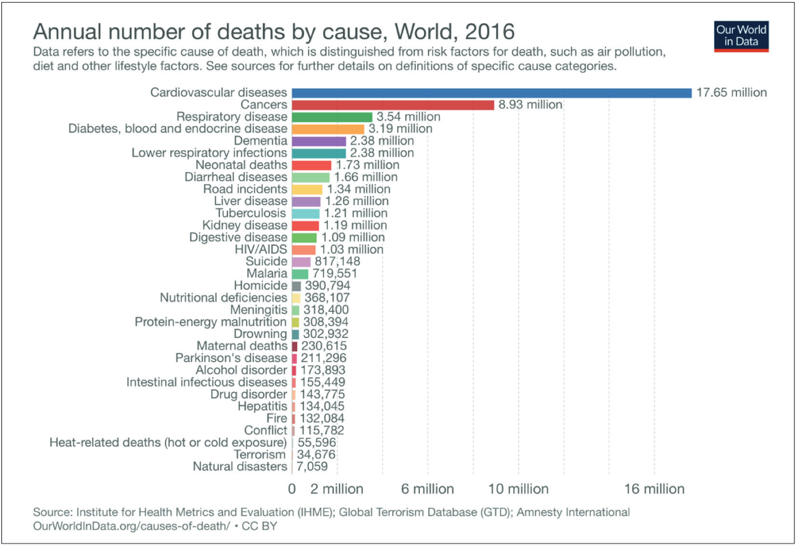
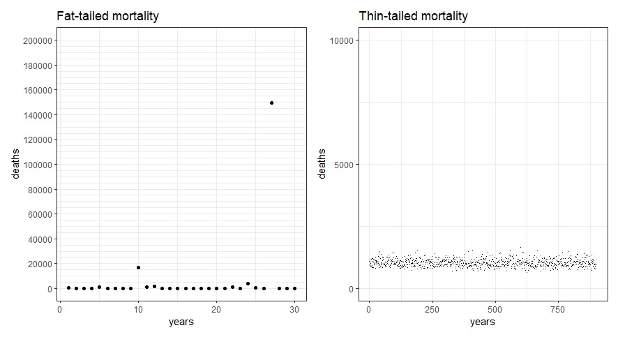
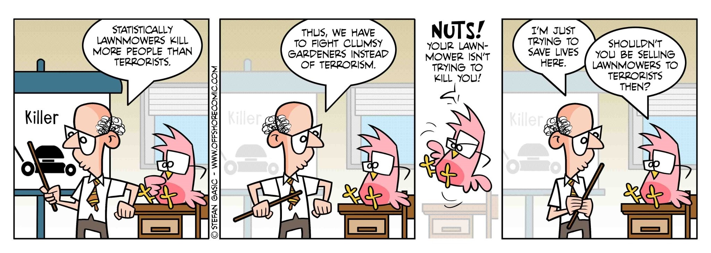

*In this post, I introduce fat-tailed distributions and the concept of the Shadow Mean, with implications to how seriously multiplicative events should be taken in the society. [Addendum: If you want a technical treatment of the proper Shadow Mean approach instead of my caricature, see [this](https://twitter.com/nntaleb/status/1242443727366479874)]*

I keep getting struck by how often we see well-meaning educated people comparing phenomena such as terrorism and epidemics to the "as much or more" dangerous lifestyle diseases. I even saw one of the smartest health psychologists I know commit this error in their professorial inauguration speech. Note, that I'm not against preventing non-communicable diseases; in fact, that's what my dissertation is about. But we need to be vigilant on how risks work.

Here's a chart from the aforementioned presentation, where you can clearly see that, *all else equal*, we should be diverting almost all our prevention resources to the biggest killers, which are lifestyle diseases:

The problem is, that *all else is **not** equal*. Why?

It has to do with a concept called "Shadow Mean" (capitalised for ominosity), which relates to "fat tailed" distributions. I'll explain more later.

But let us first consider some properties of the Coronavirus pandemic, and how they differ from the common flu – and, by extension, to lifestyle diseases. To do so, I'll give the floor to Luca Dellanna ([Twitter](https://twitter.com/DellAnnaLuca/), [website](https://www.luca-dellanna.com/)), who kindly contributed his thoughts to this blog:

---

## Luca Dellanna: Six unintuitive properties of the current pandemic

### 1/6: Asymmetry (part I)

*“The cost of paranoia is bounded. The sooner we get paranoid, quicker we can get a handle on things, sooner we can confidently go back to business as usual the cost of "letting it happen" is unbounded. Here is the tradeoff in the US: Restrict international travel **now** and maintain our ability to move freely domestically **or** keep the flows coming and inevitably have to restrict movement both internationally and domestically. The choice is clear.”* – Joe Norman ([link](https://luca-dellanna.us11.list-manage.com/track/click?u=8f08600c57feae1f92c3b7354&id=4feae629a1&e=89a6aa636c))

There is enough evidence that the pandemic is inevitable. The only question is how big and how fast we want it.

The costs of preventing the pandemic are mostly linear. Closing down schools today for one month costs roughly as much as closing them for one month in April. Closing down 3 schools costs roughly half as closing down 6 (assuming the same size).

Instead, the costs of letting the pandemic grow are nonlinear.

Letting the pandemic run today might mean 100 more people infected tomorrow. Letting the pandemic run next week might mean 1000 more people infected the following day.

And it gets worse (see the next point).

### 2/6: Nonlinearities

*“In the US, we have 2.3 million people in prison. I cannot imagine a way to stop #coronavirus from spreading like wildfire among that population. How will federal, state, & local authorities handle this?”*– Jon Stokes ([link](https://luca-dellanna.us11.list-manage.com/track/click?u=8f08600c57feae1f92c3b7354&id=30590f3af8&e=89a6aa636c))

Another example of the non-linear consequences of the pandemic.

A pandemic that “knocks-off” (i.e. prevents from working, for any reason) 0.1% of the workforce is bad but not *that* bad.

A pandemic that “knocks-off” (i.e. prevents from working, for any reason) 0.1% of the workforce *in a clustered way*is much worse: it means that some companies lose a large percentage of their workforce for a few days or weeks and must close the operations (whereas others are directly unaffected).

A pandemic that “knocks-off” (i.e. prevents from working, for any reason) 0.2% of the workforce is ten times worse than a 0.1% pandemic – for there are less workers to covers those who are sick, for one company closing creates problems downstream the supply chain, and so on.

The worst case is so bad that it makes sense planning for it even if it has low chances to happen (which is itself a strong assumption on too uncertain variables).

### 3/6: Impact

*“The difference between the flu and the coronavirus is that between a tide and a tsunami. The same amount of water, but the impact is different because the tsunami arrives all at once.”*– Roberto Burioni ([link](https://luca-dellanna.us11.list-manage.com/track/click?u=8f08600c57feae1f92c3b7354&id=e7b861320d&e=89a6aa636c))

As I explained [on Twitter](https://luca-dellanna.us11.list-manage.com/track/click?u=8f08600c57feae1f92c3b7354&id=c2cf89a564&e=89a6aa636c), the problem is not (only) the current mortality, but the mortality we can get if our healthcare system gets overwhelmed. People won’t receive the care they need, even for conditions unrelated to the coronavirus.

“If a juggler can juggle 4 balls letting them drop 1% of time,  then he can also juggle 10 balls letting them drop 1% of time.” – this is how most people estimate mortality. As if healthcare was a fully elastic system.

### 4/6: Asymmetry (part II)

*“Asymmetry. Convex decision. So long as there is no risk of harm from masks & disinfectants, the decision is wise, in spite of the*absence of evidence*.*– Nassim Nicholas Taleb ([link](https://luca-dellanna.us11.list-manage.com/track/click?u=8f08600c57feae1f92c3b7354&id=ecfe4adf0e&e=89a6aa636c))

Face masks do not offer full protection, but they do offer some protection. As long as you remove them carefully and they don’t make you sweat (so that you’re tempted to touch your face), they’re better than nothing.

Their cost is minimal and bounded, their benefit is large and unbounded (at least for you: they might save your life).

Of course, there is the argument that face masks are finite and they should be allocated where they’re the most needed. It’s a valid argument. But let’s focus on the asymmetry of the cost-benefit, because it applies to another method as well: washing hands and disinfecting.

Their cost is extremely low. I’m baffled that so few people are doing it first thing while arriving home.

Don’t be penny-wise but pound-foolish with your time.

### 5/6: Testing

*“True epidemic in Iran and South Korea, community spread in Italy, confirmed transmission from Iran to multiple countries, the US basically isn’t testing anybody… and as far as I can tell it’s gauche even to mention [the virus] in public in the United States.”* – @toad\_spotted ([link](https://luca-dellanna.us11.list-manage.com/track/click?u=8f08600c57feae1f92c3b7354&id=0e8e570b45&e=89a6aa636c))

If a country doesn’t like to talk about a problem, it *will* have to talk about that problem.

Problems grow the size they need for you to acknowledge them.  
*The virus is already here, it’s just not evenly detected.* – Balajis Srinivasan ([link](https://luca-dellanna.us11.list-manage.com/track/click?u=8f08600c57feae1f92c3b7354&id=c4b3b01709&e=89a6aa636c))

### 6/6: Infection

*“I just realized that when people say ‘yeah but you won’t die’ they mean ‘yeah you’ll become a carrier and make everyone you see sick but not die’.”*– Paul McKellar ([link](https://luca-dellanna.us11.list-manage.com/track/click?u=8f08600c57feae1f92c3b7354&id=b0a14990ae&e=89a6aa636c))

There are many replies to “the coronavirus is not that mortal”.

- “15% mortality in older people (80+ years old) almost means a Russian Roulette if they get infected”.
- One’s chances of dying depend on the number of infected people he meets in his day-to-day (because the more he meets, the more the chances he gets the virus).
- We don’t know! There are many reasons that prevent us from pinpointing the mortality of the virus in a way that is predictive of the future. We should assume the worst scenarios until we can rule them out. (Why? Because asymmetry and nonlinearities; the content of points #1 and #4 above.)

[Luca's newsletter is pretty much the only one I've ever found positively thought-provoking; if you want to hear more of his ideas, subscribe [here](https://luca-dellanna.us11.list-manage.com/track/click?u=8f08600c57feae1f92c3b7354&id=7417e0433d&e=89a6aa636c)]

---

### Horizontally challenged tails

What does this have to do with lifestyle diseases? Well, while the incidence of the common flu is quite unlikely to quadruple from one year to the next, it is much, *much* less likely, that the incidence of e.g. cardiovascular disease would do the same.

Let's look at an example. In the left plot below, you see what a mortality rate from a fat tailed distribution would look like. There are two years, when you have an extreme case – something psychologists are used to just eliminating from the data. Note, that *outliers* are different from *extremes*; an outlier may be a badly measured observation, whereas an extreme lies within the conceivable boundaries of the phenomenon.

 Figure by me; code available [here](https://drive.google.com/drive/folders/1w_iRJM8_SVVbCh-pNKfwjT6rRBu7dd3G)

The left plot could signify a viral epidemic. Say we are living year 26; the mean observed annual mortality would be around 900, and you probably aren't too worried; things are almost exclusively very calm. But, given the fat-tailed distribution, extreme values are possible and upon surviving year 27, the mean would be almost 6000. Before it's seen, this is known as the Shadow Mean; there are yet unobserved cases we can infer from the mechanics that produce the fat-tailed distribution, but which are not (yet) observed empirically.

Contrast the situation with that on the right plot, which could signify deaths from accidents in a country like Finland. In 900 years, we still have not observed one with over 2500 deaths (nb. this is just simulated data from a thin-tailed distribution). The mean is about 1000 and if we omit the maximum observation, it remains practically identical.

 Figure by [Stefan Gasic](http://Stefan Gasic); see his work [here](https://gumroad.com/l/IJgDY)!

### N-th order matters

Time and second-order effects – that is, things that happen as an indirect consequence of an event – are of great importance when something extreme happens. Let us run a small scenario. Finland has 5½ million people. Let us consider that 25% would get infected (with a maximum of, say, 50%), and 5% (max. 20%) would require care in a hospital. This would already mean, that we would suddenly have 70 000 (max 550 000) extra patients in the healthcare system, which has been "streamlined" for years. Very different scenario than having the same number of extra patients over the course of a year or a decade – one, which lays fertile ground to second-order effects. These include the impact on people, who wouldn't have big problems under normal situations, due to having hospital care capacity readily available.

Finally: This is not fearmongering or a call for hysteria. Cold-headed rational decision making calls for taking precautions here. If you stock up so that you can self-quarantine yourself for 14 days in the case of getting ill, and do it gradually by buying little extra every time you go to the store anyway, you are making a good decision. Here's one more figure by Luca, illustrating the point:

 Figure by Luca Dellanna; [source](https://twitter.com/DellAnnaLuca/status/1232178676910788609)

Relevant resources and references:

- On why the highly interconnected world is ill-suited for suppression of pathogens: [Systemic Risk of Pandemic via Novel Pathogens – Coronavirus: A Note](https://mattiheino.com/wp-content/uploads/2020/03/b72e0-systemic_risk_of_pandemic_via_novel_path.pdf).
- On how to mitigate the spread: [Public Health Policies for Mitigating the Spread of COVID-19 in the United States](https://drive.google.com/file/d/17yrtgiMXt_ZAFS8tJMaQ-VqgHTTkQbxm/view?fbclid=IwAR3PzoUIMVnpsy9Oug5i8YoweWUavGE0RYdDKZGBh9AbOmJCt8V028nGGjA).
- Cochrane Collaboration freezes ongoing reviews on controlling upper respiratory viral syndromes, as nobody knows anything about the mechanisms of influenza vaccines and new evidence is not arriving: [Why have three long-running Cochrane Reviews on influenza vaccines been stabilised?](https://community.cochrane.org/news/why-have-three-long-running-cochrane-reviews-influenza-vaccines-been-stabilised?fbclid=IwAR3YWWP3Bu3MIZpCyIpfrBdGtfDTSwN6-jVcnofxjFeWn0ufCJwZMYdarjM)
- Nassim Taleb on "Naive empricism": [Tweet 1](https://twitter.com/nntaleb/status/1224714952604254210), [Tweet 2](https://twitter.com/nntaleb/status/1234093143089434624).
  - Technical background: [Statistical Consequences of Fat Tails: Real World Preasymptotics, Epistemology, and Applications](https://www.researchers.one/article/2020-01-21)
- Unlike you may have been taught, most of [life is lognormal](https://stat.ethz.ch/~stahel/lognormal/lnboard/brochure.html), definitely not Gaussian. And [lognormal is fat tailed](https://arxiv.org/pdf/1802.05495.pdf).
- Paper outlining, why conventional epidemiological models have no place here: [Epidemics on Small-World Networks](http://guava.physics.uiuc.edu/~nigel/courses/563/Essays_2005/PDF/chen.pdf)
- For a slide deck presenting fat tails and other features of complex systems, see week V of [CARMA: Critical Appraisal of Research Methods and Analysis](https://mattiheino.com/2019/09/04/carma/).
- Avoid face-touching by mindfulness practices? [Mindfulness for burning cities and viral pandemics](http://www.motivationselfmanagement.com/mindfulness-face).
- Decline a handshake with these tips
- [Website](https://www.endcoronavirus.org/) collating easily digestible high-quality information from the New England Complex Systems Institute (who are specialists in pandemics).
- Podcast which tells you much of what you need to know about complexity in the context of the pandemic: [iTunes](https://podcasts.apple.com/au/podcast/the-jolly-swagman-podcast/id1236553683#episodeGuid=262d1c0c-e644-4abf-bc88-e6005cd3b373), [Spotify](https://open.spotify.com/episode/0vFZ8k07wEG09ci45lrzjN?si=-Y3TUyMjRSuR4a19T8kWEw), [Google Podcasts](https://podcasts.google.com/?feed=aHR0cHM6Ly9yc3Mud2hvb3Noa2FhLmNvbS9yc3MvcG9kY2FzdC9pZC8xMDc5OQ&episode=MjYyZDFjMGMtZTY0NC00YWJmLWJjODgtZTYwMDVjZDNiMzcz&ved=0CAEQkfYCahcKEwjowIbL2o_oAhUAAAAAHQAAAAAQBQ).
