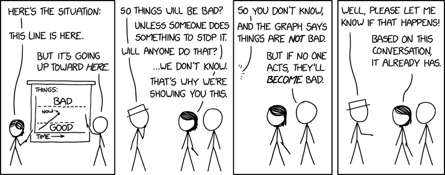
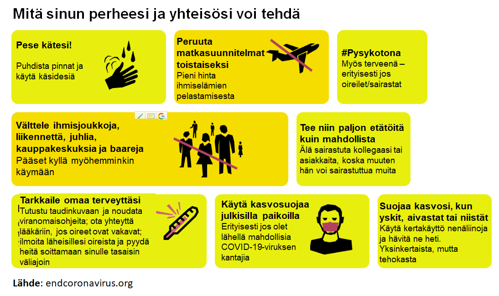

*This post curates Finnish translations (mostly [NECSI guidelines](https://necsi.edu/corona-virus-pandemic)) for stopping the Coronavirus pandemic. Tälle sivulle olen koonnut hyvinä pitämiäni suomenkielisiä tekstejä. Suomentajana [Thomas Brand](https://medium.com/@thlbr), ellei toisin mainita. Katso myös pandemioita pitkään tutkineen kompleksisuustieteilijä Yaneer Bar-Yamin [haastattelu Suomen tilanteeseen liittyen](http://mattiheino.com/2020/05/04/bar-yam/).*

Marraskuussa 2019 sain stipendin turvin mahdollisuuden osallistua Nassim Talebin [riskinhallintaryhmän](http://realworldrisk.com) koulutukseen New Yorkissa. Siellä käsittelimme pandemiankaltaisia riskejä ja toimintaa niiden välttämiseksi. Muutamaa kuukautta myöhemmin pääsinkin elämään painajaista nähdessäni, että käytännössä kaikki länsimaat toimivat täysin vastoin varovaisuusperiaatetta (ts. joukkotuhon uhka on aina vältettävä agressiivisin toimin), luottaen "parhaaseen nykytietoon" viiveellä ilmenevän riskin torjumisen sijaan.

 Kokous, joka käytiin vuoden 2020 alussa jokaisessa maailman maassa. Lähde: [xkcd](https://xkcd.com/2278/)

Alla hyviä kirjoituksia, jotka ovat pääosin alunperin [NECSI-instituutin](https://necsi.edu/corona-virus-pandemic) tuottamia.  NECSI:lla on pitkä historia hallitusten ja järjestöjen kuten WHO:n konsultoinnissa mm. Ebola ja Zikavirus-epidemioita nitistettäessä, mutta myös muissa kompleksisissa ongelmissa, joihin perinteinen matemaattinen mallinnus ei pure. Koronavirus-pandemiaan liittyvään vapaaehtoisten globaaliin verkostoon voi liittyä [täältä](http://endcoronavirus.org/); tekemistä on käännöksistä some-aktiviteettiin, maskien ompeluun, hengityslaitteiden suunnitteluun, verkkosivujen ja mobiilisovellusten luomiseen ym.!

**Lyhyitä perusohjeistuksia:**

- **[Kaikkien pitäisi käyttää maskeja: Yhteenveto tieteellisistä tutkimuksista](https://medium.com/brandin-kirjasto/kaikkien-pit%C3%A4isi-k%C3%A4ytt%C3%A4%C3%A4-maskeja-9a4a8546f7f9)**
  - Ks. myös 2½-sivuinen varovaisuusperiaatetta ja tieteellistä evidenssiä maskien käytössä käsittelevä [artikkeli](https://www.bmj.com/content/bmj/369/bmj.m1435.full.pdf)
- [Olennaiset toimintaohjeet koronaviruksen torjumiseksi ja pysäyttämiseksi](https://medium.com/brandin-kirjasto/olennaiset-toimintaohjeet-koronaviruksen-torjumiseksi-ja-pys%C3%A4ytt%C3%A4miseksi-4648fd5dcff9)
- [**Miksi viiden viikon lockdown voi pysäyttää COVID19-epidemian?**](https://medium.com/brandin-kirjasto/miksi-viiden-viikon-lockdown-voi-pys%C3%A4ytt%C3%A4%C3%A4-covid19-epidemian-c2d9ab13c8eb)
  - Nopein ja ainoa tapa epidemian lääkitsemiseen ilman humanitaarista katastrofia
- NECSI-instituutin globaalin endcoronavirus-aloitteen [suomenkielinen sivu](http://endcoronavirus.org/finnish), jolla yleistietoa pandemian taltuttamisesta

**Ehdotuksia henkilökohtaiselle toiminnalle tilanteen parantamiseksi:**

- **[Jokapäiväinen elämä ja COVID-19](https://medium.com/brandin-kirjasto/jokap%C3%A4iv%C3%A4inen-el%C3%A4m%C3%A4-ja-covid-19-698c7f70b4e8)**
  - Erinomainen, kattava ohje yksilöille – lue tämä, jos et lue muuta!
- [Perheen opas turvallisiin tiloihin](https://medium.com/brandin-kirjasto/perheen-opas-turvallisiin-tiloihin-e6fe900cf3ec)
- [Paras tapa taistella koronavirusta vastaan on sopia normeista turvallisten tilojen luomiseksi perheille ja ryhmille](https://medium.com/brandin-kirjasto/paras-tapa-taistella-koronavirusta-vastaan-on-sopia-normeista-turvallisten-tilojen-luomiseksi-b4117153a1e2)
- [Hengityselinterveyden merkitys COVID-19:n hoitotulosten parantamisessa](https://medium.com/brandin-kirjasto/hengityselinterveys-covid-19-n-hoitotulosten-parantamiseksi-ef5dde406e7a)
- [Yhteisön tuki ja turva COVID-19-tilanteessa](https://medium.com/brandin-kirjasto/yhteis%C3%B6n-tuki-ja-turva-covid-19-tilanteessa-caa94b68f840)
  - Ideoita toiminnalle pienissä läheisten porukoissa

**Jos koet lieviä tai kohtalaisia oireita:**

- [Ohjeet itsekaranteenille/itse-eristykselle](https://medium.com/brandin-kirjasto/ohjeet-itse-eristykselle-ce883015673b)

**Jos osaat ommella, tai muuten luotat kätevyyteesi:**

- [Kasvo-/hengityssuojaimen valmistaminen kotiolosuhteissa](https://medium.com/brandin-kirjasto/kasvo-hengityssuojaimen-valmistaminen-kotiolosuhteissa-7216ad8815e1)

**Ohjeita elinkeinoelämän toimijoille:**

- [**Taistelukutsu suomalaiselle liike-elämälle**](https://medium.com/brandin-kirjasto/taistelukutsu-suomalaiselle-liike-el%C3%A4m%C3%A4lle-58aac868fcb6)
  - Hyvä yhteenveto, lue tämä jos olet elinkeinoelämän toimija, etkä lue muuta
- [Koronavirusohjeita yrityksille ja yrittäjille](https://medium.com/brandin-kirjasto/koronavirusohjeita-yrityksille-ja-yritt%C3%A4jille-16378dad0265)
- [COVID-19: Työntekijöiden turvallisuus- ja seulontakysymyksiä työnantajille](https://medium.com/brandin-kirjasto/covid-19-ty%C3%B6ntekij%C3%B6iden-turvallisuus-ja-seulontakysymyksi%C3%A4-ty%C3%B6nantajille-227972dbf304)
- [Koronavirusohjeita supermarketeille, ruokakaupoille ja apteekeille](https://medium.com/brandin-kirjasto/koronavirusohjeita-supermarketeille-ruokakaupoille-ja-apteekeille-1471b3c8e836)

**Ohjeita ja esseitä yhteiskunnallisille päättäjille:**

- **[COVID-19 -taistelusuositukset poliittisille päätöksentekijöille](https://medium.com/brandin-kirjasto/covid-19-taistelusuositukset-poliittisille-p%C3%A4%C3%A4t%C3%B6ksentekij%C3%B6ille-85c7cc8ca96)**
  - 9-kohtainen ohje; lue tämä jos olet yhteiskunnallinen päätöksentekijä etkä lue muuta
- [Tarvitsemme luotettavan tieteellisen määritelmän eliminoinnille](https://medium.com/brandin-kirjasto/tarvitsemme-luotettavan-tieteellisen-m%C3%A4%C3%A4ritelm%C3%A4n-eliminoinnille-7b4582ad72fe)
  - Mitä koronaviruksen tukahduttaminen konkreettisesti tarkoittaisi?
- [Varovaisuusperiaate päätöksentekoon - Nyt!](https://medium.com/brandin-kirjasto/varovaisuusperiaate-p%C3%A4%C3%A4t%C3%B6ksentekoon-nyt-3bb744efd6cf)
- [Suurtestaus voi pysäyttää koronaepidemian](https://medium.com/brandin-kirjasto/suurtestaus-voi-lopetta-koronaepidemian-cbca69f30ff3)
- [Kansanterveyspoliittiset toimet COVID-19:n leviämisen hillitsemiseksi Yhdysvalloissa](https://medium.com/brandin-kirjasto/kansanterveyspoliittiset-toimet-covid-19-n-levi%C3%A4misen-pienent%C3%A4miseksi-yhdysvalloissa-4fdece2098cf)
- [Varhainen laumasuoja COVID-19:tä vastaan: Vaarallinen väärinkäsitys](https://medium.com/brandin-kirjasto/varhainen-laumasuoja-covid-19-t%C3%A4-vastaan-vaarallinen-v%C3%A4%C3%A4rink%C3%A4sitys-5a34b738fe19)
- [Maskien käyttövaatimus julkisessa liikenteessä ja rajavalvonnassa](https://medium.com/brandin-kirjasto/maskien-k%C3%A4ytt%C3%B6vaatimus-julkisessa-liikenteess%C3%A4-ja-rajavalvonnassa-uuden-seelannin-nykyisen-9b335a21a340)
- Matkustusrajoitukset ja "lokeroinnin" merkitys
  - [Matkustusrajoitukset keinona rajoittaa koronavirustaudin leviämistä yhteisössä](https://medium.com/brandin-kirjasto/matkustusrajoitukset-keinona-rajoittaa-taudin-levi%C3%A4mist%C3%A4-yhteis%C3%B6ss%C3%A4-481fe1cf80b4)
  - [Koronaviruksen pysäyttäminen: Pandemia- ja epidemia-alueiden värikoodaus](https://medium.com/brandin-kirjasto/koronaviruksen-pys%C3%A4ytt%C3%A4minen-pandemia-ja-epidemia-alueiden-v%C3%A4rikoodaus-v2-edafbebeaca2)
  - [Matkustusrajoitusten vaikutus Wuhan-koronavirus 2019 SARS-CoV-2:in leviämiseen Kiinassa](https://medium.com/brandin-kirjasto/matkustusrajoitusten-vaikutus-wuhan-koronavirus-2019-sars-cov-2-in-levi%C3%A4miseen-fa67ee038872)
  - [Älä tyrmää matkustusrajoituksia liian hätäisesti](https://medium.com/brandin-kirjasto/%C3%A4l%C3%A4-tyrm%C3%A4%C3%A4-matkustusrajoituksia-liian-h%C3%A4t%C3%A4isesti-ab82e04c8fa7)
  - [Sairaalainfektioiden pysäyttäminen kompleksisten järjestelmien tutkimuksen avulla](https://medium.com/brandin-kirjasto/sairaalainfektioiden-pys%C3%A4ytt%C3%A4minen-kompleksisten-j%C3%A4rjestelmien-tutkimuksen-avulla-b7ad1da63c52)

**Mallintamiseen, ennakointiin ja pandemiatutkimukseen liittyviä kirjoituksia**

- [Mitä meidän on opittava koronaviruskriisistä?](https://medium.com/brandin-kirjasto/mit%C3%A4-meid%C3%A4n-on-opittava-koronaviruskriisist%C3%A4-8f4457e4a9e1)
  - Vaikka olemme eläneet muutamia vuosikymmeniä ilman pandemioita, ne tulisi nähdä osana normaalia maailman toimintaa – ja niihin tulisi varautua sen mukaisesti.
- [Uusien taudinaiheuttajien aiheuttama systeeminen pandemiariski — Koronavirus: Muistio](https://medium.com/brandin-kirjasto/uusien-taudinaiheuttajien-aiheuttama-systeeminen-pandemiariski-koronavirus-muistio-91a154cacdd2)
  - Erinomainen essee tammikuun lopulta, mutta vaatii ehkä hieman perehtymistä. [Tämä kirjoitukseni](http://mattiheino.com/2020/03/01/shadow-mean/) saattaa avata käsitteitä; kirjoitan myöhemmin lisää selvennystä.
  - *"Liikkuvuuden vähentäminen lyhyellä aikavälillä maksaa jotain, mutta siinä epäonnistuminen maksaa lopulta kaiken — jos ei tässä tapauksessa, niin jossain tulevassa."*
- [Varotoimenpiteiden etiikka: Yksilöllinen ja systeeminen riski](https://medium.com/brandin-kirjasto/varotoimenpiteiden-etiikka-yksil%C3%B6llinen-ja-systeeminen-riski-554f567aed52)
  - Yksilötason "panikointi" johtaa yhteisön selviämiseen
- [Pandemian matematiikkaa: Taudin pysäyttäminen](https://medium.com/brandin-kirjasto/pandemian-matematiikkaa-taudin-pys%C3%A4ytt%C3%A4minen-f7c9d36c0284)
  - Peruslähtökohdat pandemian kukistamiseen
- [Katsaus Fergusonin ym. koronavirustutkimukseen](https://medium.com/brandin-kirjasto/katsaus-fergusonin-ym-koronavirustutkimukseen-a3c7edb7a13d)
  - Ongelmalliset oletukset paljon julkisuutta saaneessa analyysissa
- [Fiasko tekeillä: Enemmän dataa ei ole vastaus koronaviruspandemiaan](https://medium.com/brandin-kirjasto/fiasko-tekeill%C3%A4-enemm%C3%A4n-dataa-ei-ole-vastaus-koronaviruspandemiaan-6b0b1d8b9e10)
  - Kun data on puutteellista ja riski valtava, on erehdyttävä varovaisuuden puolelle
- [Ensimmäisiä ajatuksia supertartuttajien tapauksista](https://medium.com/brandin-kirjasto/ensimm%C3%A4isi%C3%A4-ajatuksia-supertartuttajien-tapauksista-9900dd92a35c)
  - Miksei tällaisia pandemioita ole ollut enempää?
  - Ks. myös [videokeskustelu](https://www.youtube.com/watch?v=LX_bqMQfWlw) 5½min Yaneer Bar-Yamin ja Nassim Talebin välillä
- [Iso-Britannian koronaviruspolitiikka saattaa kuulostaa tieteelliseltä. Se ei ole sitä.](https://medium.com/brandin-kirjasto/iso-britannian-koronaviruspolitiikka-saattaa-kuulostaa-tieteelliselt%C3%A4-se-ei-ole-a0d195def17a)
  - Tiede vs. skientismi, ja ongelmalliset "Näyttöön pohjautuvat" menetelmät

