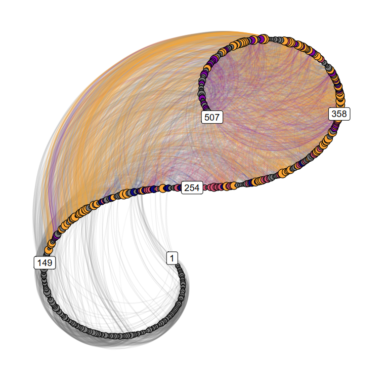

*In 2019 I attended an exciting summer school; [Complexity Methods for Behavioural Science: A Toolbox for Studying Change](https://www.ru.nl/radboudsummerschool/courses/2020/complexity-methods-behavioural-science-toolbox/). Later, we – that is, the University of Helsinki [Behaviour Change and Wellbeing Group](https://www.helsinki.fi/en/researchgroups/behaviour-change-and-wellbeing) – had the opportunity to invite Fred Hasselman, who devised the course, to Finland. He gave an overview talk as well as a 3-day workshop, which I recorded with varying success. This page collates resources regarding the course.*

For all the recordings, see our [YouTube channel](https://www.youtube.com/channel/UCR9nYEjzOCzQLjxDgKo0EZA). There are two playlists; one for short snippets and another one for full-length lectures. [Here are some tweets](https://twitter.com/Heinonmatti/status/1221904607133216768) on the course, with links to further resources. For additional slides, see [here](https://github.com/FredHasselman/The-Complex-Systems-Approach-Book/tree/master/slides). See the end of the post for literature!

- **Lecture 0 ([video](https://www.youtube.com/watch?v=BXJN_KhGtrs), [slides](https://complexity-methods.github.io/slides/Helsinki2020/HELSINKI2020_Talk.pdf))** – **Overview of complexity science and its applications in behavioural sciences**. Also see shorter snippets on [**ergodicity**](https://www.youtube.com/watch?v=dwu-1ahai8Q), **[interaction- vs. component-dominant dynamics](https://www.youtube.com/watch?v=T_lN5y2HcVU)**, and **[my interview with Fred](https://youtu.be/fVakcirn2-g)**.
- **Lecture 1 ([video](https://www.youtube.com/watch?v=gjKcYMdsmkM&feature=youtu.be), [slides](https://complexity-methods.github.io/slides/Helsinki2020/Helsinki_Day1_1_SimpleModels.pdf) [1-25])** – **Introduction to Complexity Science**: Dissipative systems, Self-Organization, Self-Organised Criticality (SOC), Phase transition, Interaction Dominant Dynamics, Emergence, Synchronisation.
- **Lecture 2 ([video](https://www.youtube.com/watch?v=CJ1TKJ8bmyQ), [slides](https://complexity-methods.github.io/slides/Helsinki2020/Helsinki_Day1_1_SimpleModels.pdf) [26-74])** – **Introduction to the mathematics of change**: Logistic Map, Return Plot, Attractors. [*The beginning of the lecture was cut due to camera problems; please find a great introduction to the logistic map [here](https://www.youtube.com/watch?v=_9UC5dcNolc&list=PLF0b3ThojznQwpDEClMZmHssMsuPnQxZT&index=42).*]
- **Lecture 3 ([video](https://youtu.be/zzRchp6xSFY), [slides](https://complexity-methods.github.io/slides/Helsinki2020/Helsinki_Day1_2_BasicTSA.pdf))** – **Basic Time Series Analysis:** Autocorrelation Function, Sample Entropy, Relative Roughness.
- **Lecture 4 ([video](https://youtu.be/VZJJGEwqqO0), [slides](https://complexity-methods.github.io/slides/Helsinki2020/Helsinki_Day1_2_BasicTSA.pdf))** [34 onwards, see also [this](https://github.com/FredHasselman/The-Complex-Systems-Approach-Book/blob/master/slides/1718_Session4a_Fractal%20Analysis.pdf), [this](https://github.com/FredHasselman/The-Complex-Systems-Approach-Book/blob/master/slides/1718_Session5a_scaling%20and%20long-range%20correlations%20B_Bb.pdf) and [this](https://github.com/FredHasselman/The-Complex-Systems-Approach-Book/blob/master/slides/1718_Session5b_Scaling_Summary.pdf)] – **Detecting (nonlinear) structure in time series**: Fractal Dimension, Detrended Fluctuation Analysis, Standardised Dispersion Analysis.
- **Lecture 5 ([video](https://youtu.be/fljCVXdS_K4), [slides](https://complexity-methods.github.io/slides/Helsinki2020/Helsinki_day2_CategoricalRQA_PhaseSpaceReconstruction.pdf) [1-16])** – **Quantifying temporal patterns in *unordered categorical* time series data**: Categorical Auto-Recurrence Quantification Analysis (RQA).
- **Lecture 6 ([video](https://youtu.be/cRUyFg06ie0), [slides](https://complexity-methods.github.io/slides/Helsinki2020/Helsinki_day2_CategoricalRQA_PhaseSpaceReconstruction.pdf) [17-52])** – **Quantifying temporal patterns in *continuous* time series data**: Continuous Auto-Recurrence Quantification Analysis, Phase-space reconstruction.
- **Lecture 7 ([video](https://youtu.be/wWcUDNkvgxE), [slides](https://complexity-methods.github.io/slides/Helsinki2020/Helsinki_day2_CategoricalRQA_PhaseSpaceReconstruction.pdf) [52-70])** – **Recurrence Quantification Analysis in practice:** Data preparation for RQA, "General recipe" (i.e. RQA workflow), lagged/windowed RQA, RQA in detecting cognitive phase transitions, RQA in neural imaging.
- **Lecture 8 ([video](https://youtu.be/W0CJgPK_XK4), [slides](https://complexity-methods.github.io/slides/Helsinki2020/Helsinki_day2_CRQA.pdf))** – **Multivariate Recurrence Quantification Analysis:** Cross-Recurrence Quantification Analysis (CRQA), applications in interpersonal synchronisation dynamics (leader-follower behaviour), Diagonal Cross-Recurrence Profiles (DCRP).
- **Lecture 9 ([video](https://youtu.be/W4jTsAxTWsQ), [slides](https://complexity-methods.github.io/slides/Helsinki2020/Helsinki_day3_DC.pdf))** – **Multivariate Time Series Analysis – Dynamic Complexity & Phase Transitions in Psychology:** Self-ratings as a research tool, the importance of sampling frequency, dynamic complexity as an early warning signal in psychopathology.
- **Lecture 10 ([video](https://youtu.be/bZvXpUiDst0), [slides](https://complexity-methods.github.io/slides/Helsinki2020/Helsinki_Day3_ComplexNetworks.pdf) [1-37])** – **Introduction to graph theory, with applications of network science:** Complex networks, hyperset theory, network-based complexity measures, small-world networks.
- **Lecture 11 ([video](https://youtu.be/rDxJZTBxAxM), [slides](https://complexity-methods.github.io/slides/Helsinki2020/Helsinki_Day3_ComplexNetworks.pdf) [38-80])** – **Multiplex recurrence networks for non-linear multivariate time series analysis:** Recurrence networks, change profiles of ecological momentary assessments as an alternative to raw scores. Also see [this paper](https://www.frontiersin.org/articles/10.3389/fams.2020.00009/abstract)!

**Literature:**

*Three recent papers directly related to the course's topics:*

Hasselman, F., & Bosman, A. M. T. (2020). Studying Complex Adaptive Systems with Internal States: A Recurrence Network Approach to the Analysis of Multivariate Time Series Data Representing Self-Reports of Human Experience. *Frontiers in Applied Mathematics and Statistics*, *6*. <https://doi.org/10.3389/fams.2020.00009>

Heino, M. T. J., Knittle, K. P., Noone, C., Hasselman, F., & Hankonen, N. (2020). *Studying behaviour change mechanisms under complexity* [Preprint]. PsyArXiv. <https://doi.org/10.31234/osf.io/fxgw4>

Olthof, M., Hasselman, F., & Lichtwarck-Aschoff, A. (2020). *Complexity In Psychological Self-Ratings: Implications for research and practice* [Preprint]. PsyArXiv. <https://doi.org/10.31234/osf.io/fbta8>

*An important complementary perspective to complexity basics:*

Siegenfeld, A. F., & Bar-Yam, Y. (2020). An Introduction to Complex Systems Science and Its Applications. *Complexity*, *2020*, 6105872. <https://doi.org/10.1155/2020/6105872>

*More resources on complexity:*

1. Mathews, K. M., White, M. C., & Long, R. G. (1999). Why Study the Complexity Sciences in the Social Sciences? *Human Relations, 52(4)*, 439–462. <https://doi.org/10.1023/A:1016957424329> [**INTRO COMPLEXITY SCIENCE**]
2. Richardson, M. J., Kallen, R. W., & Eiler, B. A. (2017). *Interaction-Dominant Dynamics, Timescale Enslavement, and the Emergence of Social Behavior.* In Computational Social Psychology (pp. 121–142). New York: Routledge. [**INTERACTION-DOMINANCE**]
3. Molenaar, P. C., & Campbell, C. G. (2009). The new person-specific paradigm in psychology. *Current directions in psychological science, 18(2)*, 112-117. [**ERGODICITY**]
4. Kello, C. T., Brown, G. D., Ferrer-i-Cancho, R., Holden, J. G., Linkenkaer-Hansen, K., Rhodes, T., & Van Orden, G. C. (2010). Scaling laws in cognitive sciences. *Trends in cognitive sciences, 14(5),* 223-232. [**SCALING PHENOMENA**]
5. Lewis, M. D. (2000). The promise of dynamic systems approaches for an integrated account of human development. *Child development, 71(1)*, 36-43. [**STATE SPACE, DYNAMICS**]
6. Olthof, M., Hasselman, F., Strunk, G., van Rooij, M., Aas, B., Helmich, M. A., … Lichtwarck-Aschoff, A. (2019). Critical Fluctuations as an Early-Warning Signal for Sudden Gains and Losses in Patients Receiving Psychotherapy for Mood Disorders. *Clinical Psychological Science,* 2167702619865969. [**DYNAMIC COMPLEXITY**]
7. Olthof, M., Hasselman, F., Strunk, G., Aas, B., Schiepek, G., & Lichtwarck-Aschoff, A. (2019). Destabilization in self-ratings of the psychotherapeutic process is associated with better treatment outcome in patients with mood disorders. *Psychotherapy Research, 0(0)*, 1–12. <https://doi.org/10.1080/10503307.2019.1633484> [**DYNAMIC COMPLEXITY**]
8. Richardson, M., Dale, R., & Marsh, K. (2014). *Complex dynamical systems in social and personality psychology: Theory, modeling and analysis.* In Handbook of Research Methods in Social and Personality Psychology (pp. 251–280). [**INTRO COMPLEXITY SCIENCE – Social and personality psychology**]
9. Wallot, S., & Leonardi, G. (2018). Analyzing Multivariate Dynamics Using Cross-Recurrence Quantification Analysis (CRQA), Diagonal-Cross-Recurrence Profiles (DCRP), and Multidimensional Recurrence Quantification Analysis (MdRQA) – A Tutorial in R. Frontiers in Psychology, 9. <https://doi.org/10.3389/fpsyg.2018.02232> [**MULTIDEMINSIONAL RQA**]
10. Webber Jr, C. L., & Zbilut, J. P. (2005). Recurrence quantification analysis of nonlinear dynamical systems. In Tutorials in contemporary nonlinear methods for the behavioral sciences (pp. 26–94). Retrieved from <http://www.saistmp.com/publications/spiegorqa.pdf> [**RQA**]
11. Marwan, N. (2011). How to avoid potential pitfalls in recurrence plot based data analysis. International Journal of Bifurcation and Chaos, 21(04), 1003–1017. <https://doi.org/10.1142/S0218127411029008> [**RQA parameter estimation**]
12. Boeing, G. (2016). Visual Analysis of Nonlinear Dynamical Systems: Chaos, Fractals, Self-Similarity and the Limits of Prediction. *Systems, 4(4)*, 37. <https://doi.org/10.3390/systems4040037> [**LOGISTIC MAP, DERTERMINISTIC CHAOS**]
13. Kelty-Stephen, D. G., Palatinus, K., Saltzman, E., & Dixon, J. A. (2013). A Tutorial on Multifractality, Cascades, and Interactivity for Empirical Time Series in Ecological Science. *Ecological Psychology, 25(1)*, 1–62. <https://doi.org/10.1080/10407413.2013.753804> [**MULTI-FRACTAL ANALYSIS**]
14. Kelty-Stephen, D. G., & Wallot, S. (2017). Multifractality Versus (Mono-) Fractality as Evidence of Nonlinear Interactions Across Timescales: Disentangling the Belief in Nonlinearity From the Diagnosis of Nonlinearity in Empirical Data. *Ecological Psychology, 29(4)*, 259–299. <https://doi.org/10.1080/10407413.2017.1368355> [**(MULTI-)FRACTAL ANALYSIS**]
15. Hawe, P. (2015). Lessons from Complex Interventions to Improve Health. *Annual Review of Public Health, 36(1),* 307–323. <https://doi.org/10.1146/annurev-publhealth-031912-114421>
16. Rickles, D., Hawe, P., & Shiell, A. (2007). A simple guide to chaos and complexity. *Journal of Epidemiology & Community Health, 61(11),* 933–937. <https://doi.org/10.1136/jech.2006.054254>. [**INTRO COMPLEXITY SCIENCE – Public health**]
17. Pincus, D., Kiefer, A. W., & Beyer, J. I. (2018). Nonlinear dynamical systems and humanistic psychology. *Journal of Humanistic Psychology, 58(3)*, 343–366. <https://doi.org/10.1177/0022167817741784>.  [**INTRO COMPLEXITY SCIENCE – Positive psychology**]
18. Gomersall, T. (2018). Complex adaptive systems: A new approach for understanding health practices. *Health Psychology Review, 0(ja)*, 1 - 34. <https://doi.org/10.1080/17437199.2018.1488603>. [**INTRO COMPLEXITY SCIENCE – Health psychology**]
19. Nowak, A., & Vallacher, R. R. (2019). Nonlinear societal change: The perspective of dynamical systems. *British Journal of Social Psychology, 58(1)*, 105-128. <https://doi.org/10.1111/bjso.12271>. [**INTRO COMPLEXITY SCIENCE – Societal change**]
20. Carello, C., & Moreno, M. (2005). Why nonlinear methods. In Tutorials in contemporary nonlinear methods for the behavioral sciences (pp. 1–25). Retrieved from <https://nsf.gov/pubs/2005/nsf05057/nmbs/chap1.pdf> [**INTERACTION DOMINANCE, ERGODICITY**]
21. Liebovitch, L. S., & Shehadeh, L. A. (2005). Introduction to fractals. In Tutorials in contemporary nonlinear methods for the behavioral sciences (pp. 178–266). Retrieved from <https://nsf.gov/pubs/2005/nsf05057/nmbs/chap5.pdf> [**FRACTAL ANALYSIS**]
