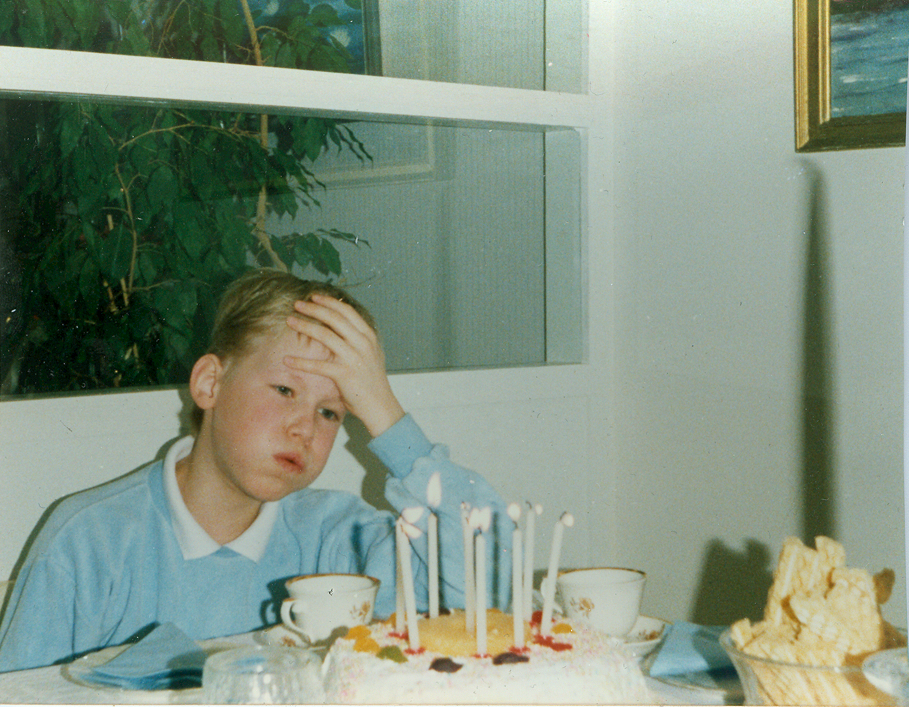

*This post consists of autobiographical snippets of the development of my mental landscape; things I've been struggling with in an uncertain, complex world. I'm posting these right before attending the [Real World Risk Institute](https://realworldrisk.com/) training, which I expect to be the antonym of a linear, predictable, optimisable and rationalisable world view.*

---

Let's divide the world into two arbitrary-ish categories:

1. The linear, predictable, solvable, efficient, articulable, reductionistic, rational, computer game-like, direct, Apollonean, Yang
2. The non-linear, chaotic, vexing, surprising, inarticulable, holistic, (seemingly) irrational, a-night-out-with-strangers-like, oblique, Dionysean, Yin

The first category has always been easy for me to live in. I've landed more than one job/professional position by having pre-ran many scenarios in my head and coming out from a negotiation seeming like I can "think on my feet". My inclination has been to A) make plans, then some more plans, B) hone whatever I work at to perfection, C) streamline. These work great when the past is like the future, and the problems you're dealing with are not from the second category. Unfortunately, that's not how most of life works.

---

Once many years ago, I was making coffee at the office. My boss gathered everyone around to watch, how no movement was wasted in the ultra-efficient process of preparing a coffee machine. This was, to him, a manifestation of the company's principles. I solved problems, and where there weren't any, I found them anyway -- the kind of person you want in a place with broken things, not one that runs smoothly.

---

I grew up playing computer games, where problems are well-articulated and you have at least one way to solve them perfectly. You know the rules and will make progress by diligently doing what you've done before. This is not a good model for the actual world, where even if you manage to solve one problem, you can end up with several new ones arising as a response.

---

I've always been prone to optimise my life; inclined to find The One Best Way of doing things. Unfortunately, in complex systems you're never done. This inclination is what I've tried to revamp for more than a decade now.

---

When I was very young, I realised I can use logic and reasoning to run circles around the adults close to me, which made me draw the conclusion, that these adults knew next to nothing about the things they're supposed to be experts on. Unfortunately, I took the wrong lesson -- that I have the wrong adults, instead of knowledge being much more slippery than I thought.

---

 
Fred W. Taylor was the pioneer in making factories more efficient. His ideas worked great in an environment where tasks could be chopped down to easily articulable optimal sub-behaviours. There's a story about him, that as a child, he would try to figure out the optimal step length to cover most distance with least energy expenditure. We would've been kindred spirits; after I realised I know things the adults don't, I figured I could hack walking, too. Two decades later, I still ran funny.

---

When in upper secondary school, I realised local events have practically no bearing on global ones, and set my mind to ignore the local and focus on the global. This was a huge mistake, as almost all things you can reliably (i.e. without invoking glorious cascades of second-order effects) affect live on the local scale. The farther you move away from the local, the more abstract and complex things get.

---

Not having been very social in my childhood, I figured I could learn about human interaction from books. I think I learned quite a bit, and enough to keep me afloat in e.g. the extrovert world of salespeople, but it came at the cost of having amazing amounts of junk in my brain, based on the musings of writers wishing to impress their audience.

---

Early on, I figured I could learn to fight in martial arts class, and many childhood experiences fortified this idea. Later, having moved to increasingly realistic forms of combat training, I realised how little I can do if someone wants me gone.

---

Doing martial arts as a kid, I made the first error in extrapolation I can remember: I calculated the number of months it had took me to progress in the initial belt colors, and estimated the time to reach black. Didn't realise that the time & effort you need to put in is non-linear to the progression. Luckily, being 9, this didn't carry huge consequences (yet).

---

After high school I spent two years in the military, one in Finland and one in Africa, but still didn't know what I want to do when I grow up (I also thought I need to know that). In the absence of better options, I did a business degree, which prepared you for 3.5 years to learn how to avoid saying "I don't know".

---

I've always been maximising, as opposed to satisficing, realising I don't get the expected returns but assuming every case is an isolated instance.

---

I've always been finishing, as opposed to exploring. Yes I know Buddha said finishing that project won't give you lasting satisfaction, and I promise I'll stop and re-think my approach once I just finish everything first!
[note: turns out everything is very, very much]

---

Assuming old age necessarily comes with weakening and fattening. I recently discovered in my closet a bunch of jeans with much wider waist than what I use. I can't remember their origin, but I had been saving them with the idea that "I'll probably need them one day". In spite of considering myself as such a special snowflake, I had implicitly thought the population-level processes very likely apply to each individual.

- ‎insisting on generality/universality of contexts where a decision works, e.g. of I do x, would it be ok of everyone did it
- scalable solutions wanted for all local probs
- ‎nitpicking typos
- dead fucking serious instead of playful and light (unless there's alcohol, especially if free)
- ‎love: static, unchanging
- finding opportunities for not being exposed to downsides while keeping the upside; lending with interest, science 🤔
- Thinking published stuff is true, then thinking failed rep makes it false: like saying researchers teach birds to fly, and when it doesn't replicate, conclude birds can't fly (cog dissonance grim example)
- Traveling; many acquaintances, few friends
- "end is well, all is well" - it's never the end!
- orwell horse i work hardest
- food, mixed everything = unmixed everything
- apollonian over dionysean, yang over yin
- seneca 3 manifestations of god: liber bacher = life force (dionysean), hercules = strength, mercury = craft, science, rationale (apollonian)
- - not-knowing vs describing the unknowable and undescribable... Labels not reality, zen
- no redundancies
- life purpose, find one and stick with it instead of changing in time to experience all of life
- Organic = for hippies, unscientific. Contra Taleb\*
- "Whenever you question some aspects of medicine—or unconditional technological “progress”—you are invariably and promptly provided the sophistry that “we tend to live longer” than past generations. Note that some make the even sillier argument that a propensity to natural things implies favoring a return to a day of “brutish and short” lives, not realizing it is the exact same argument as saying that eating fresh, noncanned foods implies rejecting civilization, the rule of law, and humanism. So there are a lot of nuances in this life expectancy argument. - antifragile
