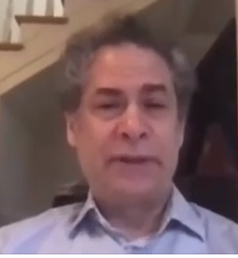

*Yaneer Bar-Yam is a complexity scientist, who has worked with and warned about pandemics for 15 years. His interview with Esa-Pekka Pälvimäki and Thomas Brand (in English) regarding the COVID-19 situation in Finland can be found* *[here](https://www.youtube.com/watch?v=LRSQdm3HboY)**; these are some of my no*tes and video extracts.

*Nämä ovat muistiinpanoni [Esa-Pekka Pälvimäen](https://twitter.com/eppe) ja [Thomas Brandin](https://twitter.com/thlbr) toimittamasta kompleksisuustieteilijä ja pandemiatutkija Yaneer Bar-Yamin* *[haastattelusta](https://www.youtube.com/watch?v=LRSQdm3HboY)**, jossa tämä kommentoi Suomen Koronavirustilannetta. [Bar-Yam](https://twitter.com/yaneerbaryam) on yksi kompleksisuustieteiden isistä, ja äärimmäisen kunnioitettu tutkija. Ks. myös* *[Suomenkielisiä työkaluja COVID-19 taisteluun](https://mattiheino.com/2020/03/24/koronavirus-suomeksi/)**.*

**Ensisijainen asia:** On ymmärrettävä, että voimme päästä taudista eroon. Voimme lopettaa tämän taudin siinä, missä olemme lopettaneet muitakin tauteja: SARS, MERS ja Ebola eivät ole globaaleja riesoja. Tästä lisää myöhemmin.

> "On maita, jotka ovat toimineet viisaasti ja päässeet taudista eroon; ne ovat [historian silmissä] voittajia. Suomi ei ole vielä siellä... jos Suomi haluaa päästä johtajien joukkoon, sen tulee toimia nopeasti ja voimakkaasti taudin hävittämiseksi."

**Kaksi tietä ulos kriisistä:**

1. Kahden viikon sulku johtaa siihen, että uudet tautitapaukset loppuvat lähes kokonaan. Niillä alueilla, joilla edelleen on tapauksia, sulkua tulee jatkaa. Hallituksen tulisi tukea kaupunkien ja muiden yhteisöjen päätösvaltaa siinä, että nämä voivat säädellä itse omia rajoituksiaan.
2. Viiden viikon kansallinen sulku: On paljon maita, jotka ovat menestyneet COVID-taistossa kansallisen sulun avulla (esim. Etelä-Korea, Kreikka, Islanti, Luxemburg, Kroatia; ks. [kuva](https://twitter.com/yaneerbaryam/status/1256769252369072134)). Tähän joukkoon kuuluvat maat voivat avata matkustusrajoituksia toistensa välillä. Toim. huom. yksikään maa ei ole peitonnut virusta ilman päättäväisiä vastatoimia.

**Mikä on yhteisöjen rooli epidemian torjunnassa?** Mikäli lainvoimainen ulkonaliikkumiskielto tai muut liikkumisrajoitteet ovat mahdottomia, pandemiavaste voidaan tehdä yhteisöissä; viestinä on, että olemme samassa veneessä ja kaikki haluavat päästä takaisin normaaliin – palataan siis normaaliin mahdollisimman nopeasti! Kaikki eivät suosituksia tietenkään tule noudattamaan, mutta jos suurin osa niin tekee, se riittää. Yleinen ja hyväksi havaittu tekniikka epidemian hallintaan on ovelta ovelle kulkeminen ja yhteisön jäsenten voinnin tiedusteleminen; ovatko he terveitä, sairaita, tarvitsevatko he jotakin? Tätä voi pari viikkoa tehdä yhteisön jäsen, Suomessa kenties taloyhtiön suojelu/turvallisuusvastaava?

Yhteisöissä, joissa tauti leviää poikkeuksellisen vahvasti, tulee puhua johtajille ja kertoa, että taudista ja sen tuottamasta kärsimyksestä voidaan päästä eroon. Ei ole mitään tärkeämpää kuin se, että yhteisöt saadaan ottamaan omistajuus ja vastuu omista jäsenistään. Heitä, heidän huoliaan ja ongelmiaan tulee kuunnella ja kysyä, kuinka heitä voitaisiin parhaalla tavalla auttaa.

https://youtu.be/tGGwqU4Jzmo

**Käynnistyykö leviäminen väistämättä uudestaan, jos tautia kantava henkilö pääsee tartunnoista vapaalle alueelle?** Uudet tartunta-aallot eivät ole tarpeellisia. Tartuntatauteja on hävitetty ennenkin, ja samoin voidaan Koronaviruskin hävittää: paikallisesti ja globaalisti. Kyse on valinnasta. Esim. 1-3 tapausta voidaan aina pysäyttää kontaktijäljityksen ja altistuneiden eristämisen avulla; voimme myös toimillamme vaikuttaa siihen, että tapausten ilmaantuminen on hyvin epätodennäköistä. Mutta jos tapauksia on esim. kymmenen, tarvitaan järeämpiä toimia.

**Palaako tauti aina ja ikuisesti ulkomailta, kunnes rokotus on saatavilla; eihän minkään maan talous kestä niin pitkiä rajoituksia?** Ei, taudin hävittäminen saadaan tehtyä viikoissa. Suomessa se saataisiin poistettua monista paikoista kahdessa viikossa, toisissa kolmessa tai useammassa. Viidessä-kuudessa viikossa se katoaisi kaikkialta. Tähän liittyy kiinnostava harha: taudin alkuvaiheessa ajateltiin taudittoman maailman kestävän ikuisesti, ja nyt ajatellaan taudin kestävän ikuisesti. Ei – normaalitila ei kestä ikuisesti, eikä poikkeustila kestä ikuisesti. SARS ja MERS eivät päätyneet nekään kiertämään maailmaa ikuisesti.

https://youtu.be/K7Pyw0BUT-k

**Entä laumaimmuniteetti?** Laumaimmuniteetin hankinnan kustannus on valtava, eikä ole selvää, että se toimisi. Jos emme tee suurempia toimia, yritämme pitää tautitapaukset alhaalla ja odotamme rokotetta sekä laumaimmuniteettia, siinä voi mennä vuosia, ja se voi maksaa 250 000 henkeä.

Keskustelussa sivuttiin seitsemää ensimmäistä kohtaa **9-kohtaisesta toimintaohjelmasta** (ks. [COVID-19: How to Win](https://www.endcoronavirus.org/papers/how-to-win), sekä suomennetut ohjeet: [COVID-19 -taistelusuositukset poliittisille päätöksentekijöille](https://medium.com/brandin-kirjasto/covid-19-taistelusuositukset-poliittisille-p%C3%A4%C3%A4t%C3%B6ksentekij%C3%B6ille-85c7cc8ca96) | [Miksi viiden viikon lockdown voi pysäyttää COVID19-epidemian?](https://medium.com/brandin-kirjasto/miksi-viiden-viikon-lockdown-voi-pys%C3%A4ytt%C3%A4%C3%A4-covid19-epidemian-c2d9ab13c8eb) | [Milloin voimme jälleen avata yhteiskunnan?](https://medium.com/brandin-kirjasto/milloin-voimme-j%C3%A4lleen-avata-yhteiskunnan-a31445fe8e20))

1. Kaikkien – yritysten, yhteisöjen ja hallituksen – saaminen mukaan ponnistukseen.
2. Sulku (lockdown): Fyysisen etäisyyden (6–9 metriä; 2m ei riitä) pitäminen, tartuntojen rajoittaminen perheryhmissä (positiiviseksi testatut henkilöt lähetetään karanteeniin esim. hotelliin oman asunnon sijaan).
3. Tapausten tunnistaminen ja eristäminen (miellyttäviin paikkoihin, esim. hotelleihin) ajoissa*.*
4. Kasvosuojainten käyttäminen, erityisesti välttämättömissä palveluissa.
5. Edes jonkinasteiset matkustusrajoitukset. Liikkumisen rajoittaminen tarpeellisiksi nähtyihin palveluihin on parempi kuin se, että kaikki liikkuvat mielin määrin, mikä tuo tartuntatapaukset paikkoihin joissa niitä ei välttämättä muuten olisi.
6. Välttämättömien palveluiden käytön saaminen turvalliseksi. Turvalliset työtilat, etätyömahdollisuudet, ruokakauppojen kotiin-/kadullekuljetukset, jne.
7. Laajamittainen testaus, jotta tiedetään missä tarvitaan lisärajoituksia ja missä rajoituksia voidaan höllentää. Tietokonetomografiaa voidaan käyttää testaamisen nostamiseen uudelle tasolle; se tuottaa hyvin vähän vääriä negatiivisia havaintoja.

https://youtu.be/vo0eYkjYtSY

> "Kuka tahansa, joka nykyään sanoo, ettei ole olemassa informaatiota, jonka perusteella kasvosuojainten voi sanoa olevan hyödyllisiä taudin leviämisen kannalta, on sokea. He pitävät maskia suun ja nenän sijaan silmillään. Näyttö on olemassa, tieteellinen ymmärrys on olemassa; tämän viestin pitää olla selkeä."
>
> – Yaneer Bar-Yam (39:34)

**Valtava virhe vastatoimissa on, että ajattelemme ja toimimme kuin tämä olisi influenssa.** Mutta siitä ei ole kyse; voimme oppia enemmän vakavista tartuntatautitapauksista selvinneiltä mailta, kuin voimme menneestä toiminnastamme vanhojen perus-influenssojen parissa. Esimerkiksi Ebola on tullut paikallisen häviämisen jälkeen takaisin vain siksi, että se on palannut eläinten kautta ihmisiin.

https://youtu.be/81xaSFRrXtQ

Vaihtoehtoinen strategia ei ole Flatten the Curve, ts. "Pidä tapausmäärät alhaalla ja odottele".

https://youtu.be/jeRYnZ9aW6A

Tässä vielä video kokonaisuudessaan:

https://www.youtube.com/watch?v=LRSQdm3HboY

