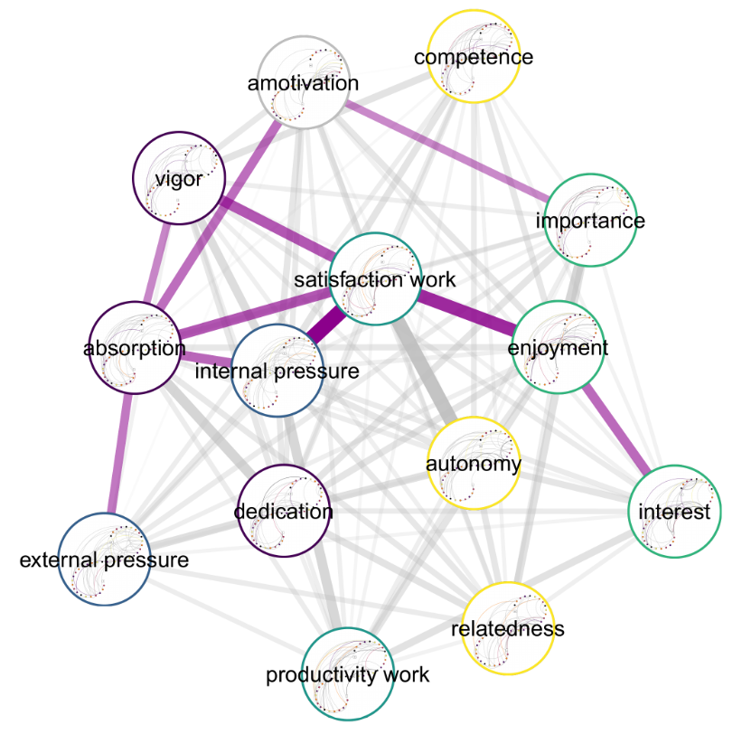
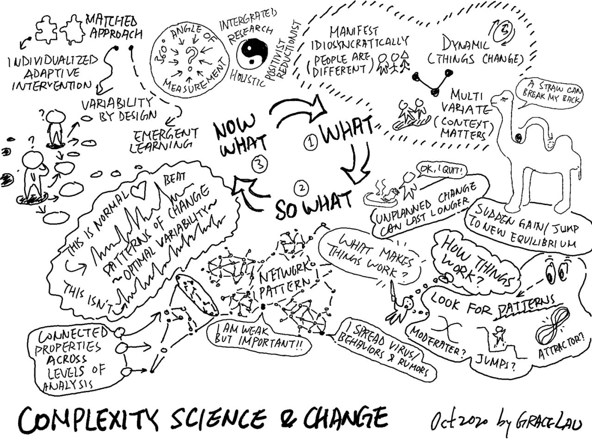

*I had the great pleasure to be involved in organising a symposium on the topic of my dissertation. Many if not most societal problems are both behavioural and complex; hence the speakers' backgrounds varied from systems science, and psychology to social work and physics. Below is a list of video links along with a short synopsis of the talks.* See [here](http://linktr.ee/besp) for other symposia in the Behaviour Change Science and Policy series.

A live-tweeting thread on 1st day [here](https://twitter.com/Heinonmatti/status/1314144101521076229), 2nd day (not including presentations by me, Nanne Isokuortti or Ira Alanko) [here](https://twitter.com/Heinonmatti/status/1314491415473393664). See [here](https://www.helsinki.fi/en/conferences/complexity-science-and-behaviour-change-interventions) for the official web page, and [here](https://www.youtube.com/playlist?list=PLFktS8riUYh8Hq47I513P5MCVwIujdbj7) for the YouTube playlist!

**Nelli Hankonen: [Opening words & introduction to the Behaviour Change Science & Policy (BeSP) project](https://youtu.be/7e0ky3e1WNE)**

- See [here](https://linktr.ee/besp) for videos of previous symposia (I: Intervention evaluation & field experiments; II: Behavioural insights in developing public policy and interventions; III: Reverse translation: Practice-based evidence; IV: Creating real-world impact: Implementation and dissemination of behaviour change interventions)

**Marijn de Bruijn: [Integrating Behavioural Science in COVID-19 Prevention Efforts – The Dutch Case](https://youtu.be/wuepm48lilg)**

- Behaviour change efforts for COVID-19 protective behaviours are operations on a complex system's user experience: A virus is the problem, but behaviour is the solution.
- Knee-jerk communication responses of health officials can be improved upon by using methods derived from what works in real-world behavioural science interventions.
- Protective behaviours entail feedback dynamics: for example, crowding leads to difficulty maintaining distance, which leads to perceiving that others don't consider it important, which leads to more crowding, etc.

**Nelli Hankonen: [Why is it Useful to Consider Complexity Insights in Behaviour Change Research?](https://youtu.be/M_NHhelZAAE)**

- Complexity-informed approaches to intervention have been around for a long time, but only recently analytical methodology has become widely available.
- There are important differences between "complicated" and "complex" behavioural interventions.
- By not taking the complexity perspective into account, we may be missing opportunities to properly design interventions.

**Olli-Pekka Heinonen: [Complexity-Informed Policymaking](https://youtu.be/zIK4W_-DUPo)**

- If a civil servant wants to be effective, maximum control doesn't work – even what constitutes "progress" can be difficult to ascertain.
- Systems, such as the society, move: what worked yesterday, might not work today.
- Hence *continuous* learning, adaptation and experimenting are not optional for societal decision-making.

**Gwen Marchand: [Complexity Science in the Design and Evaluation of Behaviour Interventions](https://youtu.be/irNcmbU3DNw)**

- What does it mean to define behavior and behavior change from a complex systems perspective?
- Focal units and well-defined timescales are key considerations for design and research of intervention
- Context acts to constrain and afford possible states for behavior change related to intervention

**Jari Saramäki: [How do Behaviours, Ideas, and Contagious Diseases Spread Through Networks?](https://youtu.be/O7F18ob9SRA)**

- People are embedded in networks that influence their behaviour and health
- Network structure – how the networks’ links are organized – strongly affects this influence
- Interventions that modify network structure can be used to promote or hinder the spread of influence or contagion.

**Matti Heino: [Studying Complex Motivation Systems – Capturing Dynamical Patterns of Change in Data from Self-assessments and Wearable Technology](https://youtu.be/Mp-daByWcAc)**

- Analysis of living beings involves addressing *interconnected*, *turbulent* processes that *vary* across time.
- Recruiting less individuals and collecting more data on fewer variables, may be a considerably beneficial tradeoff to better understand dynamics of a psychological phenomenon.
- Methods to deal with such data include building networks of networks (multiplex recurrence networks) and assessing early warning signals of sudden gains or losses.

If you're interested in the links, download my slides [here](http://drive.google.com/uc?export=download&id=1NBTjTfqQW1_UcYvSH47vF6sq-QKc_6RX). I actually forgot to show what a multiplex network of variables combined from several theories looks like (you don't condition on all other variables, so you can combine stuff from different frameworks without the meaning of the variables changing, as in a regression-based analysis). Anyway, it looks like this:

*A single person's multiplex recurrence network, i.e. a network of recurrence networks of work motivation variables queried daily for 30+ days. Colored connectors are relationships which can't be attributed to randomness.*

**Nanne Isokuortti: [From Exploration to Sustainment – Understanding Complex Implementation in Public Social Services](https://youtu.be/1psSvEs4pUI)**

- Illustrate the complexity in an implementation process with a real-world case example
- Introduce Exploration, Preparation, Implementation, and Sustainment (EPIS) Framework
- Provide suggestions how to aid implementation in complex settings

**Ira Alanko: [The AuroraAI Programme](https://youtu.be/2jyIm_lWJwQ)**

- The Finnish public sector is taking active steps to utilise AI to make using of  services easier
- AI has opened a window for a systemic shift towards human-centricity in Finland
- The AuroraAI-network is a collection of different components, not a platform or collection of chatbots

**Daniele Proverbio: [Smooth or Abrupt? How Dynamical Systems Change Their State](https://youtu.be/4tW6No-u0Ag)**

- Natural phenomena don’t necessarily follow smooth and linear patterns while evolving.
- Abrupt changes are common in complex, non-linear systems. These are arguably the future of scientific research.
- There exist a limited number of transition classes. Understanding their main drivers could lead to useful insights and applications.

**Ken Resnicow:  [Behavior Change is a Complex Process. How does that impact theory, research and practice?](https://youtu.be/7KCTjsSrh6o)**

- Behavior change is a complex, non linear process.
- Sudden change is more enduring than gradual change.
- Failure to replicate prior interventions can be understood from a complexity lens.

(nb. on the last talk: personally, I'm not a huge fan of mediation analysis, moderated or otherwise. Stay tuned for an interview where I discuss the topic at some length with [Fred Hasselman](https://complexity-methods.github.io/))

*Notes from the symposium by [Grace Lau](https://www.linkedin.com/in/grace-lau-80238631)*
