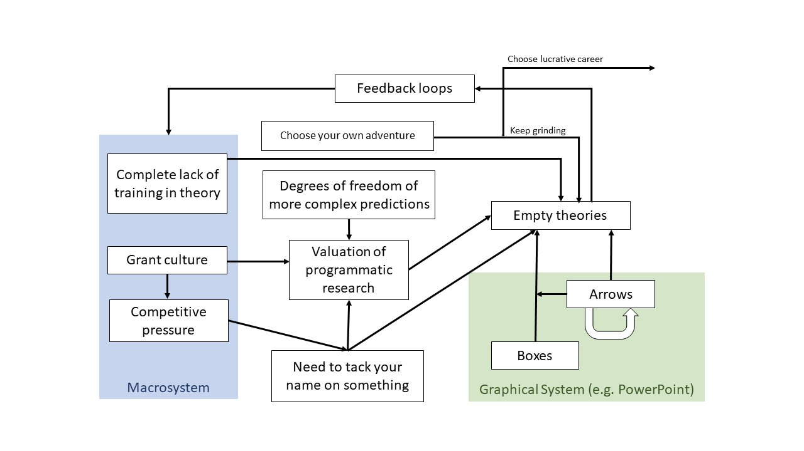

I had the opportunity to interview [Fred Hasselman](https://complexity-methods.github.io/), the main architect of *[casnet](https://fredhasselman.com/casnet/): An R toolbox for studying Complex Adaptive Systems and NETworks*. We spoke of how compatible the complex systems perspective is with some methods widely used in social sciences.

https://youtu.be/rut6mdWYA9g

A few notes:

- **Multilevel models** (and what you put in those) **come in many varieties** – **and some are useful**
  - See [this blog post](https://psych-networks.com/how-to-study-early-warning-signals-for-clinical-change/) for an overview of how multi-level survival model can be used to study early warning signals for clinical change.
  - Same strategy used in physical activity research in a recent preprint of ours (includes data and code): [Characterizing and predicting person-specific, day-to-day, fluctuations in walking behavior](https://osf.io/preprints/sportrxiv/bzj6s)
- **Interaction is not interaction**
  - Interaction (1): Two variables are intertwined – or "coupled" – in such a way, that they cannot be separated without severing the phenomena arising from their interplay.
  - Interaction (2): A multiplicative, instead of additive, relationship in a linear regression model, where you can partial out variance and get nice beta weights for each variable to determine their individual impacts.
  - The two meanings presented above are logically inconsistent: See #36 in Scott Lilienfield's "[Fifty psychological and psychiatric terms to avoid](https://www.frontiersin.org/articles/10.3389/fpsyg.2015.01100/full#h4%E2%80%8B)"
    - See also this piece: [On the distinction between interaction and effect modification](https://journals.lww.com/epidem/Fulltext/2009/11000/On_the_Distinction_Between_Interaction_and_Effect.16.aspx)
- **Interdependence means you can't use the regular statistics which social scientists know and love.**
  - ... because you lose additivity.
- ***"Don't infer causality, observe it."*** 
  - When the system you're looking at is an individual instead of e.g. the society, you're in the quite happy position, that lab studies are possible (if you're smart about them).
- **An excellent paper** from [Merljin Olthof](http://twitter.com/olthofmerlijn): [*Complexity in psychological self-ratings: implications for research and practice*](https://doi.org/10.1186/s12916-020-01727-2)
- **Additional resources:**
  - [A symposium](https://mattiheino.com/2020/03/31/complexity-channel/) we held on complexity in behavioural science, evidence and policy.
  - [A workshop](https://mattiheino.com/2020/03/31/complexity-channel/) by Fred Hasselman (scroll to the end for an extensive reading list).
  - [University of Helsinki course](https://mattiheino.com/2019/09/04/carma/) by Matti: *CARMA – Critical Appraisal of Research Methods and Analysis*.

Because every post needs an image, here's *[Julia Rohrer](http://www.twitter.com/dingding_peng)'s (2017) [Theory of Regulation of Empty Theories (TROETE)](https://twitter.com/dingding_peng/status/933253692131647488)*
